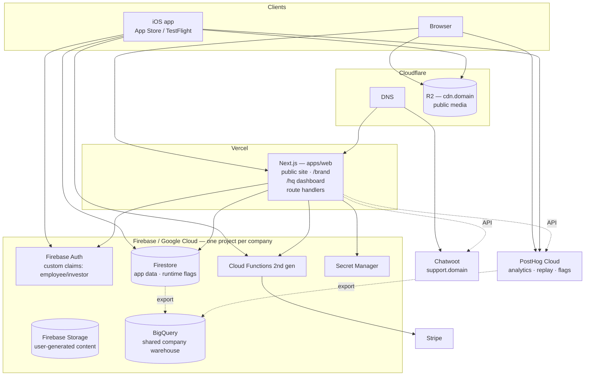
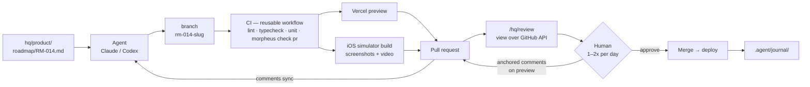

# Morpheus — Architecture

> **Status:** Draft 2, under active iteration. Decisions marked **[open]** are unresolved and
> collected in [§21](#21-open-questions). Nothing is implemented yet.

---

## 1. What Morpheus is

Morpheus is a company-building machine: a single repository that can instantiate a complete,
running business — software product, brand, dashboards, automations, third-party integrations —
and then keep every business it created up to date.

The observation behind it: across five web projects built in quick succession, roughly 80% of the
technology and company stack was either *entirely reusable* (design token pipeline, auth gate, CI
workflows, deploy config) or *structurally reusable* (brand documents, roadmap format, QA
checklists — same shape, different content). Rebuilding that 80% each time is waste, and the
copies drift.

Morpheus makes the 80% a dependency instead of a copy.

### The two halves

| Half | What it is | How it reaches a project |
|---|---|---|
| **Initializer** | A CLI that creates a new company repo with full scaffolding | Copied at `init`, then owned by the project |
| **Kit** | One versioned package of reusable runtime code and tooling | Depended on, upgraded over time |

### Who this is for

Chris, plus a small number of family and friends. It is not a product. Three consequences:

- **Opinionation is free.** No user wants Vue. Canonical choices are hard-coded.
- **Public namespace collisions do not matter.**
- **Multi-tenancy, billing, and onboarding UX are out of scope.** Forever.

---

## 2. Design principles

1. **Agents are the primary operator; humans review.** Every artifact is chosen for legibility to
   an agent first. Markdown over databases. Files over GUIs. SQL over proprietary APIs.

2. **One obvious place for everything.** An agent should infer a file's location from its purpose
   without searching. Directory names are plain nouns.

3. **Canonical choices, stated once.** The stack is decided here. Projects do not re-litigate it.
   Deviations are recorded in the manifest, not discovered by reading code.

4. **Import, don't sync.** Where two places need the same fact, one owns it and the other imports
   it. Copying with a sync step is drift waiting to happen.

5. **Reusable code is a dependency, never a copy.**

6. **Templates are copies and that is fine.** Scaffolding is a starting point. Projects diverge.
   Do not build machinery to keep templates in sync — build machinery to *add* new ones (§13).

7. **The human checks in once or twice a day.** Anything requiring human input queues rather than
   blocks. Agents must always have work available that needs no approval.

8. **Buy where the vendor holds a regulatory, data, or platform moat; build where the vendor's
   value is collaboration UX we do not need.**

9. **Instructions are advisory; CI is enforcement.** Anything that genuinely must happen on every
   PR is a check, not a sentence in a markdown file.

---

## 3. Canonical project structure

```
acme/
├── README.md                  # human entry point
├── AGENTS.md                  # agent entry point — canonical instructions
├── CLAUDE.md                  # symlink → AGENTS.md
├── morpheus.json              # project manifest (§5)
├── package.json               # workspace root
├── pnpm-workspace.yaml
│
├── apps/                      # deployable surfaces
│   ├── web/                   # Next.js — always present
│   │   └── tests/             # unit + component tests, colocated
│   ├── ios/                   # SwiftUI — optional
│   │   └── Tests/
│   └── hardware/              # designs, BOM, vendors — optional
│
├── packages/
│   └── shared/                # cross-surface: tokens, schema, generated types (§4)
│
├── hq/                        # the business layer — rendered at /hq
│   ├── brand/                 # identity, voice, visual system, messaging, assets
│   ├── product/               # goals, roadmap, feature requests
│   ├── marketing/             # SEO, ASO, social, content
│   ├── finance/               # revenue/expense model, dashboard config
│   ├── ops/                   # strategy, legal, contracts, vendors, procurement
│   └── support/               # macros, escalation policy, known issues
│
├── qa/                        # cross-surface QA (§16)
├── docs/                      # engineering documentation (§17)
├── infra/                     # deploy config, environments, IaC (§18)
├── .agent/                    # agent journal and durable notes (§12.4)
├── .claude/                   # skills, commands
├── .github/workflows/         # ci.yml, deploy.yml, agent-*.yml
└── local/                     # gitignored scratch
```

### `apps/` and `hq/`

The split is: **`apps/` is deployed and has users; `hq/` is read, decided, and written down.**

**Renamed from `company/` to `hq/`** for two reasons. First, not every project is a company —
`cpheinrich.com` is personal and Morpheus itself is an internal tool, so "company" was wrong for a
meaningful share of projects. Second, and better, it makes the naming coherent across all three
layers:

```
hq/               the data          (markdown in the repo)
/hq               the view          (route in apps/web)
@morpheus/kit/hq  the renderer      (package)
```

One word, one concept, and the mapping is obvious in both directions: whatever is in `hq/` is what
`/hq` shows.

The concern about `apps/` needing facts from `hq/` is real and is solved by importing rather than
syncing — see §15.2.

### Project kinds

Not every project needs every subtree. `morpheus.json` carries a `kind`, set by the wizard, which
determines what gets scaffolded and what `doctor` expects to exist.

| | `company` | `personal` | `internal` |
|---|---|---|---|
| Example | Darwin, Evo, Lakina | cpheinrich.com | Morpheus |
| `hq/brand/` | ✅ | ✅ | — |
| `hq/product/` | ✅ | ✅ | ✅ |
| `hq/marketing/` | ✅ | ✅ | — |
| `hq/finance/` | ✅ | — | — |
| `hq/support/` | ✅ | — | — |
| `hq/ops/` (legal, contracts, vendors) | ✅ | — | — |
| `hq/identity/` | — | ✅ | — |
| Chatwoot inbox | ✅ | — | — |
| `/hq/investors` | ✅ | — | — |

A **personal** project has no customer support and no corporate legal — a person does not have
terms of service with themselves. What it does have is `hq/identity/`: the personal equivalent of
`ops/` holding contact details, professional bio, licence and consent notes for photography, and
anything else the site needs to state truthfully about a real person.

An **internal** project is the minimal case: a roadmap and nothing else.

`kind` is not a hard constraint — `morpheus add support` can bolt a support inbox onto a personal
project later if it grows one. It sets defaults, not limits.

### `packages/shared/`, not `apps/shared/`

`shared/` is not a deployable surface, so it does not belong under `apps/`. It holds everything
consumed by two or more surfaces:

```
packages/shared/
├── tokens/                 # DTCG source (primitives from brand)
├── generated/              # Style Dictionary output
│   ├── web/tokens.css, tokens.js, tokens.json
│   └── ios/Tokens.swift
├── schema/                 # Firestore collections + document shapes (source of truth)
│   └── *.schema.ts
├── generated/schema/       # codegen output
│   ├── web/types.ts
│   └── ios/Models.swift
└── messaging.json          # taglines, mission, audience — imported by web (§15.2)
```

### Firestore schema — staged, not built all at once

**Firestore has no native schema.** It is schemaless by design, so "the canonical way" is a
convention you pick. The realistic options, in ascending cost:

1. Nothing — the schema lives implicitly in whatever code touches the collection. This is what most
   projects do and it is exactly how web and iOS drift apart.
2. TypeScript types plus `withConverter` — web only, no help for Swift.
3. **Zod schemas in one file, TypeScript types inferred from them** — validation at boundaries and
   types for free.
4. Zod as source, plus a generator emitting Swift structs and Firestore rules.

**Recommendation: do 3 now, add 4 when iOS actually starts.**

The key point is that **most of the value comes from having one file, not from the codegen.** A
single `packages/shared/schema/user.schema.ts` that both surfaces are required to conform to
already prevents the Polycam-style drift, because there is an unambiguous answer to "what shape is
this document." Codegen removes the manual transcription step, which matters once a second
consumer exists — and not before.

```ts
// packages/shared/schema/entry.schema.ts — the source of truth
export const Entry = z.object({
  id: z.string(),
  userId: z.string(),
  imageKey: z.string(),          // R2/Storage object key, never a URL
  calories: z.number().int(),
  loggedAt: z.string().datetime(),
});
export type Entry = z.infer<typeof Entry>;
```

Stage 1 gives you `Entry` as a TypeScript type and runtime validation at every write. Stage 2 adds
`generated/ios/Models.swift` and `infra/firebase/firestore.rules` emitted from the same file, so
rules cannot drift from the shape they guard.

On "real work": the cost is not effort — it is **complexity you have to live with**. A codegen
pipeline is another CI step that can break and another thing to update when Firebase or Swift
changes. Deferring stage 2 until iOS exists means you never pay for a generator with one consumer.

---

## 4. Where each business function lives

| Function | Location | Form |
|---|---|---|
| Web product | `apps/web/` | Next.js app |
| iOS product | `apps/ios/` | SwiftUI app |
| Android product | `apps/android/` | Deferred — bolt-on template later |
| Design tokens | `packages/shared/tokens/` | DTCG JSON → generated |
| Database schema | `packages/shared/schema/` | TS source → generated types + rules |
| Brand messaging | `packages/shared/messaging.json` | Imported by web |
| Analytics | PostHog Cloud + `/hq` KPIs | SaaS + dashboard |
| Automations | `.claude/skills/`, `.github/workflows/` | Skills + Actions |
| Staging | Vercel preview per PR | Ephemeral |
| Unit tests | `apps/*/tests/` | Colocated |
| E2E tests | `qa/e2e/` | Playwright |
| QA checklists, acceptance | `qa/` | Markdown |
| Security posture | `qa/security.md` | Markdown |
| Cloud infra | `infra/` | Config + IaC |
| SEO | `hq/marketing/seo/` | Docs + Semrush |
| ASO | `hq/marketing/aso/` | Docs + ASC integration |
| Marketing content | `hq/marketing/content/` | Markdown |
| Identity, mission, audiences | `hq/brand/strategy.md` | Markdown |
| Finance | `hq/finance/` → rendered at `/hq/finance` | Config + dashboard |
| Legal, contracts, ToS | `hq/ops/legal/` | Markdown + PDFs |
| Vendors, procurement | `hq/ops/vendors/`, `apps/hardware/` | YAML |
| Secrets | `secrets.manifest.json` + GSM | Manifest; values external (§14) |
| Customer support | Chatwoot + `/hq/support` | Self-hosted + dashboard |
| Agent instructions | `AGENTS.md`, `.claude/skills/` | Markdown |
| Agent journal | `.agent/journal/` | Markdown |
| Goals, roadmap, requests | `hq/product/` | Markdown |
| Engineering docs | `docs/` → `/hq/docs` | Markdown + Mermaid |
| HR | Google Workspace + Gusto | External |
| Investors | `/hq/investors` | Dashboard view |

---

## 5. The project manifest

`morpheus.json` — written by the wizard, read by agents. The `stack` block is gone; the stack is
canonical and lives in this document. Only *deviations* are recorded.

```jsonc
{
  "morpheusVersion": "0.1.0",
  "name": "evo",
  "displayName": "Evo",
  "kind": "company",                 // company | personal | internal (§3)
  "org": "darwin-health",            // groups sibling repos (§11); omit for personal/internal
  "domain": "evo.med",
  "description": "One-sentence description.",
  "surfaces": { "web": true, "ios": true, "hardware": false },
  "integrations": ["firebase", "stripe", "posthog", "github", "slack", "semrush"],
  "hq": {
    "route": "/hq",
    "allowlist": ["you@example.com"],
    "investorAllowlist": []
  },
  "inherits": {                       // §11 — what comes from the parent company
    "legal": "darwin",
    "hr": "darwin"
  },
  "deviations": [
    { "choice": "hosting", "value": "cloudflare", "reason": "..." }
  ]
}
```

---

## 6. Morpheus's own structure

**One package, not many.** `@morpheus/kit` ships everything, with subpath exports so a project
imports only what it uses. One version number, one install, one registry entry.

```
morpheus/
├── README.md
├── architecture.md
├── AGENTS.md                  # + CLAUDE.md symlink
├── morpheus.json              # kind: "internal"
├── package.json               # the single published package
│
├── hq/                        # Morpheus eats its own dog food (§5.1)
│   └── product/
│       ├── goals/
│       └── roadmap/
│
├── src/
│   ├── cli/                   # init, add, upgrade, doctor, secrets
│   ├── hq/                    # dashboard routes + components
│   ├── design/                # semantic tokens + React components
│   ├── agent/                 # AGENTS.md fragments, skills, review tooling
│   ├── integrations/          # Stripe, Firebase, PostHog, Chatwoot, Slack adapters
│   ├── analytics/             # event schema + PostHog helpers
│   ├── pm/                    # roadmap/goal schemas + parsers
│   └── qa/                    # test harness, CI actions
│
├── templates/
│   └── base/  web/  ios/  hardware/  brand/  android/
├── .github/workflows/         # reusable workflows called by every project (§13.1)
├── .agent/journal/
├── tests/
└── docs/
```

### 5.1 Morpheus's own `hq/`

You are right that it needs one. As `kind: "internal"` it gets the minimal subtree — `hq/product/`
with `goals/` and `roadmap/`, and nothing else. No brand, no marketing, no finance, no support:
Morpheus has no customers and does not bill anyone.

This is the smallest honest instance of the structure, which makes it a useful test. If the roadmap
schema is awkward here, it is awkward everywhere.

Note that `src/hq/` (the renderer, shipped in the package) and `hq/` (Morpheus's own data) sit side
by side in this repo without colliding — one is code the kit exports, the other is content this
repo owns. Every other project has only the latter.

Consumers import subpaths:

```ts
import { HqShell } from "@morpheus/kit/hq";
import { Button } from "@morpheus/kit/design";
```

Heavy or surface-specific dependencies are declared as **optional peer dependencies**, so a
web-only project never installs hardware or iOS tooling. If install weight becomes a real problem
later, splitting one package into several is a mechanical change — starting split and merging
later is not. Start together.

The CLI is exposed as a `bin` from the same package, installed globally:
`pnpm add -g @morpheus/kit`.

---

## 7. Canonical tool choices

### Bought

| Function | Choice | Why not first-party |
|---|---|---|
| Auth, database, storage, push, crash | **Firebase** | Mobile services bundle is irreplaceable |
| Payments | **Stripe** | Regulatory surface |
| Banking | **Mercury** | |
| HR / payroll | **Gusto** | Compliance surface |
| Email, accounts | **Google Workspace** | |
| Code hosting, CI, packages | **GitHub** | Substrate for everything else |
| Messaging | **Slack** | Agent notification target |
| DNS, CDN, public media | **Cloudflare** | Registrar, CDN, R2 (§19) |
| SEO research | **Semrush** | Data moat |
| Agents | **Claude + Codex** | |
| Error tracking | **Sentry** | |
| **Web hosting** | **Vercel** | §9 — decided on the review loop, not the hosting |
| **Product analytics** | **PostHog Cloud** | §8 |
| Hardware | **Macs** | |

### Built and maintained in Morpheus

| Function | Why build it |
|---|---|
| Internal dashboard (`/hq`) | Every alternative is built for teams; we need one pane agents write to |
| Project management | Goals/roadmap/requests as markdown in git beats any API |
| QA tracking | Checklists next to the code they check |
| Automations | GitHub Actions + skills; no Zapier |
| Review queue | GitHub PRs + `decision` issues (§12.3) |
| Investor reporting | A view over the same data, gated differently |

### Self-hosted

| Function | Choice | Notes |
|---|---|---|
| Customer support | **Chatwoot** | §20 — deployed at `support.<domain>`, surfaced in `/hq/support` |

### Stack defaults

Next.js (App Router) · React · TypeScript · Tailwind · pnpm · Style Dictionary (DTCG) ·
Vitest + React Testing Library · Playwright (E2E) · SwiftUI · Auth.js with Google OAuth ·
uv + ruff + pytest where Python is needed.

---

## 8. Analytics: PostHog

**Decision: PostHog Cloud.** It is a strong fit and self-hosting is strictly worse.

### Why it fits

The positioning you responded to is backed by the actual product surface. PostHog bundles product
analytics, session replay, feature flags, experiments, surveys, and error tracking in one tool
with one SDK — which collapses five vendors into one and, more importantly, gives an agent one
place to look.

**SDK coverage is complete for our surfaces:** official libraries for React, iOS (Swift, moving to
Swift Package Manager as CocoaPods goes read-only in December 2026), Android, and React Native.
Android is covered before we build it.

**It has an official MCP server**, so an agent can query trends, funnels, retention, and raw HogQL
without a bespoke integration. This is the mechanism for the ingestion loop in §12.5 — the agent
reads product metrics the same way it reads a file.

### Cost

Free tier, per month: **1M events**, 5K web session replays, 1M feature flag requests, 100K
exceptions, 1M data warehouse rows, 1,500 survey responses. No platform or base fee.

Beyond that: **$0.00005/event** — $50 per additional million. Session replay is $0.005/recording
(web), $0.01 (mobile); flags $0.0001/request; error tracking $0.00037/exception. Rates decrease at
volume.

Practically: a new project pays nothing for a long time, and a successful one pays tens of dollars
a month. This is not a cost decision.

### Self-hosting: no

PostHog's own documentation recommends against it, and the terms make it clearly wrong here:

- **Paid-plan features are Cloud-only.** Self-hosting gets you *fewer* features, not the same ones
  cheaper.
- No support, no uptime guarantee, "assume all responsibility and risk."
- Continuous updates from `main` rather than versioned releases, and **they do not publish CVEs** —
  so staying secure means tracking the latest Docker image continuously.
- Recommended only below ~300K events/month, on a 4 vCPU / 16GB VM.

Self-hosting costs more operationally, delivers less, and the free Cloud tier is three times the
volume they consider the self-host ceiling. Not close.

### Interface

Exactly the shape you described: a handful of KPIs rendered in `/hq` (pulled server-side via the
PostHog API and cached), each linking out to the corresponding PostHog dashboard for depth. We do
not rebuild PostHog's UI.

---

## 9. Software architecture and hosting

### What Next.js is (and Angular)

Both are frameworks for building websites and web apps in the browser — the web equivalent of
choosing SwiftUI vs UIKit. Both are React-era answers to "how do I build a site with many pages,
shared components, and data fetching."

- **Next.js** is built on React (Meta's UI library) and is the mainstream default for new web
  work. It renders pages on the server for speed and SEO, then hydrates them into an interactive
  app in the browser.
- **Angular** is Google's older, heavier, more prescriptive framework. It is common in enterprises
  and rare in new consumer products.

**Next.js + TypeScript is the right call and matches what all four of your existing repos already
use.** Firebase App Hosting listing Angular support first is a signal about its origins, not about
what you should build.

### Runtime architecture



Both surfaces talk to the same Firebase backend. The web app additionally does server-side work in
Next.js route handlers (Firebase Admin SDK) for anything needing a secret. The iOS app talks to
Firebase directly and to Cloud Functions for privileged operations. `/hq` reads PostHog and
Chatwoot over their REST APIs to render summary tiles, linking out for depth.

### The development and review loop



The critical property: human feedback re-enters as PR comments the agent already knows how to
read, so review never requires a separate system or a handoff.

### Hosting decision: Vercel

**Decided on the review loop, not on hosting quality.**

Firebase App Hosting has improved substantially — it runs on Cloud Build, Cloud Run, and Cloud CDN
with Secret Manager integration, and Next.js 16.2's stable Deployment Adapter API gives it
first-class support where previously providers reverse-engineered internal Next.js APIs. It is a
credible option and the all-Google consolidation argument is genuine.

But two things decide it:

1. **Remaining Next.js gaps.** Cache Components and the Proxy (formerly Middleware) still present
   architectural hurdles on non-Vercel providers; App Hosting limits caching for apps using
   middleware, and Cloud Run's URL path decoding can break parallel routes. These are exactly the
   features a `/hq` dashboard with auth middleware would use.

2. **Vercel Comments solve your Q9 directly.** Comments on preview deployments are enabled by
   default on every plan at no cost, let a reviewer click any element on the staged page and leave
   a threaded comment anchored to it, and **sync those comments into the associated GitHub pull
   request**. That is precisely the loop you described: a human leaves visual feedback on a staged
   site, and the agent ingests it as PR comments with enough context to know which part of the page
   each note refers to. Nothing in the Firebase or Cloudflare stack has an equivalent.

The cost is one more provider. It buys the single most important human-in-the-loop mechanism in the
whole system, so it is worth it.

**Reconsider if:** Vercel pricing becomes painful at scale, or Firebase App Hosting ships
equivalent preview commenting.

---

## 10. The `/hq` dashboard

Mounted at `<domain>/hq` in the project's own Next.js app — not a separate deployment — so it
inherits the domain, auth, and deploy pipeline. Shipped as `@morpheus/kit/hq`.

```
/hq                     Overview — KPIs, what agents did since last check-in
/hq/review              Review queue: PRs, staging links, decisions awaiting approval
/hq/product             Goals, roadmap, requests (rendered from hq/product/)
/hq/finance             Revenue, expenses, runway
/hq/analytics           PostHog KPIs, links out to PostHog dashboards
/hq/support             Chatwoot summary, links out to support.<domain>
/hq/qa                  Test status, CI health, known defects
/hq/infra               Deploy status, environments, costs
/hq/docs                Rendered engineering documentation (§17)
/hq/design              Internal design system reference
/hq/vendors             Suppliers, procurement, contracts (hardware projects)
/hq/investors           Restricted subset, second allowlist
```

Public counterpart: `<domain>/brand` — see §15.3.

### 10.1 Access control: Firebase Auth with custom claims

**Canonical: Firebase Auth + custom claims. Not Auth.js, not Cloudflare Zero Trust.**

Firebase is already the identity system for the product, so adding a second one for internal pages
means two session models, two logout paths, and two places to revoke someone. Custom claims collapse
that: staff are ordinary Firebase users carrying a role claim.

```jsonc
// custom claims on the Firebase user
{ "role": "employee" }        // employee | investor | admin
```

The decisive advantage over both Auth.js and Cloudflare Zero Trust: **the same claim gates the
route and the data.** Zero Trust is a network-layer gate — it can stop someone loading `/hq`, but it
cannot stop a Firestore read, so you would still need a second rule system underneath. With claims,
one fact does both jobs:

```js
// infra/firebase/firestore.rules
allow read: if request.auth.token.role in ["employee", "admin"];
```

```ts
// apps/web/middleware.ts — same claim, route layer
if (!["employee", "admin"].includes(claims.role)) return redirect("/sign-in");
```

**Access as code.** The allowlist in `morpheus.json` stays the declarative source of truth — it is
in git, reviewable in a PR, and diffable. `morpheus sync-access` reads it and applies the claims via
the Admin SDK. Granting someone access is a pull request, not a console click, and revocation is
the same.

**Migration note.** `darwin` currently uses Auth.js v5 with a hardcoded email allowlist, and
`heinrichbros.com` uses Google SSO with a GCP-approved audience plus Cloudflare Zero Trust. Both
should move to this model. Since you are actively building Darwin's `/hq` now, this is the piece to
settle first — retrofitting auth after internal tooling exists is materially harder than starting
with it. Keep Zero Trust only where you want defense-in-depth on genuinely sensitive infrastructure
(the Chatwoot admin panel, for example); it is redundant in front of `/hq`.

---

## 11. Companies with multiple repos

One repo per product, not per company. Darwin Health operates `darwin` and `evo` as separate
repos with separate brands and separate analytics, but shared HR and legal.

**Grouping:** `morpheus.json` carries an `org` field. Sibling repos share a value.

**Inheritance:** the `inherits` block declares which `hq/` subtrees come from the parent
rather than being owned locally. `evo` inherits `legal` and `hr` from `darwin`; it owns `brand`,
`product`, `marketing`, and `support`. The CLI does not copy these — `/hq` resolves them by
reading the parent repo, and agents are told in `AGENTS.md` where the canonical copy lives.

**Cross-project dashboards:** `darwin.health/hq` needs Evo's numbers. Two options considered:

- *Rejected:* Evo exposes an authenticated `/api/hq/export` that Darwin calls. Adds a service
  dependency, an auth surface, and a failure mode.
- **Chosen:** both projects write metrics to a **shared BigQuery dataset scoped to the company**.
  `darwin`'s `/hq` queries across both. PostHog projects stay separate (separate products deserve
  separate funnels) but both export to the same warehouse.

This means the GCP project boundary is per *company*, not per repo — which also makes the secrets
model in §14 simpler.

---

## 12. Agent operating model

### 12.1 Instruction layering

- **`AGENTS.md` (root)** — canonical, project-wide. `CLAUDE.md` symlinks to it so Claude and Codex
  read exactly one file. Generated at init from `@morpheus/kit/agent` fragments plus project
  specifics, with a marked region the CLI can update on `morpheus upgrade`.
- **`apps/web/AGENTS.md`** — surface-specific. The brand-preflight pattern from
  `cpheinrich.com/web/AGENTS.md` is the model.
- **`.claude/skills/`** — named, repeatable procedures.

### 12.2 Conventions and how they are actually enforced

The conventions: every PR includes tests where testable, updates docs when behavior changes,
carries a staging link, updates roadmap status, states a test plan, lists open questions, and
records self-review.

Enforcement is layered, weakest to strongest:

| Layer | Mechanism | Strength |
|---|---|---|
| Instruction | `AGENTS.md` | Advisory — agents mostly comply |
| Visible | `.github/pull_request_template.md` with checklist | Social |
| **Enforced** | **`ci.yml` — `morpheus check pr`** | **Blocking** |

`morpheus check pr` runs in CI and fails the build when: source files changed without
corresponding test changes and no `skip-tests` justification is present; a public API changed
without a `docs/` change; the PR body is missing required sections; or the roadmap item referenced
in the branch name was not moved to `review`.

Instructions get ignored eventually. A failing check does not.

### 12.3 The work loop and review queue

1. Agents pull work from `hq/product/roadmap/` and `qa/`.
2. Work happens on a branch named `rm-<id>-<slug>`. Never on `main`.
3. Push triggers CI and a Vercel preview deploy.
4. The PR is registered in the review queue with a summary, staging link, screenshots, and a test
   plan.
5. Human reviews at `/hq/review` or directly on the Vercel preview, leaving anchored comments.
6. Comments sync to the PR; the agent ingests them and iterates.
7. Approval merges and deploys.

**Queue storage — revised from draft 2.** The earlier answer (Firestore, with PRs synced in) was
wrong, and asking "where does Morpheus itself host this?" is what exposed it. Any design requiring
a sync job between GitHub and Firestore has two copies of the same state and a job that can fail.

**The queue is GitHub.** Two item types, one source of truth each:

| Item | Lives as | Why |
|---|---|---|
| Code awaiting review | **Pull request** | Already the source of truth; never duplicate it |
| Non-code decision | **Issue labeled `decision`** | Structured body, state, assignee, comments, API |

Spending approvals, copy sign-off, and vendor selection are all fine as issues — they have a title,
a body with structured frontmatter, open/closed state, and a comment thread. Agents create them via
the API; you close them to approve.

`/hq/review` becomes a **read-only view over the GitHub API**, not a separate store. Nothing to
sync, nothing to reconcile, and it degrades gracefully: with no `/hq` deployed, the GitHub PR and
issue lists *are* the queue, which is exactly how Morpheus itself operates (§24).

**Firestore is reserved for state the running application must read** — a launch-approval flag the
web app checks at request time, for example. That is a genuinely different need from "a human owes
me a decision," and conflating them was the error.

**Never-blocked rule:** when the queue is full, agents must have a backlog needing no approval —
tests, docs, refactors, research written to `.agent/`. An idle agent is a design failure.

### 12.4 Agent memory

Deliberately minimal: markdown in git, no vector database, no external store.

```
.agent/
├── journal/
│   └── 2026-07-28-calorie-pipeline.md
└── learned.md
```

Journal entries carry frontmatter (`agent`, `date`, `roadmap-id`, `outcome`) and a short body: what
was attempted, what happened, what was learned — **including dead ends that produced no code**,
which is the part git history cannot capture.

`learned.md` holds durable project facts an agent should know before starting: gotchas,
non-obvious constraints, decisions and their reasons.

Git rather than Cloud Storage because these are small, textual, benefit from appearing in PR
diffs, and are greppable by any agent with no authentication. If volume ever makes grep
insufficient, indexing markdown is easy; migrating off a bespoke store is not.

`AGENTS.md` instructs both agents to read `learned.md` at session start and append a journal entry
before opening a PR.

### 12.5 Ingestion loops

Scheduled agent runs (GitHub Actions cron) that read the world and propose changes:

| Loop | Cadence | Reads | Produces |
|---|---|---|---|
| Bug triage | Daily | Sentry, Chatwoot, bug form | Labeled issues, roadmap entries |
| Analytics review | Weekly | PostHog MCP | `/hq` KPI notes, roadmap proposals |
| Support sweep | Daily | Chatwoot API | Draft replies queued for approval |
| Finance sync | Weekly | Stripe, Mercury | `/hq/finance` update |
| Market research | Monthly | Semrush, web | `hq/marketing/research/` |
| Roadmap proposal | Weekly | All of the above | **A PR adding/editing `roadmap/*.md`** |

The critical design choice: **agent proposals arrive as pull requests against
`hq/product/roadmap/`.** Review is a diff. The human edits the proposal in the same place
the agent will read it back from. No separate approval system.

---

## 13. Distribution: three mechanisms

Morpheus reaches a project three ways, and the difference matters:

| Mechanism | Reaches projects by | Updates | Use for |
|---|---|---|---|
| **Templates** | Copied at `init` / `add` | Never automatically | Scaffolding that should diverge |
| **The kit** | npm dependency | Version bump | Runtime code that should not diverge |
| **Reusable workflows** | Referenced by ref | Instantly, on ref | CI logic |

The test for the first two: *if I improve this, do I want every existing project to get the
improvement?* Yes → kit. No → template.

### 13.1 Reusable GitHub workflows

Your instinct is right and it is a real GitHub feature. Workflows with an `on: workflow_call`
trigger live in Morpheus; each project keeps a thin delegator that supplies project-specific
inputs.

```yaml
# morpheus/.github/workflows/web-ci.yml
on:
  workflow_call:
    inputs:
      node-version: { type: string, default: "22" }
      run-e2e:      { type: boolean, default: true }
    secrets:
      VERCEL_TOKEN: { required: true }
```

```yaml
# acme/.github/workflows/ci.yml — the whole file
name: CI
on: [push, pull_request]
jobs:
  ci:
    uses: cpheinrich/morpheus/.github/workflows/web-ci.yml@v1
    with:
      run-e2e: true
    secrets: inherit
```

Improving CI for every project becomes one commit in Morpheus. Projects pin a tag (`@v1`) so a
change does not break twelve repos simultaneously; moving the tag is the deliberate rollout step.

**One setup requirement:** because Morpheus is private, cross-repo workflow access is not on by
default. In Morpheus's **Settings → Actions → Access**, the policy must be set to allow access from
your other repositories. Without it, calling repos fail with a permissions error that does not
obviously point at this setting.

Planned shared workflows: `web-ci`, `ios-ci`, `deploy`, `pr-check` (the `morpheus check pr` gate),
`agent-triage`, `agent-analytics-review`, `release-kit`.

### `morpheus add` — bolt-on templates

Templates are not only for `init`. `morpheus add <template>` applies a template to an existing
project:

```sh
morpheus add android          # scaffold apps/android/, wire CI, extend token pipeline
morpheus add hardware
morpheus add legal            # a company function added after the fact
```

It refuses to overwrite existing files, writes only what is missing, prints a summary of what it
added, and updates `morpheus.json`. Because templates are additive and file-scoped, this stays
simple — it is `init` restricted to a subset, run against a non-empty directory.

`morpheus upgrade` is the separate, narrower operation: bump the kit, and *offer diffs* for
template files that changed upstream without ever applying them automatically.

### Why not GitHub template repositories

GitHub's template-repo feature is one-shot and monolithic — it cannot compose optional surfaces
(base + web + ios) or bolt on later. Templates live as directories inside the Morpheus repo, and
the CLI copies and interpolates them. That supports composition, `add`, and per-file diffs.

### Registry

`@morpheus/kit` publishes to **GitHub Packages**. Projects get an `.npmrc`:

```
@morpheus:registry=https://npm.pkg.github.com
//npm.pkg.github.com/:_authToken=${GITHUB_TOKEN}
```

Publishing is a GitHub Action on tag; consuming needs a PAT with `read:packages` (CI gets it
automatically via `GITHUB_TOKEN`). **Prerequisite:** the machine-level Polycam Artifactory registry
config must be removed first, and the per-repo `.npmrc` overrides in `darwin` and `evo` deleted
during retrofit.

---

## 14. Secrets

Values never enter git. What enters git is a manifest declaring which secrets exist and where they
live, so an agent knows what it needs without being able to read it.

```jsonc
// secrets.manifest.json
{
  "STRIPE_SECRET_KEY": {
    "purpose": "Server-side Stripe API calls",
    "scope": ["production", "preview"],
    "store": "gsm",
    "consumers": ["apps/web"]
  }
}
```

### Two populations, two stores

The apparent 1Password-vs-Secret-Manager choice dissolves once you notice these are different
kinds of secret:

| | **Google Secret Manager** | **1Password** |
|---|---|---|
| Holds | Anything code reads at runtime | Anything only a human uses |
| Examples | API keys, service account JSON, DB URLs | Bank logins, vendor portals, 2FA recovery codes |
| Runtime access | Native — Cloud Run and Functions mount secrets directly | Awkward — requires fetch-at-boot |
| Human editing | Console; adequate, not delightful | Excellent |
| Agent access | `gcloud secrets` — full lifecycle management | `op` CLI with a service account |

**GSM is the source of truth for every secret the software touches. 1Password holds credentials
code never reads.** These populations barely overlap, so this is one system per job, not two
systems for one job.

### Scoping

One **GCP project per company** (matching §11), so `darwin` and `evo` share a boundary while
`lakina` is fully isolated. IAM is per-project, and the agent's service account gets
`roles/secretmanager.secretAccessor` scoped there and nowhere else. Compromise of one project's
agent credentials cannot reach another company's secrets.

For 1Password, the equivalent is **one vault per company**, with a 1Password Service Account
granted read access to only that vault. Agents never hold your personal 1Password credentials —
they hold a scoped service-account token that is itself stored in GSM.

### How much can an agent manage?

Essentially all of GSM. Creating projects, enabling APIs, creating secrets, granting IAM,
rotating versions, and wiring Cloud Run to mount them are all `gcloud` commands. `morpheus init`
will run them. The only step needing you is the initial billing-account link and the first OAuth
consent.

1Password requires you to create the vault and mint the service-account token once per company;
after that an agent can read and write within that vault.

### Tiering

| Context | Mechanism |
|---|---|
| Local development | `.env.local`, gitignored, populated by `morpheus secrets pull` |
| CI | GitHub Actions secrets, synced from GSM by `morpheus secrets push --ci` |
| Runtime | GSM mounted directly into Cloud Run / Vercel environment |

`morpheus doctor` verifies every manifest entry resolves in every declared scope, so a missing
secret fails before deploy rather than at runtime.

### 14.1 MCP credentials

The consumer here is **the agent**, not the application — so this is a third population, distinct
from both runtime secrets and human-only credentials. There are three cases, and the Semrush
example lands in the first.

**Case 1 — remote MCP authenticated through claude.ai (no token to manage).** Semrush, Linear,
Asana, Figma, Slack, and Sentry as currently connected are OAuth connectors: you authorize once in
claude.ai and the credential lives in Claude's own store, never in the repo and never in GSM.
There is no `SEMRUSH_API_KEY` anywhere in this system today. The catch is that these are
**account-scoped, not project-scoped** — one Semrush identity across every project.

**Case 2 — MCP servers needing an API key.** `.mcp.json` at the project root **is designed to be
committed** and supports environment variable expansion — `${VAR}` and `${VAR:-default}` — in
`command`, `args`, `env`, `url`, and `headers`. So the file documents *which* servers the project
uses (valuable, reviewable, diffable) while holding no values:

```jsonc
// .mcp.json — committed
{
  "mcpServers": {
    "cloudflare": {
      "type": "http",
      "url": "https://mcp.cloudflare.com/mcp",
      "headers": { "Authorization": "Bearer ${CLOUDFLARE_API_TOKEN}" }
    }
  }
}
```

Values live in gitignored `.env.local`, populated by `morpheus secrets pull` from that org's Secret
Manager — the same command and the same store as application secrets, so there is one place a
credential can be and one command to get it. `secrets.manifest.json` gains a `consumers: ["agent"]`
entry so `doctor` knows to check it.

**Case 3 — per-project identity for the same service.** This is the case you raised earlier
(multiple Cloudflare or Google accounts), and it is the reason case 2 matters. Because claude.ai
connectors authenticate per *account*, they cannot give you a different Cloudflare identity per
project. **When you need per-project scoping, use a project-scoped `.mcp.json` server with a scoped
API token instead of the claude.ai connector.** The `.mcp.json` in `evo/` then points at Evo's
Cloudflare token and the one in `lakina/` at Lakina's, with each token stored in its own org's GSM.

Claude Code's scope precedence is local → project → user → plugin → claude.ai connector, and
duplicates are matched by name for the first three and by endpoint for the last two. So a
project-scoped entry pointing at the same URL as a claude.ai connector **wins**, which is exactly
the override behavior this needs. Project-scoped servers require one-time approval per repo, and in
a freshly cloned repo they stay pending until you trust the workspace — worth knowing so it does
not look like a bug.

---

## 15. Brand and design

**Brand is what changes in a rebrand; the design system is what changes in a redesign.**

### 15.1 Layout

```
hq/brand/
├── README.md              # index, reading order
├── strategy.md            # positioning, mission, vision, audiences
├── voice.md               # tone, vocabulary, patterns
├── visual-system.md       # color, type, layout, imagery, logo usage
├── tokens.json            # primitives — the raw palette and type scale
├── messaging.json         # taglines, mission statement, audience — structured (§15.2)
└── assets/
    ├── logo.svg  logo-reverse.svg  monogram.svg
    ├── icon.png  icon-1024.png
    └── og-image.png
```

Assets live in git: they are small, versioned, diffable (SVG), and needed at build time. Large
media does not — see §19.

### 15.1a How the design system is actually split

The design system is not one thing in one place. It is **reusable structure in the kit, and
project-specific values in the project.** Three layers:

| Layer | What it is | Where it lives | Project-specific? |
|---|---|---|---|
| **Primitives** | The raw palette, type scale, spacing ramp | `hq/brand/tokens.json` | **Yes** — owned by the project |
| **Semantic mapping** | `action.primary → electricRed` | `packages/shared/tokens/semantic.json` | **Yes** |
| **Generated bindings** | CSS vars, JS consts, Swift enum | `packages/shared/generated/` | **Yes** — derived, never hand-edited |
| **Components** | `Button`, `Card`, `DataTable` — structure, variants, states, a11y | `@morpheus/kit/design` | **No** — reusable |
| **Showcase renderer** | The code that draws a palette grid, type specimen, component gallery | `@morpheus/kit/design/showcase` | **No** — reusable |
| **Showcase route** | The page that mounts it | `apps/web/app/brand/page.tsx` | Yes, but ~5 lines |
| **One-off components** | Things only this product has | `apps/web/components/` | **Yes** |

The mechanism that makes this work: **kit components never hardcode a color, font, or radius.**
They reference CSS custom properties that the project defines.

```tsx
// in @morpheus/kit/design — ships once, used everywhere
export function Button({ variant = "primary", ...props }) {
  return <button className={styles[variant]} {...props} />;
}
// styles.primary → background: var(--ac-color-action-primary);
```

```css
/* in the project — packages/shared/generated/web/tokens.css */
:root { --ac-color-action-primary: #e63946; }
```

Same `Button` component; it looks like Evo in Evo and like Lakina in Lakina, with no forking, no
theme prop threading, and no per-project component copies. Token prefix is a two-letter project
code, as with `--lk-` in Lakina.

**So there is no "populated design system" as a separate artifact.** The populated design system is
the kit's components rendered in the browser with the project's token CSS loaded. It only exists at
runtime — which is exactly why the showcase page (§15.3) is worth having: it is the only place you
can *see* it.

The full flow:


### 15.2 Import, don't sync

Your point about brand copy also appearing on the website is the important one. A Claude skill that
copies text between `hq/brand/` and `apps/web/` would drift within weeks.

Instead, facts that appear in both places live once in **`hq/brand/messaging.json`**, are
re-exported through `packages/shared/`, and are *imported* by the web app:

```ts
import { tagline, mission, primaryAudience } from "@acme/shared/messaging";
```

Changing the tagline is a one-line edit in one file; the site picks it up at build. Prose that is
genuinely page-specific stays in `apps/web/content/`. The skill that remains
(`.claude/skills/brand-review`) checks *consistency and application* — does this page reflect
current voice and visual system — rather than copying strings.

### 15.3 Public design system route

`<domain>/brand` — a public, unauthenticated page rendering the live design system: palette, type
scale, component gallery, logo downloads, and usage rules.

**The rendering code is in the kit; the route is in the project.** `@morpheus/kit/design/showcase`
exports the components that introspect tokens and draw the gallery. The project mounts them:

```tsx
// apps/web/app/brand/page.tsx — the entire file
import { BrandShowcase } from "@morpheus/kit/design/showcase";
import tokens from "@acme/shared/tokens.json";
import { assets, usage } from "@acme/shared/brand";

export default function Page() {
  return <BrandShowcase tokens={tokens} assets={assets} usage={usage} />;
}
```

Because it reads the same tokens the product renders with, it cannot go stale — there is no
separate design-system site to keep in sync, and improvements to the showcase itself arrive with a
kit upgrade for every project at once.

This is the link you send a hardware vendor or contractor. It deliberately excludes strategy,
audiences, and positioning, which stay internal in `hq/brand/strategy.md`. `/hq/design` is the
internal counterpart and may include the strategic material.

### 15.4 `/hq` inherits the project brand

Confirmed as intended: `/hq` uses the same kit components and the same token CSS as the public
site, so each project's dashboard is themed by that project's brand with no per-project styling
work.

One refinement — dashboards want higher information density than marketing pages. The kit defines a
small set of `--hq-*` semantic tokens (density, table row height, muted surface) that default
sensibly and *derive from* brand colors rather than introducing a parallel palette. A project can
override them, but is not expected to.

---

## 16. Testing and QA

Tests are first-class. Agents update tests in the same PR as the code, enforced by CI (§12.2).

### Where tests live

**Colocated with the code they test.** Unit and component tests go in `apps/web/tests/` and
`apps/ios/Tests/`, never centralized — an agent editing a component should find its test in the
same tree.

**`qa/` holds what spans surfaces or is not code.**

```
qa/
├── e2e/                       # Playwright — full user journeys across the web app
│   ├── specs/
│   └── fixtures/
├── test-plans/                # per-feature manual test plans, referenced from PRs
│   └── RM-014-calorie-pipeline.md
├── checklists/
│   ├── pr-review.md           # what an agent self-checks before requesting review
│   ├── release.md             # pre-deploy gate
│   └── accessibility.md
├── acceptance/                # acceptance criteria per roadmap item
├── known-issues.md            # defects accepted and deferred, with reasons
└── security.md                # posture, threat notes, dependency policy
```

### Gates

| When | Runs | Blocks |
|---|---|---|
| Every commit | Lint, typecheck, unit tests | Merge |
| Every PR | Above + `morpheus check pr` + build | Merge |
| Pre-deploy | E2E against the preview deployment | Deploy |
| Human review | Preview link + screenshots + test plan | Deploy |

### The human review artifact

Every PR carries: a Vercel preview link, screenshots of changed screens captured in CI, a per-change
"what to test" list generated from the acceptance criteria, and for iOS a simulator recording plus a
build link.

**Web feedback** comes back as Vercel comments anchored to page elements, synced into the PR (§9),
which is what makes it unambiguous which note refers to which part of the page.

### 16.1 iOS: agents can build, run, and QA their own work

Yes — this works today with the standard Xcode toolchain, no special infrastructure:

| Capability | Mechanism |
|---|---|
| Build | `xcodebuild -scheme Evo -destination 'platform=iOS Simulator,name=iPhone 16'` |
| Boot a simulator | `xcrun simctl boot`, `xcrun simctl install`, `xcrun simctl launch` |
| Drive the UI | **XCUITest** — the agent writes UI tests and they double as the QA script |
| Screenshot | `xcrun simctl io booted screenshot shot.png` |
| Record video | `xcrun simctl io booted recordVideo demo.mp4` |
| Distribute a real build | Firebase App Distribution or TestFlight via `fastlane` |

So the agent can implement a change, build it, launch it in a simulator, drive the flow with
XCUITest, capture a screenshot per step and a video of the whole flow, and attach all of it to the
PR. It genuinely QAs its own work before asking for review.

Running on a **physical device** additionally needs a provisioning profile and a connected device,
so simulator is the default for the review loop and device builds go through App Distribution when
you want to hold the real thing.

**Feedback convention.** Since iOS has no anchored-comment equivalent, screenshots are emitted with
stable numbered names tied to the test step that produced them —
`RM-014-03-paywall-presented.png` — so a PR comment saying "03 — the CTA is too low" is
unambiguous to the agent. The kit's `ios-ci` workflow enforces the naming.

This is deliberately lower-tech than Vercel Comments and good enough. Building an in-app feedback
overlay is possible later if numbered screenshots prove insufficient in practice.

---

## 17. Documentation

One source of truth: **markdown in `docs/`**, rendered at `/hq/docs`.

```
docs/
├── README.md              # index
├── architecture/          # system design, with Mermaid diagrams
├── decisions/             # ADRs — one file per significant choice
├── runbooks/              # how to do operational things
└── api/                   # generated where possible
```

**Diagrams are Mermaid in fenced code blocks**, not image files. Mermaid renders natively on
GitHub *and* in the web app, so one text source serves both, diagrams live in PR diffs, and agents
can edit them. No Figma-export-to-PNG step that goes stale.

`/hq/docs` renders `docs/` at build time. The markdown is canonical; the web page is a view. There
is never a second copy.

Company documentation is different in kind — it *is* the `hq/` tree, navigated from `/hq`,
which is why it does not live in `docs/`.

---

## 18. `infra/`

Configuration for everything that runs, kept at the root because it spans surfaces — the same
Firebase project backs web and iOS, and the same DNS zone fronts the site, the CDN, and Chatwoot.

```
infra/
├── environments/
│   ├── production.json  preview.json  local.json
├── firebase/
│   ├── firestore.rules        # generated from packages/shared/schema
│   ├── firestore.indexes.json
│   └── storage.rules
├── vercel.json
├── cloudflare/                # DNS records, R2 buckets, cache rules
├── gcp/                       # project setup, IAM, enabled APIs, Secret Manager
├── chatwoot/                  # docker-compose + Coolify config for the support host
└── README.md                  # what runs where, and how to reach it
```

The goal is that recreating the entire runtime from an empty cloud account is a scripted operation
an agent can perform, not tribal knowledge.

---

## 19. Media assets

Git holds brand assets (SVG logos, icons, OG images) because they are small and build-time.

**Everything large goes to Cloudflare R2**, served from `cdn.<domain>`: hero images, motion
graphics, onboarding videos, marketing photography, App Store screenshots.

Rationale, consistent with earlier analysis: marketing media is written once and read constantly by
every visitor, which is exactly the profile where R2's **zero egress fees** win decisively. R2
storage is $0.015/GB-month with no transfer cost, against $0.08–0.12/GB egress on Google Cloud.

The split:

| Content | Store | Why |
|---|---|---|
| Brand assets (logo, icon) | Git | Small, versioned, build-time |
| Public marketing media | **R2**, `cdn.<domain>` | Read-heavy — free egress |
| User-generated content | **Firebase Storage** | Upload-heavy, read-cold, needs Security Rules + lifecycle tiering |
| Source files (raw video, PSD) | Google Drive | Never needed by the build |

Always store **object keys** in the database, never full URLs, and always serve through
`cdn.<domain>` — so the backing store can change without touching data or shipped clients.

---

## 20. Customer support: Chatwoot

**Decision: self-host Chatwoot from the start**, rather than building first-party email handling
and migrating later. You expect volume to grow and dislike migrations; Chatwoot is a well-trodden
deployment, and starting there costs a few hours once instead of a migration under pressure.

### What it takes

A Linux VPS with **2 CPU cores and 4 GB RAM minimum** (4 GB / 2 cores is the production baseline),
running Docker Compose with PostgreSQL and Redis, behind Nginx with a Let's Encrypt certificate.
Roughly $20–40/month on Hetzner.

**Deploy via Coolify** rather than hand-rolled Compose. Coolify is a self-hosted PaaS that handles
TLS, environment variables, backups, and updates behind a consistent API — which turns "a bespoke
server an agent must reason about" into "a managed surface an agent can operate." An agent can
perform the entire setup: provision, deploy, configure channels, and wire webhooks.

### One instance, many inboxes

**"Shared" means one self-hosted deployment on one VPS**, serving every company through separate
accounts and inboxes. One server to patch and back up instead of five, and each project's `/hq`
reads only its own inbox via a scoped API token. The alternative — one Chatwoot per company — buys
a stronger security boundary at roughly 5× the operating cost, which is not worth it for projects
that share an operator.

Custom domains still work per company (`support.evo.med`, `support.darwin.health`) by pointing
multiple hostnames at the same instance.

### Integration with `/hq`

Confirmed viable: Chatwoot's **Application API** is account-scoped REST with full CRUD over
conversations, contacts, messages, and agents, plus built-in reporting covering first-response
time, resolution time, conversation volume, agent performance, and CSAT. Everything needed for
`/hq/support` tiles is available programmatically — it is not GUI-only.

So `/hq/support` renders live summary metrics (open conversations, first-response time, backlog,
common labels) and links out to `support.<domain>` for actual conversation work. Agents use the
same API plus webhooks to triage incoming messages, draft replies, and queue them for approval.

Worth knowing about for later: Chatwoot also supports **Dashboard Apps**, which embed *your* app
inside Chatwoot's agent view with the current conversation and contact passed in as context. That
is the reverse direction — it would let an agent handling a ticket see the customer's Firestore
record, subscription state, and recent events inline. Not needed on day one, but it is the reason
not to plan on replacing Chatwoot's UI.

**Reconsider if:** volume stays trivially low for a year, in which case the VPS is waste — but the
cost of being wrong in that direction is $30/month, versus a migration in the other.

---

## 21. Project management as files

No Jira, no Linear. Markdown in git, with a validated schema.

### 21.1 Layout — one file per item

```
hq/product/
├── goals/
│   ├── README.md              # GENERATED index table
│   └── G-2026-Q3-01.md
├── roadmap/
│   ├── README.md              # GENERATED index table
│   ├── RM-014.md
│   └── RM-015.md
└── requests/
    ├── README.md              # GENERATED index table
    └── FR-007.md
```

**One file per item, not one big `roadmap.md`.** Revised from draft 2 for a concrete reason: you
plan to run several agents concurrently, and two agents updating status in a single `roadmap.md`
produce a merge conflict every time. One file per item makes concurrent writes conflict-free, gives
each item exactly one frontmatter block to validate, and keeps diffs readable.

The cost — you can no longer read the whole roadmap in one file open — is paid back by the
**generated `README.md`** in each directory, rebuilt by CI on every merge. GitHub renders a
directory's README automatically, so navigating to `hq/product/roadmap/` shows a sortable table
of every item, its status, and its PRs. The index is derived, never hand-edited.

### 21.2 Schemas

The source of truth for the *shape* is Zod, exported from `@morpheus/kit/pm`. The same schemas
validate frontmatter in CI (`morpheus check pm`), parse files for `/hq`, and generate the index
tables — so there is one definition, not three.

```ts
// @morpheus/kit/pm/schema.ts
export const RoadmapItem = z.object({
  id:         z.string().regex(/^RM-\d{3,}$/),
  title:      z.string().min(3),
  status:     z.enum(["backlog", "in-progress", "review", "shipped", "dropped"]),
  priority:   z.enum(["P0", "P1", "P2", "P3"]).default("P2"),
  goal:       z.string().regex(/^G-\d{4}-(Q[1-4]|ANNUAL)-\d{2}$/).optional(),
  owner:      z.enum(["agent", "human"]).default("agent"),
  prs:        z.array(z.number().int()).default([]),
  acceptance: z.string().optional(),        // path into qa/acceptance/
  created:    z.iso.date(),
  updated:    z.iso.date(),
});

export const Goal = z.object({
  id:      z.string().regex(/^G-\d{4}-(Q[1-4]|ANNUAL)-\d{2}$/),
  title:   z.string(),
  horizon: z.enum(["annual", "quarterly"]),
  period:  z.string(),                      // "2026" | "2026-Q3"
  metric:  z.string(),                      // what is measured
  target:  z.string(),                      // the number to hit
  current: z.string().optional(),           // updated by the analytics loop
  status:  z.enum(["on-track", "at-risk", "missed", "achieved"]),
});

export const Request = z.object({
  id:      z.string().regex(/^FR-\d{3,}$/),
  title:   z.string(),
  source:  z.enum(["support", "analytics", "investor", "founder", "agent"]),
  status:  z.enum(["new", "triaged", "accepted", "declined", "duplicate"]),
  roadmap: z.string().optional(),           // RM-id once promoted
  created: z.iso.date(),
});

export const JournalEntry = z.object({
  date:    z.iso.date(),
  agent:   z.enum(["claude", "codex", "human"]),
  roadmap: z.string().optional(),
  outcome: z.enum(["shipped", "abandoned", "blocked", "research"]),
  summary: z.string(),
});
```

An item file is frontmatter plus free prose — the schema constrains the metadata, never the body:

```markdown
---
id: RM-014
title: Ship calorie estimation pipeline
status: in-progress
priority: P1
goal: G-2026-Q3-01
owner: agent
prs: [42, 47]
acceptance: qa/acceptance/RM-014.md
created: 2026-07-20
updated: 2026-07-28
---

Users photograph a meal; the pipeline returns a calorie estimate.

## Context
...
```

This is the same validation approach used for Firestore documents (§3) — **one way to describe a
shape, whether it lands in a markdown file or a database row.**

Branch names derive from the id (`rm-014-calorie-pipeline`), which is how `morpheus check pr` knows
which item to verify status on.

---

## 22. The init wizard

`morpheus init <name>` — interactive; answers written to `morpheus.json`.

1. **Kind** — company, personal, or internal. Determines which `hq/` subtrees are scaffolded (§3)
2. **Identity** — name, display name, domain, one-sentence description, parent org if any
3. **Surfaces** — web (assumed), iOS, hardware
4. **Brand** — generate skeletons, or point at an existing `brand/`
5. **Integrations** — which canonical services to wire
6. **Secrets** — prompt for each required credential, write to GSM, never to disk
7. **Access** — `/hq` allowlist

Then: create the directory, scaffold from templates, install `@morpheus/kit`, init git, create the
private GitHub repo, push, provision the GCP project and Secret Manager entries, create the
Firebase project, link the Vercel project, configure DNS in Cloudflare, and set Actions secrets.

Target: a deployed skeleton on a real domain with a working `/hq`, in one command.

---

## 23. Hardware (optional)

```
apps/hardware/
├── designs/            # CAD, schematics, revisions
├── bom/                # bill of materials, versioned
├── vendors/            # one file per vendor: contacts, terms, lead times, MOQ
└── procurement/        # POs, shipment tracking, QC records
```

Vendors and BOM are structured YAML so `/hq/vendors` can render them and agents can reason over
cost and lead time. Large CAD files go to R2, not git.

---

## 24. Build plan

The risk is building Morpheus as a speculative platform. The counter-rule:

> **Extract on the second use, never the first.** Nothing enters the kit until a second project
> needs it. Until then it lives in the project that needs it and is allowed to be specific.

This inverts the usual scaffolder failure mode, where someone designs a framework, then discovers
the abstractions were wrong once real projects arrive. Here, real projects come first and Morpheus
is the residue of what they had in common.

### Stage 0 — Documentation only ✅

`architecture.md`. Done. No code. The value is that decisions are settled before anything encodes
them.

### Stage 1 — Extract what you already need twice (next)

Driven strictly by your stated near-term needs — analytics on Evo *and* Darwin, project management
across multiple projects — each item already has two consumers:

| Ship | Why now | Consumers |
|---|---|---|
| **Reusable workflows** (`web-ci`, `pr-check`) | Highest value per hour; no package publishing needed | All four repos |
| **`@morpheus/kit/pm`** — roadmap/goal format + parser | You want agents working off roadmaps across projects | Darwin, Evo |
| **`@morpheus/kit/analytics`** — PostHog setup + event schema | You want analytics on both, and the wrong event schema is expensive to fix later | Darwin, Evo |
| **`@morpheus/kit/hq`** — shell, auth, nav, first tiles | You are building Darwin's `/hq` now | Darwin, then Evo |

Publishing infrastructure (GitHub Packages, release workflow) comes with this stage since the kit
needs somewhere to go.

**The `/hq` auth model (§10.1) should land first within this stage**, because everything else in
`/hq` sits behind it and retrofitting auth is materially harder than starting with it.

### Stage 2 — Retrofit by hand, then codify

**Retrofit Evo manually before writing `morpheus init`.** Move it to `apps/` + `hq/`, wire the
kit, switch auth, adopt the workflows. Do it by hand and take notes.

That retrofit *is* the specification for `init`. Writing the initializer first would encode guesses
about a structure no project has actually lived in. Writing it second turns it into transcription.

Darwin follows as the second retrofit, which is where the templates get validated — anything that
needed hand-editing the second time is a template bug.

### Stage 3 — The CLI

`morpheus init` and `morpheus add`, built from stage 2's notes. Then `doctor`, then `upgrade`.
`init` earns its keep on the *third* project; before that, retrofitting by hand is faster than
building the tool.

### Stage 4 — Extract on encounter, indefinitely

Firebase setup helpers, Stripe adapters, design system components, Chatwoot integration, schema
codegen. Each enters the kit the second time you need it, not before. There is no completion date;
Morpheus is a permanent byproduct of building companies.

### How Morpheus uses itself

It should — but only where dogfooding is real, not ceremonial:

| Uses itself for | How | Why it is genuine |
|---|---|---|
| Project management | `hq/product/roadmap/` in this repo | Morpheus has a roadmap; proves the format immediately |
| Documentation | `docs/` with Mermaid | Already true of this file |
| Agent memory | `.agent/journal/` | Multi-session work starts now |
| CI | Calls its own reusable workflows | Genuine test: if they break, they break here first |
| Conventions | Its own `AGENTS.md` + `morpheus check pr` | The gate must survive contact with its author |

**What it should *not* do yet: have a web surface.** A `/hq` for a repo with no customers, no
revenue, and no analytics would render empty tiles — a worse test of the dashboard than Darwin,
which has real data and real stakes. **Dogfood `/hq` in Darwin, not in Morpheus.**

### 24.1 Where Morpheus's own data lives and how you read it

The apparent contradiction — "it uses itself for roadmap and docs, but has no web surface" —
dissolves once you notice **GitHub is already a hosted, authenticated, searchable web view of
exactly this data.**

| Data | Source of truth | How you view it | How an agent reads it |
|---|---|---|---|
| Roadmap | `hq/product/roadmap/*.md` | GitHub renders the generated `README.md` as a table when you open the directory | Reads the directory |
| Goals | `hq/product/goals/*.md` | Same | Same |
| Docs | `docs/**.md` | GitHub renders markdown **and Mermaid diagrams** natively | Same |
| Journal | `.agent/journal/*.md` | GitHub, or `grep` | Same |
| Code review queue | Open pull requests | GitHub PR list | GitHub API |
| Decision queue | Issues labeled `decision` | GitHub issue list, filtered | GitHub API |

Nothing here needs Firebase, a deployment, or a domain. GitHub gives you rendering, auth, full-text
search, mobile apps, and notifications for free, on a private repo, today.

**`/hq` is a nicer view of the same files, not a different source of truth.** That is the whole
point of keeping state in markdown and GitHub rather than in a product's database — the data is
readable with or without the dashboard, and the dashboard is an optimization you add when a project
has enough going on to justify it.

**The trigger for building a Morpheus web surface** is therefore not "Morpheus needs a dashboard" —
it is *cross-project rollup*. Once four or five projects each have their own roadmap, you will want
one page showing what every agent is working on everywhere, and GitHub cannot span repositories.
That is a genuinely different product from a per-project `/hq`: an aggregator that reads several
repos via the GitHub API and renders one table. It is worth building at that point, and it is the
natural home for the kit's design system showcase and rendered docs as well.

Until then, buying a domain would be buying a placeholder.

Morpheus has only `hq/product/` — it is an internal tool, not a company (§5.1).
Its structure is legitimately a subset, and `morpheus.json` records that with
`"kind": "internal-tool"` so `doctor` does not report the missing directories as drift.

---

## 25. What Morpheus is not

- Not multi-tenant, not a product, not sold.
- Not a way to avoid choosing a stack — it *is* the choice, made once.
- Not a replacement for Stripe, Firebase, or Gusto. Those moats are real.
- Not a runtime. It scaffolds and supplies packages; it is not in the request path.

---

## 26. Resolved

| Question | Resolution |
|---|---|
| `apps/` + `hq/` grouping | Adopted. Solved the cross-reference concern with import-not-sync (§15.2) |
| Retrofit existing projects | Yes, all four — after Morpheus matures. Lakina moves off Vite to Next.js |
| Package registry | GitHub Packages. Wipe Artifactory config first |
| One package or many | **One** — `@morpheus/kit` with subpath exports |
| Secrets store | GSM for anything code reads; 1Password for human-only credentials |
| Analytics | PostHog Cloud. Not self-hosted — self-host has fewer features |
| Hosting | Vercel, decided by preview-comment review loop |
| Repo per company | One repo per product; `org` field groups them; shared BigQuery for cross-project `/hq` |
| Support | Chatwoot self-hosted from day one, via Coolify, at `support.<domain>` |
| Staging | Vercel preview per PR; no permanent staging environment |
| Review queue | **GitHub** — PRs for code, `decision`-labeled issues for the rest. Firestore only for state the app reads at runtime |
| PM file layout | One file per item + generated `README.md` index, to avoid concurrent-agent merge conflicts |
| PM schemas | Zod in `@morpheus/kit/pm`; same shape definition validates CI, parses `/hq`, generates indexes |
| Viewing Morpheus's own data | GitHub renders it. Web surface deferred until cross-project rollup is needed |
| `company/` renamed | **`hq/`** — not every project is a company, and it makes `hq/` → `/hq` → `kit/hq` coherent |
| Project kinds | `company` \| `personal` \| `internal`, set by the wizard, drives which `hq/` subtrees exist |
| MCP credentials | `.mcp.json` committed with `${VAR}` refs; values in `.env.local` from GSM. claude.ai connectors need no token but are account-scoped |
| Design system split | Components + showcase in the kit; tokens and route in the project (§15.1a) |
| `/hq` auth | Firebase Auth custom claims; allowlist in `morpheus.json` applied by `sync-access` |
| `/hq` theming | Inherits project brand automatically; `--hq-*` tokens for density only |
| Shared CI | GitHub reusable workflows in Morpheus, thin delegators in projects |
| iOS review | Agent builds, runs in simulator, drives XCUITest, attaches numbered screenshots + video |
| Firestore schema | Zod source of truth now; Swift + rules codegen deferred until iOS starts |
| Chatwoot topology | One instance, per-company inboxes, custom domains per company |
| Kit versioning | Semver, projects pin a tag, `doctor --outdated` surfaces drift |
| Codex/Claude split | Conventions in `AGENTS.md` prose so both benefit; skills are a Claude bonus |
| Morpheus web surface | Deferred — dogfood `/hq` in Darwin, which has real data |

---

## 27. Open questions

**Q1 — Event schema design.** Analytics is stage 1 and the event schema is the expensive thing to
get wrong. Do we define a small canonical set every project emits (`signup`, `activation`,
`purchase`, `retention_ping`) so cross-project dashboards work, and let projects extend it? Or is
each project's schema fully its own?

**Q2 — Cross-project rollup.** If Morpheus, Darwin, and Evo each keep their own `roadmap/`, should
there be a rollup view — one place showing what agents are doing across every project? That implies
either a shared Firestore or an aggregator reading several repos. Useful, or premature?

**Q3 — Which agent does what.** You noted Codex is better at image asset generation. Should
`AGENTS.md` encode a division of labor (Codex for asset generation and bulk mechanical edits, Claude
for architecture and review), or stay agent-agnostic and let you route by hand?

**Q4 — `hq/` for non-software businesses.** The structure assumes a software product. If a
company is purely hardware or services, `apps/` is nearly empty. Support it, or explicitly out of
scope?

**Q5 — Journal growth.** `.agent/journal/` grows monotonically. When does it need compaction, and
should a scheduled agent fold old entries into `learned.md`?

**Q6 — Secrets bootstrap ordering.** `morpheus init` needs credentials to create the GCP project
that will hold the credentials. What is the minimum set you hold personally (a `gcloud` login and a
GitHub PAT?) before the CLI can bootstrap everything else?
