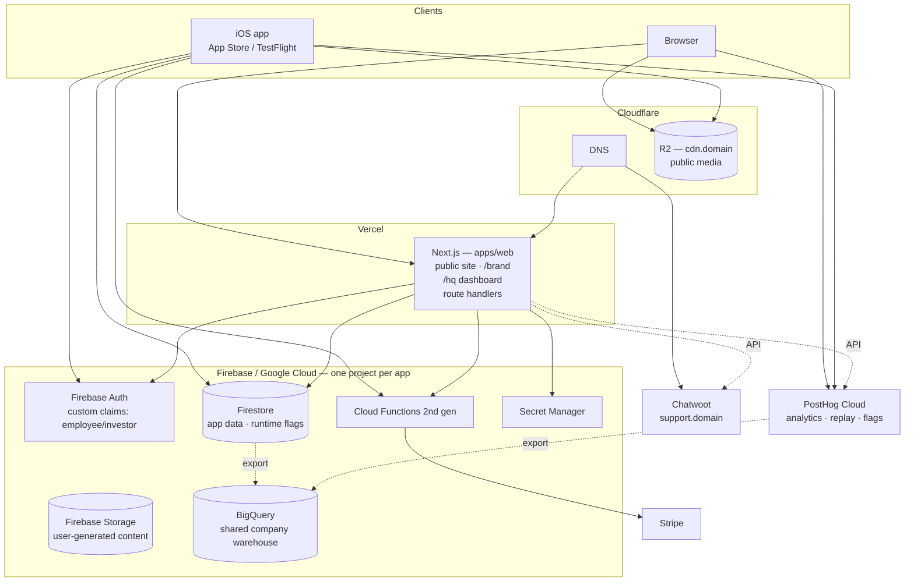
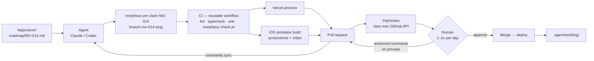
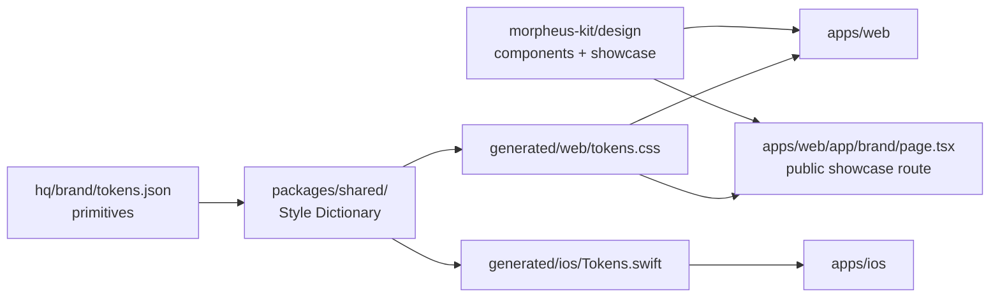
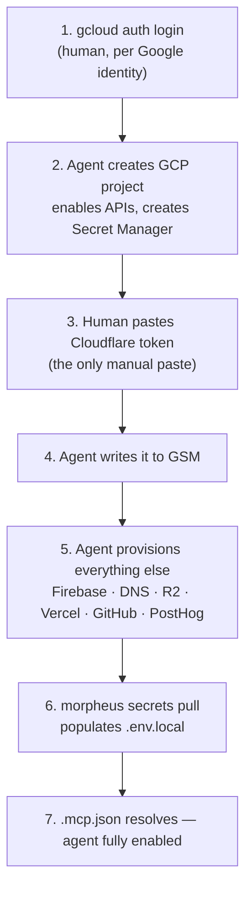

# Morpheus — Architecture

This is the specification. It states what Morpheus is, what a project it creates looks like, and
why each choice was made. Decisions carry their reason; they do not carry the argument that
produced them. Genuine unknowns are collected in [§21](#21-open-questions).

Read it top to bottom the first time: Part I is what this is, Part II is the shape of a project,
Part III is how work actually happens, Part IV is the subsystems, Part V is how Morpheus itself
gets built.

---

# Part I — Orientation

## 1. What Morpheus is

Morpheus is a company-building machine: a single repository that can instantiate a complete,
running business — software product, brand, dashboards, automations, third-party integrations —
and then keep every business it created up to date.

The observation behind it: across five web projects built in quick succession, roughly 80% of the
technology and company stack was either *entirely reusable* (design token pipeline, auth gate, CI
workflows, deploy config) or *structurally reusable* (brand documents, roadmap format, QA
checklists — same shape, different content). Rebuilding that 80% each time is waste, and the
copies drift.

Morpheus makes the 80% a dependency instead of a copy.

### The two halves

| Half | What it is | How it reaches a project |
|---|---|---|
| **Initializer** | A CLI that creates a new company repo with full scaffolding | Copied at `init`, then owned by the project |
| **Kit** | One versioned package of reusable runtime code and tooling | Depended on, upgraded over time |

### Who this is for

Chris, plus a small number of family and friends. It is not a product. Three consequences:

- **Opinionation is free.** No user wants Vue. Canonical choices are hard-coded.
- **Public namespace collisions do not matter.**
- **Multi-tenancy, billing, and onboarding UX are out of scope.** Forever.

## 2. Design principles

1. **Agents are the primary operator; humans review.** Every artifact is chosen for legibility to
   an agent first. Markdown over databases. Files over GUIs. SQL over proprietary APIs.

2. **One obvious place for everything.** An agent should infer a file's location from its purpose
   without searching. Directory names are plain nouns.

3. **Canonical choices, stated once.** The stack is decided here. Projects do not re-litigate it.
   Deviations are recorded in the manifest, not discovered by reading code.

4. **Import, don't sync.** Where two places need the same fact, one owns it and the other imports
   it. Copying with a sync step is drift waiting to happen.

5. **Reusable code is a dependency, never a copy.**

6. **Templates are copies and that is fine.** Scaffolding is a starting point; projects diverge.
   Do not build machinery to keep templates in sync — build machinery to *add* new ones (§18).

7. **The human checks in once or twice a day.** Anything requiring human input queues rather than
   blocks. Agents must always have work available that needs no approval.

8. **Buy where the vendor holds a regulatory, data, or platform moat; build where the vendor's
   value is collaboration UX we do not need.**

9. **Instructions are advisory; CI is enforcement.** Anything that genuinely must happen on every
   PR is a check, not a sentence in a markdown file.

10. **Extract on the second use, never the first.** Nothing enters the kit until a second project
    needs it. A wrong abstraction propagates into everything that adopts it.

---

# Part II — The shape of a project

## 3. Project structure

```
acme/
├── README.md                  # human entry point
├── AGENTS.md                  # agent entry point — canonical instructions
├── CLAUDE.md                  # symlink → AGENTS.md
├── morpheus.json              # project manifest (§4)
├── package.json               # workspace root
├── pnpm-workspace.yaml
│
├── apps/                      # deployable surfaces
│   ├── web/                   # Next.js — always present
│   │   └── tests/             # unit + component tests, colocated
│   ├── ios/                   # SwiftUI — optional
│   │   └── Tests/
│   ├── backend/               # workers, services, scheduled jobs — optional
│   └── hardware/              # designs, BOM, vendors — optional (§19)
│
├── packages/
│   └── shared/                # cross-surface: tokens, schema, generated types
│
├── hq/                        # the business layer — rendered at /hq
│   ├── brand/                 # identity, voice, visual system, messaging, assets
│   ├── product/               # goals, roadmap, feature requests
│   ├── marketing/             # SEO, ASO, social, content
│   ├── finance/               # revenue/expense model, dashboard config
│   ├── ops/                   # strategy, legal, contracts, vendors, procurement
│   ├── support/               # macros, escalation policy, known issues
│   └── inbox/                 # per-person status exchange (§7.5)
│
├── qa/                        # cross-surface QA (§9)
├── docs/                      # engineering documentation (§15)
├── infra/                     # deploy config, environments, IaC (§14)
├── .agent/                    # agent records (§7.5)
├── .claude/                   # skills, commands
├── .github/workflows/         # ci.yml, deploy.yml, agent-*.yml
└── local/                     # gitignored scratch
```

### `apps/` and `hq/`

**`apps/` runs as the deployed product; `hq/` is read, decided, and written down.**

Named `hq/` rather than `company/` because not every project is a company — `cpheinrich.com` is
personal, Morpheus is an internal tool — and because it makes the naming coherent across all three
layers:

```
hq/               the data          (markdown in the repo)
/hq               the view          (route in apps/web)
morpheus-kit/hq   the renderer      (package)
```

Whatever is in `hq/` is what `/hq` shows. Where `apps/` needs a fact from `hq/`, it imports rather
than copies (§12.3).

`apps/backend/` is the conventional home for a deployable product surface with no client UI: a
worker, scheduled job, inference service, execution loop, or similar long-running system. Name the
directory for that stable role rather than for one company's implementation (`trader/`, `bot/`).
Code that is imported by two or more surfaces still belongs in `packages/shared/`; code that runs
as the product belongs in `apps/backend/`, even when no other surface imports it.
That boundary is about ownership, not language: a non-TypeScript backend treats the canonical
schemas in `packages/shared/schema/` as contracts and conforms manually until a generator for its
language exists; it does not need to import the TypeScript package.

### Project kinds

Not every project needs every subtree. `morpheus.json` carries a `kind` that determines what gets
scaffolded and what `doctor` expects to exist.

| | `company` | `personal` | `internal` |
|---|---|---|---|
| Example | Darwin, Evo, Lakina | cpheinrich.com, heinrich.money | Morpheus |
| `hq/brand/` | ✅ | ✅ | — |
| `hq/product/` | ✅ | ✅ | ✅ |
| `hq/marketing/` | ✅ | ✅ | — |
| `hq/finance/` | ✅ | — | — |
| `hq/support/` | ✅ | — | — |
| `hq/ops/` (legal, contracts, vendors) | ✅ | — | — |
| `hq/identity/` | — | ✅ | — |
| Chatwoot inbox | ✅ | — | — |
| `/hq/investors` | ✅ | — | — |

**`personal` is the wizard default**, because most projects here are solo and the common case
should need the fewest answers. `company` is the deliberate choice when collaborators, revenue, or
legal entities are involved.

A **personal** project has no customer support and no corporate legal — a person does not have
terms of service with themselves. It has `hq/identity/` instead: contact details, professional bio,
licence and consent notes for photography, and anything else the site must state truthfully about a
real person.

An **internal** project is the minimal case: a roadmap and nothing else.

`kind` sets defaults, not limits — `morpheus add support` can bolt a support inbox onto a personal
project that grows one.

### `packages/shared/`, not `apps/shared/`

`shared/` is not a deployable surface, so it does not belong under `apps/`. It holds everything
consumed by two or more surfaces:

```
packages/shared/
├── tokens/semantic.json    # semantic mapping only — ownership in §12.1
├── generated/              # Style Dictionary output
│   ├── web/tokens.css, tokens.js, tokens.json
│   └── ios/Tokens.swift
├── schema/                 # Product contracts: analytics events and database shapes
│   ├── analytics.ts
│   └── *.schema.ts
├── generated/schema/       # codegen output
│   ├── web/types.ts
│   └── ios/Models.swift
└── messaging.json          # taglines, mission, audience — imported by web (§12.3)
```

## 4. The project manifest

`morpheus.json` — written by the wizard, read by agents. There is no `stack` block; the stack is
canonical and lives in this document. Only *deviations* are recorded.

```jsonc
{
  "morpheusVersion": "0.1.0",
  "name": "evo",
  "displayName": "Evo",
  "kind": "company",                 // company | personal | internal (§3)
  "org": "darwin-health",            // groups sibling repos (§17); omit for personal/internal
  "domain": "evo.med",
  "stagingDomain": "staging.evo.med", // only with a staging Firebase project (§13.2)
  "description": "One-sentence description.",
  "surfaces": { "web": true, "ios": true, "backend": false, "hardware": false },
  "integrations": ["firebase", "stripe", "posthog", "github", "slack", "openseo"],
  "accounts": { /* which identity per service — see §13.3 */ },
  "hq": {
    "route": "/hq",
    "allowlist": ["you@example.com"],
    "investorAllowlist": []
  },
  "inherits": {                       // §17 — what comes from the parent company
    "legal": "darwin",
    "hr": "darwin"
  },
  "deviations": [
    { "choice": "hosting", "value": "cloudflare", "reason": "..." }
  ]
}
```

The manifest names *which* identity a project operates as; the values live in Secret Manager
(§13). An agent opening the repo reads this and knows which account it is — the thing that most
often goes wrong when one person runs several companies.

`surfaces` is an optional, advisory declaration for agents; it does not make a surface mandatory or
cause `init` to scaffold an application directory. Projects record only the surfaces they need.

## 5. Where each business function lives

| Function | Location | Form |
|---|---|---|
| Web product | `apps/web/` | Next.js app |
| iOS product | `apps/ios/` | SwiftUI app |
| Android product | `apps/android/` | Deferred — bolt-on template later |
| Backend product | `apps/backend/` | Worker, service, scheduled job, inference or execution loop |
| Design tokens | `hq/brand/tokens.json` → `packages/shared/` | DTCG JSON → generated (§12.1) |
| Shared product schemas | `packages/shared/schema/` | Analytics contracts and database TS source → generated types + rules |
| Brand messaging | `hq/brand/messaging.json` | Imported by web |
| Analytics | PostHog Cloud + `/hq` KPIs | SaaS + dashboard |
| Automations | `.agents/skills/`, `.claude/skills/`, `.github/workflows/` | Skills + Actions |
| Staging | Vercel preview per PR | Ephemeral — no permanent staging environment |
| Unit tests | `apps/*/tests/` | Colocated |
| E2E tests | `qa/e2e/` | Playwright |
| QA checklists, acceptance | `qa/` | Markdown |
| Security posture | `qa/security.md` | Markdown |
| Cloud infra | `infra/` | Config + IaC |
| SEO | `hq/marketing/seo/` | Docs + OpenSEO |
| ASO | `hq/marketing/aso/` | Docs + Appeeky + ASC integration |
| Marketing content | `hq/marketing/content/` | Markdown |
| Organic social channels | `hq/marketing/{instagram,linkedin,x,reddit}/` | Account record + platform guidance + drafts/scripts |
| Virtual AI CMO | `hq/marketing/README.md` | Cross-channel evidence, prioritization and learning loop |
| Analytics initialization | `hq/marketing/analytics.md` | Decision, privacy, provider and verification brief |
| Launch planning | `hq/marketing/launch-plan.md` | Website plan + placeholder for a future app plan |
| Identity, mission, audiences | `hq/brand/strategy.md` | Markdown |
| Finance | `hq/finance/` → `/hq/finance` | Config + dashboard |
| Legal, contracts, ToS | `hq/ops/legal/` | Markdown + PDFs |
| Vendors, procurement | `hq/ops/vendors/`, `apps/hardware/` | YAML |
| Secrets | `secrets.manifest.json` + GSM | Manifest; values external (§13) |
| Customer support | Chatwoot + `/hq/support` | Self-hosted + dashboard |
| Agent instructions | `AGENTS.md`, `.agents/skills/`, `.claude/skills/` | Markdown |
| Agent records | `.agent/` | Markdown (§7.5) |
| Goals, roadmap, requests | `hq/product/` | Markdown (§8) |
| Engineering docs | `docs/` → `/hq/docs` | Markdown + Mermaid |
| HR | Google Workspace + Gusto | External |
| Investors | `/hq/investors` | Dashboard view |

## 6. Canonical tool choices

### Bought

| Function | Choice | Why not first-party |
|---|---|---|
| Auth, database, storage, push, crash | **Firebase** | Mobile services bundle is irreplaceable |
| Payments | **Stripe** | Regulatory surface |
| Banking | **Mercury** | |
| HR / payroll | **Gusto** | Compliance surface |
| Email, accounts | **Google Workspace** | Human mailboxes — not application email |
| Code hosting, CI, packages | **GitHub** | Substrate for everything else |
| Messaging | **Slack** | Agent notification target |
| DNS, CDN, public media | **Cloudflare** | CDN, R2 (§14.3), admin email — and DNS for every domain, see §6.1 |
| Domain registration | **Porkbun**, or **Cloudflare** where it carries the TLD | §6.1 |
| Customer email | **Resend** | Anything a customer receives — auth mail, receipts, product email. See below |
| Admin & internal email | **Cloudflare Email Sending** | Operator and agent notifications — see below |
| SEO research | **OpenSEO** | Data moat — see §6.2 |
| ASO research | **Appeeky** | App Store data moat, plus ASC/ASA writes — see §6.2 |
| Agents | **Claude + Codex** | |
| Error tracking | **Sentry** | |
| Web hosting | **Vercel** | §10.2 — every web surface, every size. Not Cloudflare Pages |
| Product analytics | **PostHog Cloud** | §10.3 |
| Hardware | **Macs** | |

**Application email splits by audience, not by vendor loyalty.**

**Anything a customer receives is Resend's** — verification links, password resets, receipts,
product email. Customer mail is deliverability-critical: the first message a new domain sends is
a password-reset-shaped email to a stranger's Gmail, and whether it lands in the inbox is the
whole feature. Resend earned the row on Evo's launch day — domain verified in under an hour,
auth mail delivered to the inbox (not spam) from a domain that had never sent email, and the
`deliver()` semantics the consumer-auth scaffold's tests now pin were field-tested the same day.
That evidence is worth more than vendor consolidation for the mail that customers judge.

**Anything an operator or agent receives stays Cloudflare's.** Email Sending is a service inside
a vendor already load-bearing for every domain's DNS (§6.1) and R2 media, reachable as a plain
bearer-token REST endpoint. Internal notifications have no sender-reputation stakes — the
recipients are your own mailboxes — so the already-in-the-stack vendor wins by default there.

Both are one seam in the scaffold (`deliver()` in `lib/email/send.ts`), so neither choice ties a
project's code to a provider. A project that departs from either row records a `deviations`
entry (§4).

Note the distinction the table makes: **Google Workspace is human mailboxes; Resend and
Cloudflare are application email.** Conflating them is how `cpheinrich.com` came to pick a
provider per-project instead of reading one off the spec.

### 6.1 Domains: DNS and registration are separate decisions

**DNS is Cloudflare. Always. There is no second option and it is not a per-project question.**

Every zone lives in Cloudflare, whoever the registrar is. One console, one audit log, one place an
agent looks to answer "where does this domain point". A project that puts DNS at its registrar has
made a mistake, not a choice, and it should be moved.

**Registration is a different question, because no single registrar carries every TLD.** That is the
reason this section exists: treating registration and DNS as one decision is what produced the
earlier claim that Cloudflare was "the registrar for every domain", which was never true.

Approved registrars, in order of preference:

| Registrar | Use when |
|---|---|
| **Cloudflare Registrar** | It carries the TLD — at-cost renewals, and DNS is already there |
| **Porkbun** | Cloudflare does not carry the TLD, which is most of the long tail |

Anything else is a deviation. Domains found at another registrar get transferred to one of these,
subject to the ICANN 60-day post-registration lock and whatever `clientTransferProhibited` state the
losing registrar has set — that status is a switch in the registrar's own panel, not a waiting
period, so check it before assuming a domain is stuck.

**Setting up a domain, in order:**

1. Register at Cloudflare if it carries the TLD, otherwise Porkbun.
2. Add the zone to Cloudflare — *Connect a domain*, not *Transfer*. Choose **manual** DNS import: a
   freshly registered domain's only records are the registrar's parking, and automatic import copies
   them into the new zone, where they then compete with the real ones.
3. Point the registrar's nameservers at the Cloudflare pair.
4. Add records in Cloudflare. Apex to Vercel is an unproxied CNAME — orange-cloud proxying puts
   Cloudflare's certificate in front of Vercel's and breaks the domain. Cloudflare flattens the apex
   CNAME, so no A record is needed, and none should be added: Vercel's IP range changes underneath it.
5. Delete the registrar's parking records once the zone is live.

**Known deviations today.** Recorded rather than left implicit — a deviation nobody wrote down is
indistinguishable from the canonical choice, which is exactly how the "Cloudflare is the registrar
for every domain" claim survived unchallenged.

| Domain | Deviation | Note |
|---|---|---|
| `heinrich.la` | **DNS at Porkbun**, not Cloudflare | The domain that motivated this section; still unmoved |
| `cpheinrich.com` | Registered at **Tucows** | Not on the approved list; DNS is correctly at Cloudflare |
| `darwin.health` | Registered at **Sav.com** | 60-day lock expired; `clientTransferProhibited` still set |

**Why not DNS at the registrar, concretely.** Porkbun's DNS editor is a staging form that does not
list a zone's existing records, so there is no way to see what is actually configured, or to
remove a
parking record, from its UI. That is not a knock on Porkbun as a registrar — it is why DNS does not
live there.

### 6.2 Search: SEO is OpenSEO, ASO is Appeeky

Two separate disciplines, two separate tools, and agents must not substitute one for the other.

| Discipline | Tool | Scope |
|---|---|---|
| **Website SEO** | **OpenSEO** | Keywords, SERPs, backlinks, rank tracking, site audits, Search Console, AI-visibility |
| **App store ASO** | **Appeeky** | App keywords, store metadata, competitor and chart intelligence, plus ASC / Apple Search Ads / Play writes |

**Any request about ranking a *website* goes to OpenSEO. Any request about ranking an *app* goes
to Appeeky.** The two vocabularies overlap enough — "keywords", "rank", "competitors",
"visibility" — that an agent reaching for the wrong one will return plausible, wrong numbers:
app-store search volume and Google search volume are different quantities that look identical in
a table.

**These replace Semrush and AppTweak**, which earlier drafts named. Semrush was chosen for the
data moat and priced as a seat subscription; OpenSEO reaches comparable data billed by usage, is
open-source and self-hostable, and — the reason that decides it here — ships an MCP server as a
first-class surface rather than an afterthought. Appeeky replaces AppTweak on the same logic, and
additionally writes: it reaches App Store Connect and Apple Search Ads, so an agent can act on
what it finds instead of only reporting it.

Both authenticate as remote MCP through claude.ai (§13.4), so neither puts a key in a repo.
Credentials for the *downstream* accounts Appeeky writes to — App Store Connect, Apple Search Ads,
Play Console — are a separate authorisation, granted once inside Appeeky.

**Search Console setup is part of website SEO setup, not a later human errand.** The agent first
tries to create or open the domain property in the authenticated browser, complete verification,
submit the sitemap, inspect indexing plus Manual actions and Security issues, and request indexing
for a small set of launch-priority URLs. A request entering Google's crawl queue is recorded as a
request, never as proof of indexing. The project-local checklist and dated operating record live in
`hq/marketing/seo/`.

If the browser cannot proceed, the agent asks for the **smallest exact prerequisite** — the named
Google identity to sign into, an interactive security check, Search Console permission, approval
for an external DNS change, or a choice between genuinely ambiguous identities — and resumes once
it is supplied. It does not replace the attempt with generic click instructions, ask for a password
or verification code in chat, or mark setup complete because access could not be checked. This is
the browser-reachable-work rule in §7.3 applied to SEO. Search Console is Google's operational
indexing surface; OpenSEO remains the research surface, and neither substitutes for the other.

Every user-facing project starts with `hq/marketing/seo/strategy.md`. It is an initialization
brief, not a synthetic strategy: an agent replaces it only after recording current site, OpenSEO,
Search Console, audience, competitive, safety and editorial evidence. The strategy states the
discovery thesis, current baseline, query-to-page portfolio, exclusions, technical/trust work,
authority plan, measurement cadence and phased milestones. Search estimates stay directional and
unknown state stays unknown.

`hq/marketing/launch-plan.md` connects that strategy to a staged website launch: readiness gates,
assets, channels, exact approvals, placements, measurement and stop conditions. Its app section is
deliberately a placeholder until a real build, store identity, listing, privacy disclosures,
screenshots, analytics and release candidate exist. At that point Appeeky supplies ASO evidence;
OpenSEO website data is not reused as app-store demand data. A launch plan prepares external
actions but never authorizes publishing, posting, outreach, account creation, spending or store
submission.

Every user-facing project also starts with `hq/marketing/instagram/`, `linkedin/`, `x/`, and
`reddit/`, whether or not those accounts exist yet. Each channel README holds the public account
identity, current platform-native creation and measurement guidance, and the boundary for future
scripts. The empty account fields are a deliberate setup reminder. Credentials, recovery methods,
session material, and private tokens never belong there.

Together these records form the operating surface for a virtual AI CMO. Its continuing loop reads
product analytics, Search Console, OpenSEO or Appeeky evidence, channel analytics, customer
language, market movement, and competitors; distinguishes attention from qualified traffic and
product outcomes; proposes a small cross-channel portfolio; adapts truthful work to each platform;
and records results back into research, experiments, content, and the roadmap. GEO and AI-answer
visibility are part of that portfolio, grounded in the same product truth and source evidence as
SEO rather than a separate collection of unsupported claims.

Continuing work does not mean unattended publication. Automation defaults to research, drafting,
validation, metric collection, or dry-run mode, with an exact account, current rules/API access,
duplicate prevention, and an audit trail. Posting, replying, direct messaging, outreach, spending,
account creation, and credential changes follow the project's explicit approval policy. Votes,
follows, fake engagement, unsolicited interaction, and rule evasion are never automated.

### Built and maintained in Morpheus

| Function | Why build it |
|---|---|
| Internal dashboard (`/hq`) | Every alternative is built for teams; we need one pane agents write to |
| Project management | Goals/roadmap/requests as markdown in git beats any API |
| QA tracking | Checklists next to the code they check |
| Automations | GitHub Actions + skills; no Zapier |
| Review queue | GitHub PRs + `decision` issues (§7.4) |
| Investor reporting | A view over the same data, gated differently |

### Self-hosted

| Function | Choice | Notes |
|---|---|---|
| Customer support | **Chatwoot** | §16 — at `support.<domain>`, surfaced in `/hq/support` |

### Stack defaults

Next.js (App Router) · React · TypeScript · Tailwind · pnpm · Style Dictionary (DTCG) ·
Vitest + React Testing Library · Playwright (E2E) · SwiftUI · uv + ruff + pytest where Python is
needed.

---

# Part III — How work happens

## 7. The agent operating model

### 7.1 Instruction layering

- **`AGENTS.md` (root)** — canonical, project-wide. `CLAUDE.md` symlinks to it so Claude and Codex
  read exactly one file. Generated at init from `morpheus-kit/agent` fragments plus project
  specifics, with a marked region the CLI can update on `morpheus upgrade`.
- **`apps/web/AGENTS.md`** — surface-specific.
- **`.agents/skills/`** — repository-owned Codex skills: named, repeatable procedures shared by
  everyone who clones the project.
- **`.claude/skills/`** — repository-owned Claude skills where that provider needs the same kind
  of discoverable procedure.

### 7.2 Conventions and how they are enforced

The conventions: every PR includes tests where testable, updates docs when behaviour changes,
carries a staging link, updates roadmap status, states a test plan, lists open questions, records
self-review, and closes every GitHub issue the roadmap item declares it resolves.

| Layer | Mechanism | Strength |
|---|---|---|
| Instruction | `AGENTS.md` | Advisory — agents mostly comply |
| Visible | `.github/pull_request_template.md` | Social |
| **Enforced** | **`ci.yml` — `morpheus check pr`** | **Blocking** |

`morpheus check pr` fails the build when: source files changed without corresponding test changes
and no `skip-tests` justification is present; a public API changed without a `docs/` change; the PR
body is missing required sections; or the roadmap item named by the branch was not moved to
`review`. A roadmap item created with `pm new roadmap --issue 123`, or updated with
`pm link-issue <ID> 123`, carries `issues: [123]` in its frontmatter and displays it in the generated
roadmap; `check pr` requires `Closes #123` (or another GitHub closing keyword) in the PR body.
The structured field distinguishes completion from a merely related issue mention, while GitHub's
native merge behaviour performs the actual close.

Instructions get ignored eventually. A failing check does not.

### 7.3 The work loop

1. Agents pull work from `hq/product/roadmap/` and `qa/`.
2. `morpheus pm claim <ID>` starts it — derives the branch from the id, marks the item
   in-progress, and pushes. Never on `main`.
3. Push triggers CI and a Vercel preview deploy.
4. The PR carries a summary, staging link, screenshots, and a test plan.
5. The human reviews at `/hq/review` or on the Vercel preview, leaving anchored comments.
6. Comments sync to the PR; the agent ingests them and iterates.
7. Approval merges and deploys.

**`pm claim` is the only supported way to start work.** Three things are derived from the item id
at claim time and cannot be kept in agreement by anyone remembering to: the branch name, the item's
`in-progress` status, and the claim itself, which *is* the remote branch. `git checkout -b`
produces none of them, and the failure surfaces at `check pr` — after the work is done and the
branch is expensive to rename. Recovery is `pm claim` on a fresh branch plus a cherry-pick, which
is why `check pr` names the command in its failure message.

**`pm claim` reconciles the board first**, marking merged work shipped and recording its PR number,
so those status changes ride along in the claim commit. Running reconciliation after a merge
instead leaves the change in a dirty tree on protected `main` with nowhere to go, which is how a
housekeeping step gets quietly dropped. A board that lags reality stops being read.

**Never-blocked rule:** when the queue is full, agents must have a backlog needing no approval —
tests, docs, refactors, research written to `.agent/`. An idle agent is a design failure.

#### Three exits, not two

An agent finishes, or it fails — and given only those two, a run that meets real ambiguity takes
the worse one: it guesses, and ships something plausible. The third exit is **blocked**: started,
hit ambiguity, stopped, and here is exactly what is needed.

**Escalating is cheap; shipping half-baked is expensive.** That asymmetry is structural rather
than advisory, because advice loses to momentum:

```sh
morpheus pm block MO-051 --needs "which model, and whose subscription pays for it"
```

Which sets `status: blocked` and `needs:` on the item, writes a worklog entry with
`outcome: blocked`, raises an open `❗` item in the owner's inbox, and commits and pushes those
records on the claimed branch. Online it refuses the protected trunk
before writing; the explicit offline path may write locally because it never commits or pushes.
**A blocked item must name its unblocker** — `needs` is required by the schema when the
status is `blocked`, so "I am blocked" without "here is what I need" does not validate. It would
otherwise be a crash with better manners. Calling it on an already-blocked item replaces the reason,
including repairing the hand-edited `blocked`-without-`needs` state that the schema rejects.

A blocked item keeps its claim: the partial work lives on that branch, and re-taking it means
checking it out rather than starting over. But **blocked is not in-flight** — it holds a branch
and consumes no lane, or one unanswered question would permanently cost a slot (§7.8).
The blocked branch is therefore not merged. Block records that must reach trunk travel on a
records-only branch staking no item; `check pr` points there instead of falsely suggesting
`status: review`.

#### What blocked is not

**An obstacle an agent could clear itself is not a blocker.** The recurring case is a browser: a
console to click through, a dashboard to read, a setting to verify. Agents have parked work on
these, waited hours for a human, and then cleared them in a minute when told to try — the wait was
pure loss, because the agent could do it and only asking cost anything.

So: **when the only obstacle is that something must happen in a browser, drive the browser.** Look
first, and report what was seen (§*use the browser tool to verify UI*). Do not describe what a
human should click.

The boundary is what makes this safe, and it is about obstacles rather than gates. Where a human is
wanted for **judgment** — spending, publishing, sending, granting access, anything under §7.4's
approval queue — the gate stands, and the browser being where it happens changes nothing. The rule
applies only where browser use is the *single, entire* obstacle.

### 7.4 The review queue is GitHub

Any design requiring a sync job between GitHub and a database has two copies of the same state and
a job that can fail. So there is no separate store.

| Item | Lives as | Why |
|---|---|---|
| Code awaiting review | **Pull request** | Already the source of truth |
| Non-code decision | **Issue labeled `decision`** | Structured body, state, assignee, comments, API |

Spending approvals, copy sign-off, and vendor selection are all fine as issues. Agents create them
via the API; closing one approves it.

`/hq/review` is a **read-only view over the GitHub API**. Nothing to sync, and it degrades
gracefully: with no `/hq` deployed, the GitHub PR and issue lists *are* the queue — which is
exactly how Morpheus itself operates (§19.3).

**Firestore is reserved for state the running application must read** — a launch-approval flag the
web app checks at request time. That is a different need from "a human owes me a decision."

### 7.5 Agent records

Deliberately minimal: markdown in git, no vector database, no external store.

```
.agent/
├── decisions.md          settled choices and their reasoning   ← read first
├── learned.md            technical facts and gotchas           ← read first
├── inbox-archive/        past cycles of hq/team/, with replies
└── worklog/              what was attempted and learned per task
```

Two raw logs, each feeding exactly one distillation:

| Raw | Feeds | Answers |
|---|---|---|
| `inbox-archive/` | `decisions.md` | *What did we decide, and why?* |
| `worklog/` | `learned.md` | *What do we know about how this behaves?* |

**`hq/team/<handle>.md` is the live exchange** — one file per person, named by GitHub handle, and
the only file a human is expected to edit. An agent writes a prose summary of what got done, then
numbered items each ending in a `~` reply slot. The human replies inline. On the next turn the
agent acts on the replies, promotes anything durable to `decisions.md`, archives the exchange to
`inbox-archive/`, and writes a fresh inbox. One inbox per *person*, not per session, so two agents
working for the same human land in one place — and two people never touch the same file, so git
never merges a status.

Worklog entries carry frontmatter (`agent`, `date`, `roadmap`, `outcome`) and record what was
attempted, what happened, and what was learned — **including dead ends that produced no code**,
which is the part git history cannot capture.

**A meeting record lands before its interpretation.** Deliver each meeting note in an isolated pull
request containing only the factual canonical record. Roadmap changes, strategy refinement,
implementation, decision promotion, and every other follow-up belong in separate pull requests, so
reviewers can distinguish what happened in the meeting from what an agent later inferred from it.
A roadmap follow-up backfills filed ids into the note's `roadmap:` field; that link is bookkeeping,
not interpretation.

Git rather than cloud storage because these are small, textual, appear in PR diffs, and are
greppable with no authentication. Indexing markdown later is easy; migrating off a bespoke store is
not.

### 7.6 Ingestion loops

Scheduled agent runs (GitHub Actions cron) that read the world and propose changes:

| Loop | Cadence | Reads | Produces |
|---|---|---|---|
| Bug triage | Daily | Sentry, Chatwoot, bug form | Labeled issues, roadmap entries |
| Analytics review | Weekly | PostHog MCP | `/hq` KPI notes, roadmap proposals |
| Organic growth review | Weekly | Search Console, PostHog, channel analytics, approved live data | Marketing experiments, drafts, roadmap proposals |
| Support sweep | Daily | Chatwoot API | Draft replies queued for approval |
| Finance sync | Weekly | Stripe, Mercury | `/hq/finance` update |
| Market research | Monthly | OpenSEO, Appeeky, web | `hq/marketing/research/` |
| Roadmap proposal | Weekly | All of the above | **A PR against `hq/product/roadmap/`** |

**Agent proposals arrive as pull requests.** Review is a diff, and the human edits the proposal in
the same place the agent will read it back from. No separate approval system.

### 7.7 The work graph

`hq/` is organised by topic — product, brand, finance, marketing. That is an **organisational
map**: it answers *where does this kind of thing live*. It is not a work graph, which answers a
different question — *what output unlocks what next, and under what condition*.

Both are useful and they are not the same lens. Morpheus is already graph-shaped: a request
becomes a roadmap item, an item becomes a claim, a claim becomes a PR, a PR becomes a shipped
status. What was missing is that the **edges were implicit**, living in prose and habit rather
than in anything traversable. That matters more here than in a normal codebase, because agents
extend the board at runtime — they are rewriting the graph while walking it.

**The test for drawing an edge: the schema already declares it and nothing traverses it.** A
dangling field is not a hypothetical — someone thought the handoff mattered enough to reserve a
place for it, and then no path was built. Speculative edges are worse than absent ones, so this
rule is what keeps the graph honest.

Three qualified, and each is built rather than described:

| Edge | Declared as | Was traversed by | Now |
|---|---|---|---|
| blocked work → the human | `JournalEntry.outcome` includes `blocked` | nothing | `pm block` (§7.3) |
| an item → its acceptance criteria | `RoadmapItem.acceptance` | nothing; no item ever set it | rung 3 (§9) |
| goals + board + in-flight → the next item | §7.6's "roadmap proposal" loop | nothing | the heartbeat (§7.8) |

Two more dangle and are deliberately **not** drawn yet. `Request.roadmap` (promotion from request
to item) and `Goal.current` (updated by the analytics loop) have one use each, and *extract on the
second use* applies to edges as much as to code.

### 7.8 The heartbeat

Everything above starts because a human opened a session. The heartbeat is the one thing that does
not: a scheduled run that reads the board, decides what should happen next, raises it, and stops.

**It is a dispatcher, not a doer.** Doing the work inside the beat puts an unattended agent on a
timer, which is a much larger decision than scheduling one.

Four moves:

1. **Read** — the board, the goals, and the live claims. All in git already; the history *is* the
   memory layer, so there is no store to add.
2. **Assess** — what is in flight, what is unblocked, what is aligned, and what is highest
   leverage.
3. **Propose** — surface the pick. Dispatch is a flag, off by default.
4. **Record** — nothing new. The board is the completion record and `pm claim` reconciles it.

**Assess is a ranking function, not a prompt.** This is the design decision worth stating, because
the obvious reading of "identify the highest-leverage work" is a model call, and building it that
way makes the heartbeat unrunnable without a credential, untestable in CI, dead at the first
billing failure, and non-deterministic in something that runs unattended. Every input is
computable from files in git: priority, goal status, claim age, ceiling headroom. A model can
reorder or veto later — as a second opinion over a ranking that stands on its own.

Guards, each closing a specific failure:

- **Concurrency ceiling.** At or above it the beat picks nothing. This is what stops a runaway
  queue, so it is the one guard that must never be advisory.
- **Settled is not in-flight.** A blocked item waits on a person; a shipped or dropped item is over;
  and a `review` claim whose PR is provably merged is only waiting on reconciliation. None consumes
  a dispatch lane. Surviving completed branches are still reported because they block a future
  claim with the same id.
- **Nothing is a valid answer.** An empty beat exits successfully with a reason. A heartbeat that
  cannot do nothing will invent work to justify itself.
- **Blocked-but-actionable work is re-surfaced, not re-raised.** `pm block` already filed it; a
  cron that duplicates items teaches people to ignore it.

The beat writes nothing to the repo. A scheduled job that commits would have to push to protected
`main`, which agents may not do — so the report is the Actions job summary, which is durable
enough and has no such problem.

Configured per project, because the ceiling is a property of the project rather than of whoever
triggered the run:

```jsonc
// morpheus.json
"heartbeat": { "ceiling": 3, "dispatch": false }
```

`morpheus heartbeat` runs a beat by hand; `.github/workflows/heartbeat.yml` is the reusable
workflow and the calling repo owns the cron, since cadence is a project's own business. Exit codes
separate the three outcomes that matter: **0** the beat ran (pick or no pick), **1** it could not
read state, **2** dispatch was asked for and refused. A beat that could not reach origin refuses
rather than proceeding — an unreadable queue is not an empty one, and reading it as empty would
dispatch straight through a full ceiling.

### 7.9 Voice sessions

Thinking out loud is a different mode from working, and Claude is good at it — but a voice session
has none of a working session's capabilities. It cannot read the repository, run the CLI, or see the
board, and it starts cold every time.

So context moves in and out as text, and the design is one split:

| Half | Lifecycle | Where |
|---|---|---|
| **What the project is** — how work happens, conventions, how to close a session | changes when a convention does | uploaded once as claude.ai **project knowledge** |
| **What the board looks like today** | stale in hours | regenerated per session and pasted in |

`morpheus voice knowledge` writes the first, `morpheus voice brief "<topic>"` the second. The split
is what keeps each paste small enough that the conversation, not the briefing, gets the context.

It also survives the thing that could not be settled from the documentation: whether project
knowledge actually reaches a voice conversation. Voice mode *is* available inside a project chat —
the composer offers it whenever the Chat/Cowork toggle is on Chat — but if the knowledge turned out
not to reach it, `--full` inlines the explainer and nothing else changes.

**Handoffs live in `local/handoffs/`, in both directions, and are never committed.** They are
correspondence rather than record: what is worth keeping from one becomes a roadmap item, a decision,
or a worklog entry, and those *are* committed. `YYYY-MM-DD-<slug>.md`, dated in the same fixed
Pacific zone as the ids, so a handoff and the item it produced sort together.

The two directions are asymmetric, which is why one is a command and the other is not:

- **Out** is deterministic — board state, open inbox items, what landed since the last handoff — so
  it is `morpheus voice brief`, with a skill supplying only the session narrative the board cannot
  know.
- **Back** is judgment. A returning spec was written without the codebase in view, so ingesting it
  means checking it against the repository, finding the false premises, and saying which parts are
  being dropped. That is `.claude/skills/voice-import`, and it cannot be a deterministic command.

**The caveat is the load-bearing part.** Both the explainer and the brief instruct the voice session
to close with a spec that says it could not see the codebase and should be deferred to. That single
line, in a handoff received on 2026-08-01, is what caused a prompt-based heartbeat design to be
checked against reality and killed rather than built.

### 7.10 Context freshness

Everything above assumes an agent has read the records. Nothing made it prove that. A session can
start without loading `decisions.md`, and a session that *did* load it six hours ago can keep
working through changes another agent has since pushed — with a claim, a plan, and a draft PR all
looking like evidence of an agent that knows the current state.

Two assertions, both local and gitignored under `local/sessions/`:

| | What it asserts |
|---|---|
| **Context receipt** | *I read these records, at these fingerprints, against this remote SHA* |
| **Session lease** | *That receipt was checked against the remote at this time, and held* |

**The remote SHA is the tip of the trunk**, not the branch tip. The whole `fresh` verdict turns on
that field, so it gets one meaning: did the canonical trunk move under this session, which is what
another agent merging does. Which ref *is* the trunk is declared rather than assumed — see below.

One file: `morpheus context refresh` builds the receipt and the lease that carries it, and the
lease is what persists. The receipt is not stored separately because it has no separate reader.

**A lease has a five-minute term**, which is the whole difference between the two. Past it the
lease states a historical fact, not a fact about now, so it degrades to `refresh_required` rather
than carrying its verdict forward. So does one whose check time is unreadable, or in the future
because a clock moved.

Three states, and the third is the point: an unreachable remote is `unknown`, never assumed
unchanged. **The guard refuses anything but `fresh`** — `gate()`, against the `GATED` table of
commands and their `Reach`. It fails closed, and offline is *contained* rather than blocked: see
below. (`requireFresh` is the policy module's own boundary and has no production caller; `gate` is
what commands go through, because refusing well needs the reach and the message as well as the
verdict.)

Two rules keep the artefacts honest, both learned by getting them wrong first:

- **A receipt is measured against a declared required set**, not just against itself. A receipt
  listing nothing would otherwise be indistinguishable from one listing everything — the same
  shape as a check that skips what is absent and reports the empty thing as correct. An *empty*
  declared set switches the check off and is the only thing that does, so a project config must
  distinguish "none declared" (take the default) from "declared as none": a blank or unparseable
  field yielding `[]` would hand every generated project a check that passes for having read
  nothing.
- **Drift is derived, not asserted**, and the observation's fingerprints are a required argument
  for the same reason. Optional, omitting them *is* the caller choosing to report no drift, under
  another name. The comparison walks the *required* set rather than what the observation reported,
  so an entry left out is unverified rather than unchanged — the same hole one level down.
- **A record with no content never counts as read.** It fingerprints to a sentinel rather than
  throwing, because a freshness check is the wrong place to abort with a raw filesystem error — but
  the sentinel is then *excluded* from the comparison rather than compared. Both sentinels
  fingerprint identically on each side, so equality alone makes *I could not read it* match itself,
  and — the wider case — makes a wrong root, where every required record is missing, certify
  `fresh`. Outside the required set `absent` does compare, because *nothing there and still nothing
  there* is genuine knowledge. This is [`.agent/learned.md`](.agent/learned.md)'s sentinel rule; it
  cost four review rounds to see once.
- **What re-reading cannot fix is reported separately.** Folded into the flat changed list, a
  record that yields no content is indistinguishable from one another agent edited, and a runner
  told only "these ids changed" loops on a refresh that can never succeed — the wrong-root case
  most of all, since a bad path is a caller mistake where a permission fault is a machine's. The
  guard's message subtracts them from what it asks to be refreshed, and the adapter has **two
  channels** rather than one — a runner given only `requestRefresh` has to guess, and the guess it
  makes is the loop.

**Local, and deliberately not shared.** A receipt says *this working copy read these files*, which
is true of one machine. Committing it would turn a local observation into a claim about everyone.
Shared evidence stays what it was: the worklog, the commit, the PR.

Local state is validated on the way **out** as well as in, and strictly: the receipt's one
privacy claim — safe source labels, never conversation text — is only a property of the artefact if
something checks at the point of writing, and a strict schema is what makes the next persisted-key
change loud rather than silently lossy.

The policy is pure and provider-neutral, sitting behind a `SessionAdapter` that runners implement
but do not own — so CI exercises fresh, stale, expired, offline and never-loaded paths with a mock,
needing neither GitHub nor a Codex or Claude account.

#### Where the gate actually is

**Inside the `morpheus` CLI**, not in per-project configuration. Every project already shells out
to `pm claim`, `pm new`, `pm link-issue`, `pm block` and `access sync` — those *are* the governed
actions — so the
check is live everywhere the moment a project bumps its git dependency. Nothing to scaffold,
nothing to migrate, and no per-provider wiring. Provider hooks reach one runner each for the same
effort, which is why they are the last layer rather than the first.

| Surface | Reaches | Per-project work |
|---|---|---|
| The CLI gate | every project, agent and human | none — bump the dependency |
| `check pr`'s `context-drift` | every PR | already centralised |
| `.claude/settings.json` | Claude Code sessions | one scaffolded file, informational |
| `.codex/hooks.json` | Codex sessions | the same, in Codex's own file |
| `AGENTS.md` | anything that reads instructions | scaffolded |

**Both providers read the same hook schema** — `hooks.SessionStart[].hooks[]`, a `type` and a
`command` — from two files, so the wiring is one fact written twice rather than two designs. The
literal lives in `src/session/install.ts`, beside the protocol, and the scaffold imports it.

Codex adds a step Claude does not: **a command hook must be reviewed and trusted before it runs**,
keyed on the hook's hash, via `/hooks` in a session. Until then the file exists and fires nothing.
That is a gate rather than an obstacle — it is a human approving code that will run automatically —
so `context install` names it rather than routing around it.

#### A scaffold only reaches new projects

`morpheus init` writes both files, and `init`'s writer skips anything already present. That is
right for a scaffold and it means **nothing carries a new scaffold file into a repository that
already exists**: six of eight projects had no session-start hook months after the protocol
shipped, and seven of eight never declared `context.handle`, so their sessions certified `fresh`
without the inbox in the required set at all. `doctor` had been reporting both the whole time,
which is the tell — the gap was not detection, it was that nothing could act on it.

So the repair is its own command, `morpheus context install`: idempotent, **merging rather than
overwriting**, and refusing any file it cannot parse rather than replacing it. A repo that added
`.claude/settings.json` for permissions gets the hook alongside what is already there, where the
scaffold would have skipped the file forever while reporting the project complete.

It declines to declare a handle whose `hq/team/<handle>.md` does not exist. A declared record that
is absent is unresolvable, therefore never `fresh`, and no flag reaches it — writing that to clear
a warning would be the repair causing the outage.

**Five commands are gated and the rest are not.** `pm claim` (claiming work you would not claim
knowing what merged), `pm new` (filing an item that already exists), `pm link-issue` (attaching an
issue to obsolete or unrelated work), `pm block` (escalating a question the inbox answered),
`access sync` (granting from an allowlist that moved). A gate that
also fired on `pm index` or `check pr` would train people to route around it, and **the
routing-around is permanent where the staleness was temporary.**

**A hook may not certify, but it may discard.** The lease is keyed on the worktree, so a session
starting where another refreshed minutes ago would inherit its ✓ — the failure this whole section
is about, arriving through the surface added to prevent it. `context brief` discards the stored
receipt before reporting: that asserts nothing, so it does not violate the rule below, and it is
what makes the lease session-scoped rather than merely working-copy-scoped. Its **project-context
report is entirely local**; one separate, bounded `ls-remote` compares the installed Morpheus
receipt to canonical `main`, because this hook is the only device-wide chokepoint before local tools
can disagree with CI. Offline skips that advisory check. It also lands correctly
on a session *resumed* after a context compaction, which is exactly when an agent has lost what it
read. Discarding rather than downgrading, because flipping the stored status does not survive the
next check — which re-observes from the receipt, and the receipt is still valid.

**The branch is part of what a receipt is about.** A `git checkout` inside the five minutes puts
different canonical records on disk, so `check` compares `receipt.branch` before trusting the term.
When a re-observation proves the receipt still true on a different branch, `check` **re-anchors it
there** — otherwise the mismatch is permanent for the session and every gated command goes back to
the network. It sits in `check` rather than at a call site because two prescribed workflows switch
branches: `pm claim` checks out the branch it stakes, and resuming blocked work is a bare `git
checkout`. Fixing either call site would leave the other.

**Taking a receipt is a command, never a side effect.** `morpheus context refresh` is the agent
asserting it has loaded current state. A hook that took one at session start would certify the
records were read by the act of not reading them, so the Claude hook prints `context brief` and
takes nothing. That command exits 0 by design rather than by `|| true`, so a missing binary does
not get swallowed the way a stale lease would be.

**The term is how often the network is consulted.** Inside five minutes the last observation
stands and the check costs one file read. Past it, the stored *receipt* — not the stored verdict —
is re-observed against `git ls-remote origin main` and the records as they are now. `ls-remote`
rather than `rev-parse origin/main`, which reads a local ref only as current as the last fetch:
the exact looks-checked-is-not failure the lease exists to catch.

**The trunk is declared, not assumed.** `origin` is not always canonical — on a fork it *is* the
fork, whose `main` sits still while the real trunk moves, and a lease measured against it certifies
`fresh` indefinitely. `context.trunk` in `morpheus.json` names it; undeclared, `origin/HEAD` is
asked before falling back to `origin/main`. And a ref that does not exist is distinguished from a
remote that cannot be reached (`ls-remote --exit-code`), because both produce an `unknown` lease
and only one of them is a network problem — conflated, a repo whose default branch is `master` was
permanently refused with a message blaming connectivity.

**A command that writes a required record re-fingerprints it — but only what it actually read.**
`pm block` appends to the owner's inbox, which the required set names, so the next gated command
past the term would be refused for drift the session authored. Re-fingerprinting keeps the
assertion *true* rather than having it re-asserted blindly, and refusals with no informational
content are the fastest route to the gate being routed around.

The caller passes the content it read immediately *before* writing, and the receipt is updated only
where that still matches what it asserts. Otherwise this is the one path that can **destroy**
evidence rather than fail to act on it: `check` returns early for an in-term lease without
re-reading anything, so a human replying in the inbox inside the five minutes is invisible — and a
blind re-fingerprint would absorb their reply into the receipt, which is the only record of what
was read.

**Offline is contained, not permitted.** `MORPHEUS_OFFLINE=1` lets local work proceed on an
`unknown` lease and still refuses anything that leaves the machine. `pm block` is the one command
that changes shape rather than being refused: it writes the records and skips the push, reporting
that the block is not yet visible. AGENTS.md tells an agent facing real ambiguity to block rather
than guess, and refusing that offline leaves guessing or stopping — for exactly the session that
most needs the third option. It has to be *declared*: an
unreachable remote is `unknown` either way, and inferring the exception from the symptom would
make every network blip an unlocked gate.

**CI answers the question it can.** A receipt is local and gitignored, so no workflow can validate
one — it is one machine's observation by construction. What CI *can* see is whether the canonical
records moved on the base branch while a PR was open, which is the same freshness question from
outside. `check pr` reports it as a warning: a moving trunk is nobody's mistake, and blocking on it
would fail PRs for something outside the author's control at write time. Refusal belongs at the
local gate; visibility belongs here.

### 7.11 Code-health routines — proposed, not built

> **Status: a proposal.** Nothing in this section exists yet. It is written here rather than in a
> scratch document because the decisions it needs are architectural, and because the argument
> against the obvious version of it belongs next to §7.8, which is the decision it must not quietly
> reverse.

Everything in §7 improves the codebase **one item at a time**. Nothing looks at the whole of it.
Duplication accumulates between modules that no single item touches, dead code survives because
deleting it is nobody's task, abstractions outlive the requirement that justified them, and a flaky
test is tolerated by every session that is busy doing something else. These are real costs, they
compound, and they are invisible to a board whose unit is the feature.

A **routine** is a scheduled agent whose job is one narrow, repeatable improvement across a whole
repository, opening pull requests for what it finds.

**The prior art is Anthropic's own.** Boris Cherny reported running roughly a dozen such routines
daily across Claude Code's iOS, Android, desktop, web, CLI and SDK repositories: a crash fuzzer, a
duplicate unifier, a dead-code remover, an abstraction police, a flaky-test fixer, and others. Over
a few weeks they opened **388 pull requests, of which 180 merged.**

That last number is the design input that matters, and it should be read twice. A 46% merge rate is
a good result for a machine that costs nothing to run — and it means **208 pull requests were
opened that a human had to look at and reject.** Anthropic can absorb that. A one-operator company
cannot: Chris's review time is already the bottleneck the inbox format was redesigned around, and a
routine fleet at that hit rate would consume it entirely while feeling productive.

So the whole design below is about earning the right to open a pull request, rather than about
generating more of them.

#### The line this must not cross

§7.8 says the heartbeat is **a dispatcher, not a doer**, and dispatch remains off — not for want of
a credential, but because nobody has yet read a week of beats to see whether the ranker picks what
Chris would have picked. Routines are, precisely, doers on a timer. Adopting them casually would
reverse that decision by the back door, and reverse it *harder*, since a routine does not merely
pick work, it writes it.

Two things keep the decisions coherent:

1. **Routines never enter the feature lane.** They do not claim roadmap items, they do not consume
   the heartbeat's ceiling, and the heartbeat does not schedule them. Two independent surfaces with
   two independent budgets. A routine flood must not be able to starve the board, and a full board
   must not silence maintenance.
2. **A routine earns its way up the same ladder dispatch is still climbing** — report first, act
   later, and only on evidence. §7.11.4.

#### 7.11.1 What a routine is, exactly

A routine is a declaration, not a script:

```jsonc
{
  "id": "dead-code",
  "title": "Remove provably unreachable code",
  "requires": ["typescript", "test-runner"],   // skipped, loudly, where unmet
  "scan": "morpheus routine scan dead-code",   // deterministic, no model
  "prompt": ".github/routines/dead-code.md",   // versioned persona, reviewable
  "evidence": "build passes, full suite passes, and each deletion is named in the body",
  "blastRadius": ["src/**", "apps/**", "packages/**"],
  "budget": { "prsPerWeek": 2, "tokensPerRun": 400000 }
}
```

Four properties, each of which is a decision:

**A deterministic scan runs before any model.** The scan finds candidates — unreferenced exports,
duplicated blocks, tests with no failing assertion — and if it finds none, the run ends having
spent no tokens. This is the property that made an hourly heartbeat affordable (§7.8), and it is
the same one here: *a routine that finds nothing must cost nothing.* It is also why the catalogue
starts with mechanically-detectable problems and not with "improve the abstractions".

**The prompt is a versioned file**, for the reason `.github/agent-review-prompt.md` is: it is the
part that gets tuned most, the part a human most wants to read, and a prompt buried in YAML is
invisible in review.

**Every routine declares its evidence obligation** — what would demonstrate the change is safe —
and the pull request body must carry it. This is rung 3's `qa/acceptance/` idea applied to work
that has no roadmap item: the routine cannot be the only witness to its own correctness.

**Every routine declares its blast radius**, and it is enforced rather than requested. No routine
may touch `.agent/`, `hq/`, `morpheus.json`, `.github/workflows/`, or any file the Firestore rules
gate — records, board, configuration and security boundaries are not maintenance. A routine that
wants to change one of those files has found a *decision*, and decisions go to §7.11.5.

#### 7.11.2 One pull request per routine per run, not one per finding

The most consequential mechanic, and the one that most separates this from the prior art. 388 pull
requests for a dozen routines over a few weeks is roughly one PR per finding.

A routine opens **at most one pull request per run**, containing every finding of that one kind:
twelve dead-code deletions in one reviewable diff, not twelve pull requests. The reviewer's
question is then *"is this class of change correct here?"* asked once, which is the question a human
can actually answer, rather than the same question twelve times with the context reloaded each
time.

It also makes rejection cheap and informative: closing one pull request rejects a batch and tells
the routine something, where closing twelve tells it the same thing twelve times at twelve times
the cost.

The cost arithmetic is the second reason. Rung 2 reviews every pull request, at a measured ~$1.14
each (`.agent/decisions.md`), so per-finding pull requests would multiply the *review* bill, not
just the generation bill. **The gate, not the model, moves the bill** — already learned once, on
this same rung.

#### 7.11.3 Merge rate is the control loop

Every routine run records its outcome, and the record is a fact GitHub already has: opened, merged,
closed-unmerged, and how long it sat. From that:

- **A routine below its merge-rate floor is suspended automatically**, and says so. A routine whose
  pull requests are mostly rejected is not a neutral cost — it is an active tax on the one resource
  the company cannot buy more of.
- **Budgets are counted in pull requests, not tokens alone.** Tokens measure what it cost us;
  open pull requests measure what it costs *Chris*, which is the scarcer number.
- **Suspension is reported, never silent.** Same rule as an unconfigured verifier: a routine that
  stopped running must not look like a routine that found nothing.

This is the mechanism that makes the whole thing safe to leave switched on. Without it, every
routine is permanently as good as the day it was written, and the failure mode is not a bad pull
request but a slow erosion of the habit of reading them.

#### 7.11.4 Three stages, and the first one opens nothing

Directly modelled on two decisions already recorded: *the review rung proves itself on one repo
first*, and *dispatch stays refusing until the beats have been read*.

| Stage | What runs | What it may do | Exit criterion |
|---|---|---|---|
| **0 — Report** | Scan + model, on Morpheus only | Writes a findings report to the job summary and one `❗` inbox item per week | Chris has read a week of reports and agrees the findings are real |
| **1 — Propose** | Same, on Morpheus only | Opens pull requests, one per routine per run | Merge rate holds above the floor for a fortnight |
| **2 — Adopt** | Opt-in per project via `morpheus.json` | Same, in projects that ask for it | — |

A routine never skips a stage, and each new routine starts at stage 0 on its own. Stage 0 is cheap
insurance against the failure this design is most likely to have: routines that produce plausible,
confident, wrong findings, discovered only after they have been trusted for a month.

#### 7.11.5 Not every finding is a pull request

A routine produces one of three things, and only the first is automatic:

- **A pull request**, when the change is mechanical and its evidence obligation is satisfiable.
- **A roadmap item**, when the finding is real work with a judgment call in it — a duplicated
  abstraction whose unification changes behaviour at one of the call sites.
- **An inbox item**, when the finding is a question — a flag that has been on for four months, where
  deleting the flag and deleting the feature are both defensible and the routine cannot know which.

This is what stops "improve the abstractions" from becoming a machine for confidently wrong
refactors. The routine's job is to *notice*; deciding stays where deciding lives.

#### 7.11.6 Reuse across projects

The three distribution mechanisms (§18) already answer this, and the split falls out cleanly:

| Piece | Mechanism | Why there |
|---|---|---|
| The catalogue and prompts | Morpheus repository, versioned files | Reviewable, and one copy to tune |
| `code-health.yml` | Reusable workflow, referenced `@main` | Improving every project's routines is one commit here |
| `morpheus routine …` | The CLI | Selection, budgets and reporting are judgment with a type checker and tests behind them, rather than YAML with neither |
| Which routines run, and their budgets | `morpheus.json` | A property of the project, like the heartbeat's ceiling |

The calling repository owns the cron, because cadence is a project's own business — the same seam
as the heartbeat.

**A routine that does not apply must skip loudly.** `requires` is checked against the project, and
an unmet requirement produces a job summary saying the routine did not run and why. A routine
silently doing nothing in a repository that has no test runner is indistinguishable from a
routine that ran and found nothing, which is the failure this codebase has now written down four
times.

#### 7.11.7 Where Morpheus's own routines differ

Most of the prior-art catalogue is about code. Morpheus can run routines nothing else can, because
it has a written specification and a scaffold to compare a project against:

- **Convention drift** — `morpheus init` already reports every file it skipped because the project
  predates it. Evo was three scaffold generations behind and nobody knew until `web init` needed
  `firebase.json`. A routine that opens the adoption pull request turns that from an archaeology
  problem into a diff.
- **Deviation drift** — `morpheus.json` declares deviations from the canonical stack; a routine can
  check whether each is still true. Evo carried `output: "export"` as an *undeclared* deviation for
  months, and the cost surfaced as a blocked roadmap item.
- **Record drift** — a decision in `.agent/decisions.md` that the code no longer honours. This is
  the highest-value and the least mechanical, so it is a stage-0 reporter for a long time.

These are the routines to build second, and the reason to build the machinery at all rather than
one-off scripts: they are the ones no other project's fleet would ever have.

#### 7.11.8 What has to be decided before any of this is built

- **Cadence, and queue depth.** Daily is the prior art. Weekly may be right for one operator; the
  binding constraint is unreviewed pull requests outstanding, not runs per week.
- **The merge-rate floor**, and the window it is measured over.
- **Whether routine pull requests get rung 2 at all.** They are agent-written and would be
  agent-reviewed, which is thin independence for a doubled bill; the alternative is that a
  routine's declared evidence obligation *is* its rung 2.
- **Whether a proven routine class may ever auto-merge on green CI.** Dead-code removal with a full
  suite passing is the candidate, and it is also the point at which this stops being a proposal
  about tidiness and becomes one about unattended agents merging to `main`. Not now, but the design
  should not foreclose it.

### 7.12 Codebase knowledge is a device capability with an exact-checkout proof

Structural code discovery uses `codebase-memory-mcp` before filesystem search. That convention is
only real when the tool is available to the agent, its index follows the repository, and the graph
describes the checkout actually being edited. A binary somewhere on `PATH`, or a ready index for a
sibling worktree, is not operational evidence.

`morpheus codebase-memory install` is the explicit, idempotent trusted-device bootstrap. It:

1. inspects before writing and returns immediately when the device and checkout are operational;
2. installs a reviewed, exact package pin through the official npm wrapper when the native binary
   is absent or reports another version;
3. delegates client-specific file merging to the upstream installer, then sets `auto_index=true`
   and `auto_watch=true` as Morpheus policy;
4. creates a full index for the exact real path of the current checkout; and
5. verifies a ready project at that path whose recorded Git SHA equals `HEAD`, with at least one
   supported local agent client configured.

`--check` is read-only, and `morpheus doctor` carries the same finding with the repair command.
Generated `AGENTS.md` and README files put the check at the start of work, so a newly cloned
Morpheus project declares the device dependency rather than assuming another machine configured
it. Worktrees are deliberately separate: their code can differ, so sharing the main clone's graph
would turn fast search into confidently stale search.

**Installation is never an npm lifecycle side effect.** Morpheus is public and a clone or package
install must not run downloaded native code merely because dependencies were resolved. The command
is an operator-visible action on a trusted device, uses `execFile` rather than a shell, and keeps
the upstream version pinned in source. Freshness has two meanings and they stay separate:

- **Operational freshness** is proved every check: automatic maintenance is on and the exact
  checkout index equals `HEAD`.
- **Upstream freshness** requires the installed version to equal the reviewed Morpheus pin. The pin
  advances through an ordinary Morpheus change, not an implicit `latest` download from a hook.

The Morpheus CLI itself is installed as a self-contained global package, not linked to any clone or
worktree. The explicit `morpheus self install` command accepts only a clean checkout at current
`main`, rebuilds it, proves committed `dist/` still matches source, packs it, installs the copy, and
writes a receipt naming the exact commit. `morpheus self update` performs the same operation from a
disposable shallow clone and removes it afterwards, so the update cannot turn a temporary worktree
into permanent runtime state or rewrite active work.

`morpheus self check` compares that receipt to the canonical `main` ref. The same bounded check is
reported by `context brief` at session start and by `doctor`; it is advisory and silent when current.
An explicit offline declaration skips it. A legacy linked checkout is trusted only when the package
root is the exact Git root (never merely nested inside one), is clean, and contains current main.

Automatic update is a remembered **device decision**, never repository-implied consent.
`morpheus self auto-update enable` writes schema-versioned state under `~/.morpheus/` and installs a
marked block in `post-merge` and `post-rewrite` for every local registry entry. The block is appended
to recognised shell hooks rather than replacing them, so Git LFS and project-specific behaviour
remain intact. A new registry entry inherits an existing yes. Disable removes only the marked
Morpheus block. Status reports every project and malformed or incompatible hooks without editing
them.

The managed block invokes the absolute path of the copied CLI and calls `self ensure`. Ensure is
silent when current, serialises updates with a device lock, defers when canonical `main` cannot be
verified, and uses the same disposable-clone installation as `self update` when stale. Hook failures
are reported but swallowed so an already-completed pull or rebase is not presented as failed.

Git intentionally cannot activate a hook delivered by that same pull; otherwise cloning or pulling
an arbitrary repository could execute code on the device. The first-use bridge is therefore a
checked-in `.morpheus/session-start.sh` plus `AGENTS.md`. The shim only inspects: a current CLI
continues into `context brief`, while a missing CLI or one that predates the entire `self` command
emits the exact consent instruction.

After yes, `.morpheus/bootstrap.sh enable` clones reviewed current `main` into a disposable
directory, installs its reviewed lockfile, and invokes that clone's committed CLI directly — never
the stale installed binary. It installs the standalone package, registers the current project,
enables the managed hooks across the registry, and removes the clone. After no, `bootstrap.sh
disable` writes the schema-versioned
disabled choice without installing code. The provider SessionStart files call the shim, and
`morpheus context install` safely creates or refreshes all three generated `.morpheus/` files while
replacing the legacy direct `context brief` hook. No package lifecycle or session hook infers
consent.

## 8. Project management as files

No Jira, no Linear. Markdown in git, with a validated schema.

### 8.1 One file per item

```
hq/product/
├── goals/      README.md (GENERATED index)  ·  MO-G-2026-Q3-01.md
├── roadmap/    README.md (static guidance)  ·  MO-26-08-01-15.26.34-blocked-is-an-outcome.md
└── requests/   README.md (GENERATED index)  ·  MO-FR-007.md
```

#### Roadmap ids are timestamps, not a sequence

`MO-26-08-01-15.26.34` — `PREFIX-YY-MM-DD-HH.MM.SS`, taken from the clock the moment the item
is first written, **in UTC**.

**Pacific time (`America/Los_Angeles`) on every machine**, not the author's local zone.

The timezone is not a detail. The scheme's whole job is ordering, and ordering is meaningless if
two authors measure from different origins: in the author's local time an item written in Tokyo at 09:00
sorts *after* one written in Los Angeles an hour later, because the calendar days differ. Pinning
one zone makes every id comparable wherever it was created. The known cost is the DST fall-back
hour, which repeats once a year — the collision step resolves it, but order within that hour is
not guaranteed.

A sequential integer requires every writer to agree on what the last one was, and that agreement
does not exist. In a single day: `pm new` offered an id a parallel session held as an
*untracked file*, invisible to an allocator that reads item files and `origin` because an
untracked file is in neither; it would have offered another an open PR's branch held; and four
items were created
in the **same second** by one decomposition fan-out. Forks make it unfixable rather than merely
awkward — a contributor's `origin` **is their fork**, so no query would tell them the truth.

A clock needs no coordination and no network, which also preserves the offline allocation `pm new`
deliberately supports. **An id that needs no answer cannot be given a wrong one.** On local
collision the seconds field steps forward, so a fan-out gets `:34 :35 :36 :37` — ordering
preserved, deterministic, no randomness.

| Field | Purpose |
|---|---|
| `id` | `MO-26-08-01-15.26.34`, or `MO-26-07-29-045` for an item migrated from the integer scheme |
| filename | `<id>-<slug>.md`, slug ≤ 32 characters — verb-noun, two to four words, `--slug` to choose it |
| `baseSha` | **`HEAD`** when the item was written — the commit the author was actually on. Not `origin/main`: for an external contributor that is their fork, and the point is the version they were using |

**The slug is in the filename, not the id.** The timestamp already makes the id unique, so the
slug's only job is recognition when browsing a directory — while the id is what `prs:`, `goal:`
and every cross-reference repeat. Measured across 80 real items the median title slugifies to 47
characters, so most are shortened; cutting at a word boundary rather than mid-word costs nothing
and avoids `project-manageme`.

**Migrated ids keep the old number.** `MO-045` created 2026-07-29 becomes `MO-26-07-29-045`, using
the item's *own* creation date. The migration date would collapse every item onto one day and
destroy the chronology; dropping the number would break `grep MO-045` against a git history,
commit messages and merged pull requests that cannot be rewritten.

Goals and requests keep sequential ids. They are rare, written deliberately, and have never
collided.

**One file per item, not one big `roadmap.md`**, because several agents run concurrently and two
agents updating status in a single file conflict every time. One file per item makes concurrent
writes conflict-free, gives each item exactly one frontmatter block to validate, and keeps diffs
readable.

The roadmap `README.md` is deliberately static. Agents, Morpheus commands and `/hq` parse the
item files directly, so a generated table was presentation state rather than a system input. It
also undid the concurrency benefit above: every independent status transition rewrote the same
file. `pm index` removes a legacy table once; after that it leaves the README alone. Goals and
requests change much less often and retain their generated indexes.

### 8.2 Schemas

The source of truth for the *shape* is Zod, exported from `morpheus-kit/pm`. The same schemas
validate frontmatter in CI, parse files for `/hq`, and generate the goal and request index
tables — one definition, not three.

Ids are project-prefixed, so an id is unambiguous across repos:

```ts
export const ROADMAP_ID = /^[A-Z]{2,4}-\d{3,}$/;                          // EV-014
export const GOAL_ID    = /^[A-Z]{2,4}-G-\d{4}-(Q[1-4]|ANNUAL)-\d{2}$/;   // EV-G-2026-Q3-01
export const REQUEST_ID = /^[A-Z]{2,4}-FR-\d{3,}$/;                       // EV-FR-007

export const RoadmapItem = z.object({
  id:         z.string().regex(ROADMAP_ID),
  title:      z.string().min(3),
  status:     z.enum(["backlog", "in-progress", "blocked", "review", "shipped", "dropped"]),
  priority:   z.enum(["P0", "P1", "P2", "P3"]).default("P2"),
  goal:       z.string().regex(GOAL_ID).optional(),
  owner:      z.enum(["agent", "human"]).default("agent"),
  prs:        z.array(z.number().int()).default([]),
  acceptance: z.string().optional(),        // path into qa/acceptance/ — rung 3's input (§9)
  needs:      z.string().optional(),        // required when status is "blocked" (§7.3)
  created:    z.iso.date(),
  updated:    z.iso.date(),
});
```

`Goal` carries `horizon`, `period`, `metric`, `target`, optional `current` (updated by the
analytics loop), and `status` of `on-track | at-risk | missed | achieved`. `Request` carries
`source` (`support | analytics | investor | founder | agent`), `status`
(`new | triaged | accepted | declined | duplicate`), and an optional `roadmap` id once promoted.
A worklog entry carries `date`, `agent`, optional `roadmap`, `outcome`
(`shipped | abandoned | blocked | research`), and `summary`.

An item file is frontmatter plus free prose — the schema constrains the metadata, never the body.
This is the same validation approach used for Firestore documents (§14.1): **one way to describe a
shape, whether it lands in a markdown file or a database row.**

> **Gotchas.** YAML silently converts an unquoted `2026-07-01` into a Date object, so frontmatter
> dates go through `isoDate`, which normalises both forms. A colon in a title breaks YAML — `pm
> new` quotes scalars defensively, and hand-written frontmatter with a colon must be quoted.

## 9. Testing and QA

Tests are first-class. Agents update tests in the same PR as the code, enforced by CI (§7.2).

**Colocated with the code they test** — `apps/web/tests/`, `apps/ios/Tests/`, never centralised. An
agent editing a component should find its test in the same tree. `qa/` holds what spans surfaces or
is not code:

```
qa/
├── e2e/                       # Playwright — full user journeys
├── test-plans/                # per-feature manual test plans, referenced from PRs
├── checklists/                # pr-review.md, release.md, accessibility.md
├── acceptance/                # acceptance criteria per roadmap item
├── known-issues.md            # defects accepted and deferred, with reasons
└── security.md                # posture, threat notes, dependency policy
```

| When | Runs | Blocks |
|---|---|---|
| Every commit | Lint, typecheck, unit tests | Merge |
| Every PR | Above + `morpheus check pr` + build | Merge |
| Pre-deploy | E2E against the preview deployment | Deploy |
| Human review | Preview link + screenshots + test plan | Deploy |

### The verifier stack

A **verifier** answers *is this correct?* without trusting the doer's own say-so. Independence is
the whole point — an agent checking its own work re-derives the same reasoning and reaches the same
wrong conclusion, which is why "the agent self-reviewed" is not a rung.

Four of them, each catching what it can so the rung above only sees what genuinely needs it:

| Rung | Verifier | Catches | Blocks |
|---|---|---|---|
| 1 | **Automated checks** — tests, types, lint, build, `check pr` | Anything mechanically decidable | Merge |
| 2 | **Agent review** — a second session, reviewer persona | Wrong-but-clean: untested failure modes, widened scope, decisions quietly reversed | No |
| 3 | **Conformance** — the change against `qa/acceptance/`, staging against the designs | Built the wrong thing correctly | Deploy |
| 4 | **Human sign-off** | Taste, strategy, real risk | Deploy |

Rung 2 does not block. A model-graded gate that can fail on its own noise trains everyone to
bypass it, and rung 4 is still a human.

**Rung 2 normally runs once when a pull request becomes reviewable, and again only when asked.**
`opened`, `reopened` and `ready_for_review` fire it; `synchronize` does not. A second look is
requested by name — `@claude` in a comment, handled by `agent-review-request.yml` — which is the
same judgment the trigger was a proxy for, made by someone who has read the thing.

The reusable workflow has an `enabled` input, defaulting to `true`, so a repository can pause the
reviewer without dismantling its CI path. The switch belongs inside the called workflow: its jobs
then report as skipped, including a required `agent-review / delivery` check; skipping the caller
can leave that nested check unreported and block every merge. Morpheus currently passes
`enabled: false` from both its automatic and on-request callers.

The reason is cost, and the shape of it generalises past this rung: **a paid check on
`pull_request` is billed per push, not per pull request, and an agent that iterates diligently is
the worst case.** Seven runs cost $8.01, four of them reading pushes that changed no code. The first
answer was a gate — skip a push whose diff is all records — which removed the cheapest half of the
waste and left every code push paying again. The trigger is the lever.

Two consequences worth stating, because both are the kind of thing that fails silently:

- **The request path carries no pull request payload.** An `issue_comment` event knows an issue
  number; the head sha, the branch and the base are resolved from it once, and every later step
  reads the resolved values. A step that reaches for `github.event.pull_request` on that path gets
  an empty string, checks out trunk, and reports a clean review of code the pull request does not
  contain — a false negative that looks exactly like a good result.
- **The re-review cursor narrows to `synchronize`.** It infers "someone reviewed this commit" from
  the caller's successful runs, which is only true while the caller reviews every push. Left
  unscoped under the new trigger it would find a green run that reviewed nothing, diff against it,
  and decline — and the one direction this rung must never fail in is silently not running. The
  mechanism stays for consumers whose caller still runs on every push.

**Only someone with repo collaboration access can request a review.** `OWNER`, `MEMBER` or
`COLLABORATOR` — the same rule as everywhere else in §13, and load-bearing here because the default
would be spending the API budget: the workflow already holds the key and write access to comment.

**This is a concept, not a directory.** The rungs already live in four places — `.github/workflows/`
for 1 and 2, `qa/acceptance/` for 3, a pull request for 4 — and a `verifiers/` directory would hold
nothing but pointers to them. What was missing was the vocabulary: with no word for *the thing that
checks the doer*, the rungs could not be reasoned about as a stack, and nobody noticed that rung 3
had no input. `qa/` keeps holding artifacts; the stack is how they are read.

**An unconfigured verifier must not report success.** Rung 2 needs a model credential — a Claude
subscription token (`claude_code_oauth_token`, preferred: its limit throttles where a prepaid
balance dies silently) or an API key — and where both are absent the step says so — a job summary plus a warning annotation — and exits without claiming to
have run. A verifier that reports green because it never executed is worse than no verifier, the
same shape as *a check that skips what is absent will report an empty thing as correct* in
`.agent/learned.md`.

**A configured verifier must prove delivery, not merely execution.** The review action creates a
tracking comment before the model reads the change, and the model may replace that with an
in-progress checklist before it reports, so neither existence nor non-placeholder text proves that
a review landed. A separate dependent job runs after the action's post step, identifies the comment
by this workflow run's URL, and requires a new id, the pinned action's finished marker, and a
Morpheus-owned Markdown link-reference sentinel that the CLI appends to every assembled prompt after
the caller's persona and item context. The reference marker renders invisibly but survives the pinned
action's sanitizer, unlike an HTML comment. Requiring it with substantive text identifies arbitrary
model-authored progress bodies without borrowing their unstable prose; an actual pinned-action
spinner image or an unticked checklist outside quoted code rejects unfinished progress wherever
the model puts it, and action headers identify errors. Any missing evidence fails closed to a
warning. Permission-denial counts are diagnostic only: healthy runs can contain denials, while a
broken reporting path need not.

**The review's content gates nothing; its process gates the merge.** Two branch-protection
settings on every repo with the rung turn the advisory review into something that cannot be
outrun or ignored, without ever letting it block on its own noise:

- **`agent-review / delivery` is a required status check.** It fails when a requested, configured
  review was not delivered, and because it depends on the review job, an in-progress review holds
  it pending — so neither `--auto` nor a manual merge can land mid-review. Legitimate skips
  (records-only pull requests, unconfigured repos, `synchronize` pushes) leave the job skipped,
  which satisfies a required check. When the reviewer itself is broken, `review-waived: <reason>`
  in the PR body passes the check and is reported as waived — the same contract as `skip-tests:`,
  validated the same way, so merging unreviewed is possible but never silent. Rung 1's checks are
  required alongside it; zero required checks is how `--auto` once merged a stale head.
- **Conversation resolution is required.** Findings land inline, so each is a resolvable thread,
  and the merge refuses while any is open. Resolving is the read receipt: the developing agent
  applies what it judges worthy, replies where it declines, and resolves every thread. This
  enforces the *act* of disposition, not its quality — the same limit human review has.

One seam is accepted rather than engineered around: a push made while the previous commit's
review is still running carries its own skipped delivery check, so a merge in that window can
outrun the in-flight review. The window is minutes wide, requires the author to push and merge
inside it, and closing it would mean re-running reviews on every push — the cost the trigger
change exists to avoid.

**The reviewer persona is a versioned file**, `.github/agent-review-prompt.md`, not a string inside
YAML. It is the part that gets tuned most often and the part a human most wants to read, and a
prompt buried in a workflow is invisible in review. `morpheus review prompt` assembles it with the
item's intent and acceptance criteria; the workflow pipes the result to the model, so the judgment
lives in a module with a type checker and tests behind it rather than in YAML, which has neither.

**Every consumer needs its own persona, and it is written rather than copied.** `loadReviewContext`
throws without one instead of falling back, so a repo adopting the rung is not one `uses:` block —
it is a `uses:` block and a persona. What transfers between repos is the *structure*: intent
mismatch, silently widened scope, absent-reads-as-correct, contradicted decisions, how to report,
what not to do. The worked examples must be that repo's own recorded failures, which makes
`.agent/learned.md` the input to a persona and a repo without one not yet ready for the rung.
Copying Morpheus's would point Evo's reviewer at `ParseIssue[]` in `src/pm/parse.ts`, a convention
Evo does not have — telling a reviewer to check for something untrue is the first step toward
manufacturing findings, which is the failure that gets this rung ignored. The order changes too:
Evo's leads on arithmetic and the information/advice boundary, because a wrong calculator number
there is acted on by someone taking prescription medication.

**Rung 3's input is `RoadmapItem.acceptance`** — a path into `qa/acceptance/`. An item that declares
one has its criteria handed to the reviewer; an item that declares one pointing nowhere is reported
as a defect rather than read as "no criteria", which is the distinction that kept the field dead
from MO-001 until MO-051 first set it.

**A self-written waiver is not verification.** `check pr` accepts `skip-tests:` and `records-only:`
from the author of the PR it is checking. Both are legitimate, and both stay — but they surface as
waived findings carrying their stated reason, rather than passing silently into a clean report. The
waiver is a fact the next rung needs, not an exemption from being looked at.

### The human review artifact

Every PR carries a Vercel preview link, screenshots of changed screens captured in CI, a
"what to test" list generated from the acceptance criteria, and for iOS a simulator recording plus
a build link. Web feedback returns as Vercel comments anchored to page elements and synced into the
PR (§10.2).

### iOS: agents QA their own work

This works today with the standard Xcode toolchain and no special infrastructure — `xcodebuild` to
build, `xcrun simctl` to boot/install/launch, **XCUITest** to drive the UI (the tests double as the
QA script), `simctl io` to screenshot and record video, and Firebase App Distribution or TestFlight
via `fastlane` for real builds. So an agent can implement a change, run it in a simulator, drive
the flow, and attach a screenshot per step plus a video to the PR.

The reusable `ios-ci.yml` owns the hosted runner, exact Xcode and simulator destination, locked
SwiftPM resolution, build-for-testing/test-without-building split, result bundles, logs, and
rendered XCTest attachments. Firebase-backed clients opt into a secret-free emulator boundary and
may name one repository script to seed local fixtures; that script runs after the emulators start
and before XCTest, so it never has to race a separately managed service.

Physical devices additionally need a provisioning profile and a connected device, so simulator is
the default for the review loop.

**Feedback convention.** iOS has no anchored-comment equivalent, so screenshots are emitted with
stable numbered names tied to the test step that produced them — `MO-014-03-paywall-presented.png`
— and a comment saying "03 — the CTA is too low" is unambiguous. The `ios-ci` workflow enforces the
naming. Deliberately lower-tech than Vercel Comments and good enough.

---

# Part IV — The system

## 10. Runtime architecture and hosting

### 10.1 Runtime



Both surfaces talk to the same Firebase backend. The web app additionally does server-side work in
Next.js route handlers (Firebase Admin SDK) for anything needing a secret. The iOS app talks to
Firebase directly and to Cloud Functions for privileged operations. `/hq` reads PostHog and
Chatwoot over REST to render summary tiles, linking out for depth.

### 10.2 Hosting: Vercel

> **Every web surface deploys to Vercel. Every project, every size.** A marketing page, a landing
> page, a one-route redirect: Vercel. This is the default, not the recommendation — an agent
> reading this section does not weigh it against alternatives, it follows it.

**Decided on the review loop, not on hosting quality.** Two reasons:

1. **Next.js gaps elsewhere.** Cache Components and the Proxy (formerly Middleware) still present
   architectural hurdles on non-Vercel providers — exactly the features a `/hq` dashboard with auth
   middleware uses.
2. **Vercel Comments.** Enabled by default at no cost, they let a reviewer click any element on a
   staged page and leave a threaded comment anchored to it, then **sync those comments into the
   GitHub pull request**. The agent ingests visual feedback as PR comments with enough context to
   know which part of the page each note refers to. Nothing in the Firebase or Cloudflare stack has
   an equivalent.

The cost is one more provider; it buys the most important human-in-the-loop mechanism in the
system.

#### The small-site trap

The argument above reads as being *about* `/hq` dashboards and auth middleware, so a one-page
marketing site looks like a case it does not cover. It reliably produces this reasoning:

> This project is a single static page. It has no `/hq`, no middleware, and its only reviewer is
> the person who wrote it, so preview commenting earns nothing. Cloudflare already holds the
> registrar and DNS, so Pages is one fewer account in the path.

Every sentence of that is true, and the conclusion is still wrong. Lakina reached it and filed
`hosting-cloudflare-pages` as a deviation; Heinrich LLC reached the same fork six weeks later.
Two projects out of three is not a judgement call being exercised, it is a default that does not
hold.

**What the local reasoning cannot see:**

- **The uniformity is the product.** An agent arriving at any project should not have to ask where
  the site deploys, how a preview URL is produced, or which CLI is installed. One answer across
  every repo is worth more than the marginal correctness of picking the ideal host per project —
  and *more* so on trivial projects, where nobody will remember the exception.
- **"It is only one page" is a statement about today.** Sites grow a contact form, then a route
  handler to receive it, then `/hq`. Lakina's own deviation records the cost it had already
  accepted: no server runtime, so `/hq` cannot be gated by edge middleware and the gate is
  client-side. That is a real capability given up in exchange for one fewer account.
- **The account is not the cost it appears to be.** Vercel is already in the stack. Adding the
  eleventh project to an existing account is not "one more provider"; declining to is what creates
  a second deployment story to remember.

**A deviation here needs a reason the next project would not also have.** "Small site" is not one:
it describes most projects, and a default that fails on the common case is not a default.

**Reconsider if:** Vercel pricing becomes painful at scale, or Firebase App Hosting ships
equivalent preview commenting. Both are reasons to change the default **for everything**, in this
file — not to except one project from it.



Human feedback re-enters as PR comments the agent already knows how to read, so review never
requires a separate system or a handoff.

### 10.3 Analytics: PostHog Cloud

PostHog bundles product analytics, session replay, feature flags, experiments, surveys, and error
tracking behind one SDK — five vendors collapsed into one, and one place for an agent to look. SDK
coverage is complete for our surfaces (React, iOS, Android, React Native), and **it has an official
MCP server**, so an agent queries trends, funnels, and raw HogQL without a bespoke integration.
That is the mechanism for the analytics ingestion loop in §7.6.

Cost is not a factor: the free tier covers 1M events/month with no base fee, and beyond it events
are $0.00005 each. A successful project pays tens of dollars a month.

**Self-hosting is rejected.** Paid-plan features are Cloud-only, so self-hosting gets *fewer*
features rather than the same ones cheaper; there is no support or uptime guarantee; updates come
continuously from `main` and **they publish no CVEs**; and it is recommended only below ~300K
events/month — a ceiling below the free Cloud tier.

`/hq/analytics` renders a handful of KPIs pulled server-side and cached, each linking out to the
corresponding PostHog dashboard. We do not rebuild PostHog's UI.

#### 10.3.1 Event contracts

Every user-facing project owns one provider-neutral event contract at
`packages/shared/schema/analytics.ts`. It is in `packages/shared/`, not an app: web, iOS, Android
and backend surfaces should import or conform to the same product vocabulary even when their SDKs
differ. PostHog configuration and transport code stay in the consuming app.

The contract follows five rules:

1. Custom event names are lower snake case and describe a semantic outcome or state
   (`account_created`, not `signup_button_clicked`). Provider-native lifecycle events such as
   `$pageview` and `$screen` remain provider-native rather than being wrapped under new names.
2. Every event has an explicit property allowlist and a numeric `event_version`, conventionally a
   positive integer literal. TypeScript enforces the numeric shape; review enforces the integer
   convention. Common metadata is limited to `schema_version`, `surface`, `environment`, and
   optional `release`; SDK-supplied browser, device, session, acquisition, and geographic properties
   are not copied into events.
3. Event properties are low-cardinality dimensions used by a named decision or metric. They never
   include personal or sensitive data, health inputs or results, free text, raw URLs, or query
   strings. Analytics is not a shadow product database.
4. Projects extend their own event map. Morpheus does not impose universal `signup`, `activation`,
   or `purchase` events whose meanings would differ between products. Cross-project reporting is
   built from explicit project-to-metric mappings in `/hq/analytics`, not false name equivalence.
5. `morpheus init` scaffolds the dependency-free TypeScript contract for company and personal
   projects without overwriting an existing file. Non-TypeScript clients conform manually until
   repeated implementations justify schema generation.

Runtime adapters remain project-owned for now. A `morpheus-kit/analytics` helper is extracted only
after a second real client proves the common initialization, privacy, and validation behavior; it
will consume the project contract rather than own the event vocabulary.

`morpheus doctor` reports missing, unreadable, duplicate, and still-empty analytics contracts as
warnings. These are adoption signals rather than governed-command failures.

`hq/marketing/analytics.md` is the companion initialization brief. It begins with the decisions
measurement must serve, then drives the project-owned contract, privacy boundary, current PostHog
organization/project resolution, provider settings, per-surface integration, production payload
inspection and decision-linked reporting. The brief distinguishes provider setup from verified
instrumentation: its existence is not evidence that events arrive or that privacy controls are
active. `morpheus init` writes the analytics, website SEO and launch briefs only when missing and
never overwrites project-specific records; `morpheus doctor` reports both missing briefs and briefs
still carrying their initialization marker.

## 11. The `/hq` dashboard

Mounted at `<domain>/hq` in the project's own Next.js app — not a separate deployment — so it
inherits the domain, auth, and deploy pipeline. Shipped as `morpheus-kit/hq`.

```
/hq                     Overview — KPIs, what agents did since last check-in
/hq/review              Review queue: PRs, staging links, decisions awaiting approval
/hq/product             Goals, roadmap, requests (rendered from hq/product/)
/hq/finance             Revenue, expenses, runway
/hq/analytics           PostHog KPIs, links out to PostHog dashboards
/hq/support             Chatwoot summary, links out to support.<domain>
/hq/qa                  Test status, CI health, known defects
/hq/infra               Deploy status, environments, costs
/hq/docs                Rendered engineering documentation (§15)
/hq/design              Internal design system reference
/hq/vendors             Suppliers, procurement, contracts (hardware projects)
/hq/investors           Restricted subset, second allowlist
```

Public counterpart: `<domain>/brand` — see §12.4.

### 11.1 Access control: Firebase Auth with custom claims

**Canonical: Firebase Auth + custom claims. Not Auth.js, not Cloudflare Zero Trust.**

Firebase is already the identity system for the product, so a second one means two session models,
two logout paths, and two places to revoke someone. Custom claims collapse that: staff are ordinary
Firebase users carrying a role claim of `employee | investor | admin`.

The decisive advantage: **the same claim gates the route and the data.** Zero Trust is a
network-layer gate — it can stop someone loading `/hq`, but it cannot stop a Firestore read, so it
would still need a second rule system underneath.

**Access as code.** The allowlist in `morpheus.json` is the declarative source of truth — in git,
reviewable in a PR, diffable. `morpheus access sync` reads it and applies the claims, so granting
access is a pull request rather than a console click, and so is revoking it.

Keep Zero Trust only for defence-in-depth on genuinely sensitive infrastructure such as the
Chatwoot admin panel; it is redundant in front of `/hq`.

#### One vocabulary, three readers

"The same claim gates both" only holds if all three parts agree on what the roles *are*. They are
derived from one exported list rather than restated:

| Reader | Consumes | Kept honest by |
|---|---|---|
| The claim **writer** — `morpheus access sync` | `Role` zod enum, built from `ROLES` | typecheck |
| The **route** gate — a project's `proxy.ts` | `canAccessHq()` from `morpheus-kit/hq` | typecheck |
| The **data** gate — `firestore.rules` | generated helpers | `morpheus hq rules --rules-path <deployed path> --check` |

Projects using the data gate enable that last check in the reusable PM workflow instead of
rebuilding the CLI in a second job:

```yaml
jobs:
  pm:
    uses: cpheinrich/morpheus/.github/workflows/pm-check.yml@main
    with:
      hq-rules-path: infra/firebase/firestore.rules
```

The empty default leaves the check off because a project with no `firestore.rules` has no data
gate to verify. The explicit path keeps the check attached to the file Firebase actually deploys;
`morpheus hq rules --rules-path infra/firebase/firestore.rules` uses the same contract locally.

Darwin's first cut carried a comment asking the next reader to keep two lists identical by hand.
An invariant a comment is asking for is one the code should be enforcing — a role added on one
side and missed on the other grants nothing, or keeps granting after removal, and neither is
visible at the time.

```ts
// morpheus-kit/hq — the whole of what a project's proxy.ts needs
const decision = await decideHqAccess({ cookie, projectId });
// → { kind: "allow" } | { kind: "sign-in", path } | { kind: "no-access", path }
```

The gate returns a decision rather than a `NextResponse`: the kit would otherwise depend on Next,
pinning every project to one framework and major version to reuse forty lines. The project adapts
it in about fifteen. `no-access` is separate from `sign-in` because redirecting a signed-in
investor to the sign-in page loops.

Verification happens at the edge, against Google's published certificates — `firebase-admin`
cannot run in middleware. **Session cookies use a different key set and issuer than ID tokens**;
using the ID-token keys fails to verify every cookie silently, which reads as a broken login
rather than a wrong constant.

#### The session cookie is not the ID token

The credential a project stores is the whole of how long a login lasts, and the two candidates look
interchangeable until they are not.

| | Firebase **ID token** | Firebase **session cookie** |
|---|---|---|
| Minted for | the client, by Google, at sign-in | **your server**, by Google, on request |
| Lifetime | **1 hour**, fixed | **5 minutes – 14 days**, you choose |
| Issuer | `securetoken.google.com/<project>` | `session.firebase.google.com/<project>` |
| Signing keys | the ID-token certificates | **a different certificate endpoint** |
| Created by | nothing — it arrives from the client | `createSessionCookie(idToken, { expiresIn })` |

Storing the ID token directly is the mistake that looks like it works. `cpheinrich.com` did exactly
that, and its session was one hour — which presented as being signed out again on every visit.
**Raising the cookie's `maxAge` does not fix it**: the cookie outlives the token inside it,
verification fails on `exp`, and the sign-in page returns on the same schedule. The fix is a
different credential, not a longer one.

```ts
// morpheus-kit/hq — the mint half
const { value, expiresInMs } = await createHqSessionCookie(adminAuth, idToken);
response.cookies.set({ ...hqSessionCookieOptions({ expiresInMs }), value });
```

`HqCookieOptions` is deliberately Next's `ResponseCookie` minus `value`, so the two spread into the
object form of `cookies.set`. That is the call that works: the two-argument overload is
`(name, value)`, so passing the session JWT first sets a cookie *named* after the JWT — nothing
lands under `hq_session`, the gate reads no cookie, and the visitor is signed out by the very code
meant to sign them in.

Sign-out is the same spread with an empty value — `set({ ...hqSessionClearOptions(), value: "" })`
— rather than `cookies.delete("hq_session")`, which reintroduces the hardcoded name that
`HQ_SESSION.cookieName` exists to prevent.

`createHqSessionCookie` takes the caller's initialised Admin `Auth` **as a parameter and never
imports `firebase-admin`** — the same argument as the gate returning a decision rather than a
`NextResponse`. The kit is imported by edge middleware, and `firebase-admin` is Node-only; depending
on it to reuse three lines of call would pin every consumer's runtime. The three lines are not the
valuable part. The policy is: the 14-day ceiling is Firebase's and rejects anything longer, the
floor is five minutes, and `sameSite` must be `lax` rather than `strict` or the cookie is withheld
on the return from Google and the visitor arrives signed in while reading as signed out.

**Renewal, not duration, is what makes a session permanent.** Two weeks is a ceiling per mint; a
session re-minted whenever it is used never reaches it.

Be precise about what the window costs when it is exceeded, because it is smaller than it looks.
**A visitor returning within five days is renewed in place. One gone longer bounces through the
sign-in page and is re-minted there** — the browser SDK still holds its refresh token, the
`onIdTokenChanged` subscription fires on that page like any other, and the route re-mints from the
ID token it posts. `safeReturnTo` carries them onward. Nobody sees Google again unless the refresh
token itself was revoked or cleared.

So the window buys a page bounce, not a re-authentication, and that is the argument for keeping the
default short: a longer one trades a longer stale-authorization window — the thing the edge cannot
close — for the removal of a redirect. A project that wants that removal passes ten days or so and
owns the trade, which is why the value is a parameter.

Renewal has two halves, in two places, and they are easy to conflate:

- **The client supplies the material.** The browser SDK holds a long-lived refresh token and mints a
  fresh ID token roughly hourly. A ~20-line `onIdTokenChanged` subscription re-posts each one to the
  session route. The kit stays framework-free, so this is a convention rather than a component.
- **The session route decides whether to act on it.** That route is the only place all three things
  exist at once: the Admin `Auth`, a fresh ID token, and the current cookie.

```ts
// the session route — a Node handler, not middleware
const decision = await decideHqAccess({ cookie, projectId });
if (decision.kind === "allow" && !renewalDue(decision.claims)) {
  return Response.json({ ok: true });   // still fresh; don't re-mint
}
const { value, expiresInMs } = await createHqSessionCookie(adminAuth, idToken);
```

**Not in middleware.** `decideHqAccess` is the edge call everywhere else in this section, and the
re-mint cannot happen there: `firebase-admin` is Node-only, and there is no server-side path from a
session cookie back to a fresh ID token — the refresh token that could mint one lives in the
browser. Middleware holds the cookie and nothing else, so its job is to gate, not to renew.

**What `renewalDue` is actually for**, given the client posts hourly: without it the route re-mints
on every post — sixty times a day for a five-day cookie. It is a server-side rate limit on
re-minting, so the cookie is re-issued at 2.5 days rather than continuously. The client loop keeps
the session alive; this keeps that loop from being expensive.

`SessionClaims` carries the verified `iat` and `exp` so the check composes directly with the gate's
output — renewal reads the window already checked, which is what "no second store to keep
consistent" has to mean. A predicate the gate's own output could not be passed to would leave a
consumer re-verifying the cookie to recover two numbers, or decoding it unverified on the one path
where that is least acceptable.

Two consequences, both load-bearing and neither obvious:

- **Minting needs a service-account key.** A project that had none now has one. That is a real
  change to its secret posture and belongs in its own `infra/` notes rather than arriving as a side
  effect of a session fix.
- **Long sessions weaken revocation, and the edge cannot close that.** A one-hour credential
  re-checks Google constantly by construction. A multi-day one does not, and the gate reads the role
  out of the cookie payload — baked in at mint time — so **the window is also how long a revoked or
  demoted account keeps working.**

  Be precise about the mitigations, because the obvious one does less than it sounds like.
  `revokeRefreshTokens(uid)` stops the *client* minting fresh ID tokens, which ends a renewal loop
  within about an hour; it does **not** invalidate a session cookie already issued, and it does
  nothing at all for a demotion. `checkRevoked` catches that, and structurally cannot run in
  `verifySessionCookie`, which is edge-only by design — it needs the Admin SDK, on a server route.

  So: the default window is five days rather than the fourteen-day ceiling, because defaulting to
  the ceiling hands every project the most permissive value by accident. A project wanting a
  same-session authorization check runs `checkRevoked` on its server routes, and one wanting instant
  demotion re-reads the allowlist per request rather than trusting the payload's role. Both are
  consumer-side by necessity, and both are worth knowing about before the window is chosen.

The client half is a convention rather than a component, since the kit stays framework-free: the
browser SDK holds a long-lived refresh token and mints a fresh ID token roughly hourly, so a
~20-line `onIdTokenChanged` subscription that re-posts to the session endpoint keeps renewal
supplied with material even on a page nobody is clicking.

`safeReturnTo()` narrows the `next` parameter the gate produces back to a path under the route. It
ships here rather than per project because the read side is where the open redirect lives, and
`raw.startsWith("/")` — the check most people write — admits `//evil.example`.

```sh
morpheus hq rules --rules-path infra/firebase/firestore.rules
morpheus hq rules --check --rules-path infra/firebase/firestore.rules
```

Only the role helpers are generated, between markers. The `match` blocks stay the project's own:
which roles exist is a shared fact, what each collection allows is a per-project decision, and a
generator people have to work around stops being run. Implication — that an admin may do what an
employee may — is deliberately not generated either; it belongs in the `match` block where a
reviewer can see which door it opens.

`pnpm test:rules` runs the generated rules against the Firestore emulator and asserts what they
actually permit. Generating a security boundary and testing only that the text looks right is the
failure mode that check exists to close.

### 11.2 Theming

`/hq` uses the same kit components and token CSS as the public site, so each project's dashboard is
themed by that project's brand with no per-project styling work. Dashboards want higher information
density than marketing pages, so the kit defines a small set of `--hq-*` tokens (density, table row
height, muted surface) that *derive from* brand colours rather than introducing a parallel palette.

## 12. Brand and design

**Brand is what changes in a rebrand; the design system is what changes in a redesign.**

```
hq/brand/
├── README.md              # workflow, reading order, and final package index
├── brand-vibes.md         # optional scratchpad for visual exploration (§12.6)
├── moodboard/             # Git-ignored raw visual inspiration; README stays tracked
├── research/
│   ├── brand.html         # five-direction comparison surface, retained as evidence
│   └── assets/            # Git-ignored heavyweight concept media; README stays tracked
├── strategy.md            # positioning, mission, vision, audiences
├── voice.md               # tone, vocabulary, patterns
├── visual-system.md       # color, type, layout, imagery, logo usage
├── decisions.md           # session record: Settled / Rejected / Open (§12.7)
├── tokens.json            # primitives — the raw palette and type scale
├── messaging.json         # taglines, mission, audience — structured (§12.3)
├── moodboards.md          # selected references and what survived from each
├── imagery.json           # approved art, source/provenance, alt text, placements
├── application.md         # image-to-surface plan for web and product
└── assets/                # logo.svg, logo-reverse.svg, monogram.svg, icon.png, og-image.png
```

Assets live in git: small, versioned, diffable, needed at build time. Large media does not (§14.3).

### 12.1 Token ownership — one canonical owner per layer

| Layer | Canonical owner | Changes when |
|---|---|---|
| **Primitives** — raw palette and type scale | `hq/brand/tokens.json` | You rebrand |
| **Semantic mapping** — `action.primary → electricRed` | `packages/shared/tokens/semantic.json` | You redesign |
| **Generated bindings** — CSS vars, JS, Swift | `packages/shared/generated/` | Never by hand |
| **Components** | `morpheus-kit/design` | — |

Primitives live with the brand because they *are* the brand. Semantic mapping lives with the design
system because it is a design decision, not a brand one. Generated output is derived.

**The kit generates primitives only.** `morpheus tokens build` emits CSS custom properties and a
typed module from `hq/brand/tokens.json` and stops there; the semantic layer stays per project.
Only one project has a semantic layer today, and inventing a shared vocabulary from a sample of one
would be guessing — principle 10 applies with particular force to a vocabulary, since a wrong one
propagates into every project that adopts it.

**A project that already has a token system keeps it.** `morpheus brand init` never overwrites an
existing final record, so adopting the brand format cannot destroy or duplicate a working visual
system. The selected direction records whether its live token source is a tracked `tokens.json` or
an established project module in `visual-system.md` and `application.md`.

### 12.2 How the design system is split

**Reusable structure in the kit, project-specific values in the project.**

| Layer | Where it lives | Project-specific? |
|---|---|---|
| Primitives | `hq/brand/tokens.json` | **Yes** |
| Semantic mapping | `packages/shared/tokens/semantic.json` | **Yes** |
| Generated bindings | `packages/shared/generated/` | **Yes** — derived |
| Components (`Button`, `Card`, `DataTable`) | `morpheus-kit/design` | **No** |
| Showcase renderer | `morpheus-kit/design/showcase` | **No** |
| Showcase route | `apps/web/app/brand/page.tsx` | Yes, but ~5 lines |
| One-off components | `apps/web/components/` | **Yes** |

The mechanism that makes this work: **kit components never hardcode a colour, font, or radius.**
They reference CSS custom properties the project defines.

```tsx
// morpheus-kit/design — ships once, used everywhere
export function Button({ variant = "primary", ...props }) {
  return <button className={styles[variant]} {...props} />;
}
// styles.primary → background: var(--ac-color-action-primary);
```

```css
/* the project — packages/shared/generated/web/tokens.css */
:root { --ac-color-action-primary: #e63946; }
```

Same component; it looks like Evo in Evo and Lakina in Lakina, with no forking and no per-project
copies. The token prefix is a two-letter project code.

**There is no "populated design system" as a separate artifact.** It is the kit's components
rendered with the project's token CSS loaded — it exists only at runtime, which is why the showcase
route is worth having: it is the only place you can *see* it.



**One token generator, not one per project.** `morpheus tokens build` exists because three projects
independently hand-rolled the same twenty lines, and the three differed in ways that matter — one
threw on arrays, one silently dropped them, one hardcoded every variable name. Two properties worth
keeping: it **writes nothing when the source has problems** and reports every problem at once,
because a stylesheet built from a half-read token file still renders, which is how the mistake
survives to production; and it **emits a TS module as well as CSS**, because a deleted custom
property renders as nothing while a deleted key does not compile.

### 12.3 Import, don't sync

Facts that appear both in `hq/brand/` and on the website live once in `hq/brand/messaging.json`,
are re-exported through `packages/shared/`, and are *imported* by the web app:

```ts
import { tagline, mission, primaryAudience } from "@acme/shared/messaging";
```

Changing the tagline is a one-line edit; the site picks it up at build. A skill that copied text
between the two would drift within weeks. Page-specific prose stays in `apps/web/content/`. The
remaining skill (`.claude/skills/brand-review`) checks *consistency and application* rather than
copying strings.

### 12.4 Public design system route

`<domain>/brand` — a public page rendering the live design system: palette, type scale, component
gallery, logo downloads, usage rules. **The rendering code is in the kit; the route is in the
project**, about five lines mounting `BrandShowcase`.

Because it reads the same tokens the product renders with, it cannot go stale, and improvements to
the showcase arrive with a kit upgrade for every project at once. This is the link you send a
vendor or contractor. It excludes strategy, audiences, and positioning, which stay internal;
`/hq/design` is the internal counterpart and may include them.

### 12.5 The brand workflow has a declared required set

`src/brand/package.ts` declares what a visual-first brand workflow must contain. It is the **single
source of that list** for the agent handoff, `morpheus brand status`, onboarding, and the generated
`hq/brand/README.md`. Written separately, a prompt can ask for a comparison page or image mapping
that nothing checks; that looks identical to a real requirement until the selected brand vanishes
in the first site build.

The workflow is deliberately staged:

| Stage | Required evidence | Why it exists |
|---|---|---|
| Input | substantive notes in `brand-vibes.md`, at least one image under `moodboard/` | Visual exploration needs a loose human brief and actual material, not a forced form. |
| Exploration | `research/brand.html` | Five comparable directions let the team choose a system rather than accidentally choose a single pleasant hero. |
| Final package | strategy, voice, messaging, tokens, visual system, moodboards, imagery, application, logo, and decisions | The winning direction can be applied by an agent who was not in the review. |

**Existence is not completeness.** `tokens.json` must carry real values under `color`, `font`, and
`space`; `visual-system.md` may not retain scaffold copy; `imagery.json` must parse, name a source,
provenance, alt text, and a live placement for every approved asset. `application.md` must cover
both Public web and Product surfaces and map every manifest id to a real use. A package that has
good tokens but leaves its diagrams on disk is incomplete. An asset may also carry an optional
non-empty `editorialBoundary`: the project-owned explanation of where visual material must not
influence editorial or product judgment. Morpheus preserves that contract without requiring it of
projects whose imagery has no such boundary.

**Optional entries carry a trigger, not a deadline** — `motion.md` when transitions start being
invented per screen, `components.md` when the same pattern is rebuilt a third time. Nothing
optional affects the exit code: treating an unmet trigger as a failure trains people to ignore the
output.

### 12.6 Start visual exploration with a scratchpad and moodboard

`hq/brand/brand-vibes.md` is an optional Markdown scratchpad, seeded with four questions about
adjectives, audience, felt experience, and any other useful context. A founder may answer one,
several, or none of them; it can hold product intent, audiences, references, half-formed visual
instincts, materials, colours, typography, hard no's, and future scope in ordinary language.
`hq/brand/moodboard/` holds the associated photographs, scans, screenshots, and source images.
Together they are exploration input, **not** a second final strategy or asset library. An agent may
use the scratchpad to make initial concept decisions, but final canonical records state the resulting
decisions directly and never cite, link to, or name `brand-vibes.md`.

`morpheus init` creates these inputs and the durable handoff for every company and personal project,
so a founder never has to remember a separate brand-initialization step. The folder itself is
present because its README is tracked, while the raw visual-inspiration files inside
`hq/brand/moodboard/` are Git-ignored by default. `morpheus brand init` remains a safe,
idempotent repair and retrofit command for an older or partial project. After the scratchpad or
moodboard changes, `morpheus brand explore` refreshes `explore-prompt.md`; the agent reads the
actual files and creates `research/brand.html`.

The retrofit reads `name` and the two-letter token prefix from `morpheus.json` before falling back
to the working-directory name; explicit `--name` and `--prefix` flags still win. This matters in the
recommended worktree workflow, where the directory is a branch handle rather than the product.
`brand init` also appends only the missing moodboard and concept-media rules to `.gitignore`, keeping
every existing project rule intact and making the READMEs' local-media promise true on a retrofit.

That page is one standalone, locally readable comparison surface, with at least five stable,
genuinely distinct initial packages. It must provide:

1. **Brand System** — palette, type, logo or icon direction, UI primitives, motif, and imagery.
2. **Home** — a usable product or app-home mock, not only an expressive splash screen.
3. **Marketing** — a public landing-page mock with the same information hierarchy and CTA.
4. **Typography** — controlled large and small specimens using the actual product name.
5. **Graphics** — multiple illustration, diagram, icon, or image-language candidates at a
   consistent scale, including restrained and dense compositions with placement context.
6. **Compare All** — substantial side-by-side art, palette, type, UI, and product snapshots.

The same representative product content, hierarchy, screens, and CTA appear in every direction so
the visual system is the independent variable. A row of colour rectangles is not a comparison
surface. The page declares a small `morpheus-brand-review` metadata contract and marks each package
with `data-morpheus-concept` and each view panel with `data-morpheus-view`; status can then verify
five concepts and all six views without prescribing a framework or aesthetic.

`answers.md` is retired from new projects. `morpheus brand migrate` copies an existing legacy
answers file into `brand-vibes.md` and leaves the original intact, so migration is reversible. An
older `vibes.txt` is also copied forward if the new scratchpad is absent; it remains untouched.
There is no replacement structured discovery record: the canonical structured files are written
only when a person selects a direction.

### 12.7 Exploration is durable; finalization promotes rather than flattens

The review page is not throwaway mockup work. It remains at `hq/brand/research/brand.html` through
and after selection, alongside a running `decisions.md` with `## Settled`, `## Rejected`, and
`## Open`. **Scrollback is not a design record.** Stable direction names and rejected components
matter because the useful result is often a hybrid — *keep Direction B's framing but reject its
palette* — rather than the page that won a vote.

`research/brand.html` is intentionally versioned so the review is readable after a clone. Its
heavy local images, generated diagrams, and temporary fonts live in
`hq/brand/research/assets/`, which is Git-ignored except for a tracked README. The page may refer
to them with relative `assets/...` paths during review. When an asset becomes part of the selected
brand, its delivery source belongs in `imagery.json`; do not turn `hq/brand/assets/` into a dump
for heavyweight concept media.

Once a person selects a named direction or intentional hybrid, `morpheus brand finalize --selection
"Name"` writes a finalization handoff. The agent reads the full review, input, and decisions, then
writes the authoritative package. It does not overwrite a person's current prose merely to make a
generator report green.

| Ownership | Files | On explore or finalize |
|---|---|---|
| `derived` | `README.md`, `explore-prompt.md`, `moodboard/README.md`, `research/README.md`, `research/assets/README.md`, `assets/README.md` | Refreshed from the workflow contract; never hides edited input. |
| `authored exploration` | `brand-vibes.md`, `research/brand.html`, `decisions.md` | Preserved; the review is evidence, not a build artifact. |
| `local exploration media` | `moodboard/*`, `research/assets/*` (except their READMEs) | Git-ignored so raw inspiration and heavyweight temporary media stay local; selected deliverables graduate through the manifest. |
| `authored final` | `strategy.md`, `voice.md`, `messaging.json`, `tokens.json`, `visual-system.md`, `moodboards.md`, `imagery.json`, `application.md`, `assets/*` | Written after selection and retained as the canonical package. |

`morpheus brand check` writes nothing and is safe in CI. It exits non-zero until the workflow has
both its review evidence and a complete final package; an early exploration is intentionally not
reported as a final brand.

### 12.8 The selected brand owns imagery, not just visual tokens

`moodboards.md` records the one or two source boards that influenced the selected direction and
what survived from each. `imagery.json` is the final asset manifest: every approved diagram,
illustration, photograph, texture, or other art gets a stable id, source or delivery key, useful alt
text, provenance or licence note, and named intended placements. Small build-time assets remain in
Git; heavy source or delivery media can live in the project's public-media store, with its stable
key recorded in the manifest. The final package takes conclusions from exploration; it does not
refer back to `brand-vibes.md` as though a scratchpad were an authoritative record.

`application.md` is the last guard against the most common loss during a concept-to-code handoff.
It maps every image id to a concrete **Public web** and/or **Product** surface. The first home page
must visibly use the selected imagery and follow its cropping, contrast, and hierarchy rules; it
may not import only `tokens.json` and `messaging.json` while leaving the asset library unused.

This is an import boundary, not a copy exercise. Page-specific prose still belongs in the app, but
the site consumes the approved messaging, tokens, and imagery manifest as source records. A later
site rebuild therefore preserves the direction's orbital diagram, alchemical geometry, or material
photography instead of silently reducing it to "warm beige plus serif."

### 12.9 Convergence needs evidence beyond a good hero

A hero section flatters almost any direction. The Brand System, Home, Marketing, Typography,
Graphics, and Compare All views require a leading direction to hold across expressive and dense
surfaces, at both desktop and mobile widths. This is where a palette without a quiet neutral or a display face that
cannot set small labels becomes visible. *If it holds on both it is a direction; if it only holds on
the hero it is a poster.*

A fuller acceptance set (interactive states, dark mode, contrast, reduced motion, imagery
provenance) is named in the exploration and finalization handoffs as things to inspect, with the
instruction to say which were not checked rather than imply they were. `## Completion` in
`decisions.md` names the selected direction, rejected or retained components, production asset
replacements, reviewed surfaces, and checks run or not run. That makes "first working version" a
claim with evidence and named gaps rather than the note a conversation happened to end on.

The repository-level `.agents/skills/motion-design-exploration` procedure applies the same
comparison discipline to loading, upload, scanning, analysis, processing, and transition graphics.
It defaults to six genuinely different motion systems in the real product shell, holds one theme
and the surrounding UI constant, and prefers an interactive HTML review surface when timing is the
thing being judged. Where stills are more honest, each direction gets matched entry, mid-loop, and
transition or exit frames. Determinate progress is shown only when the product knows it; every
direction carries a static or reduced-motion state; and the procedure stops before production
implementation so selection remains a separate human decision.

### 12.10 Setup is a checklist, not a wizard

`morpheus init status` reports how far through setup a project is, writing the full list to
`hq/onboarding.md`.

**Nothing is sequential and nothing is lost.** The defining failure of a setup wizard is that it is
a transaction: quit at step nine and begin again at step one. Here the state is a markdown file, so
closing the terminal costs nothing, steps happen in any order over as many days as it takes, and a
note under a task survives.

**Anything Morpheus can see, Morpheus checks.** Roughly half the list is detected by reading the
repository — manifest, `.agent/` records, registry membership, reusable workflows, branch
protection via `gh`, a goal, a roadmap item, an inbox, brand completeness, a linked Vercel project,
a committed `.env.example`. Those checkboxes are rewritten every run and ticking one by hand is
undone, because **a checklist that can be wrong about something it could have verified stops being
read.** Manual state exists only for work outside the repo.

Detection returns `true`, `false`, or **`null` for "could not check"**, and `null` must never
collapse into "not done" — a missing `gh` rendering as an unprotected branch sends someone to fix
what was never broken.

The list is filtered by `kind`, so Morpheus itself is never asked about a brand, a domain, or a
billing account.

### 12.11 `init` scaffolds the repository and nothing else

`morpheus init` writes the manifest, `README.md`, `AGENTS.md` with `CLAUDE.md` symlinked to it,
the `.agent/` records, the repository-level motion-design skill, the `hq/` tree for the project's
kind, an inbox, a CI workflow delegating to the reusable ones, and `.gitignore` entries. A company
scaffold also writes the deny-by-default Firestore gate at `infra/firebase/firestore.rules` and a
minimal `firebase.json` that deploys that same file. Then it registers the prefix and prints
`init status`.

The Firestore branch is migration-aware because a second security file is worse than no generated
one. A fresh company gets the canonical rules file, deployment config and matching
`hq-rules-path` CI input together. A pre-existing canonical file goes through the same adoption
check. When an existing `firebase.json` names one string rules path, that path is authoritative: a
missing file receives the starter with an explicit deployment warning; a complete generated block
is wired (and reported if stale); an unmarked or partial file is preserved with CI left off and an
explicit `hq rules --print` migration. Unreadable, malformed, multi-database or otherwise ambiguous
configurations are preserved and reported rather than guessed. Without `firebase.json`, an
established root `firestore.rules` is likewise preserved and
left unwired until its deployed path is confirmed. Existing CI files are never overwritten; the
result repeats the exact input block until the deployed path is wired.

**Every project points back here.** `README.md` and `AGENTS.md` both carry a Morpheus callout —
the repo link, `architecture.md`, and these operating principles — and `AGENTS.md` carries it
*above* the project's own conventions, because read-Morpheus-first is only true if it is read
first. The callouts are exported from `init/templates.ts` as `morpheusCalloutForReadme` and
`morpheusCalloutForAgents` rather than inlined, so the projects carrying this text cannot drift
into different answers to "what is this repo".

The audience is the reader nobody can brief: a code review agent starts with no memory by design,
and an agent working for a collaborator has never seen Morpheus. To them the structure looks
arbitrary, and arbitrary-looking structure gets confidently corrected — a generated file
hand-edited, an id renamed out from under its branch, `pm claim` bypassed into a collision.

Both callouts also tell such an agent to open an **issue or pull request on Morpheus** when it
finds a gap here, rather than working around it locally. A local workaround fixes one project and
hides the defect from every other one, so this is what turns projects built on Morpheus into a
source of improvements to it.

**It never overwrites.** Anything present is skipped and reported, which makes it safe on an
established repository — so *initialise a new project* and *bring an old one up to the standard*
are the same command rather than two that drift apart.

**It provisions nothing.** Repository-local deployment configuration and a deny-by-default rules
file are scaffolding, not a cloud mutation. No GCP, no DNS, no Vercel — those live in someone else's
console and need credentials this command should not hold. Drawing the seam there means `init` can
never be blocked on a token. Provisioning lives in `morpheus web init` (§12.12), which is allowed
to be blocked on one.

> **Gotchas.** `CLAUDE.md` is a **symlink**, not a copy; two files would drift invisibly until an
> agent acted on the stale one. Every company and personal project starts with the brand workflow,
> including tracked `hq/brand/moodboard/README.md` and `hq/brand/research/assets/README.md`; raw
> inspiration and heavyweight concept media next to them are intentionally ignored so they stay
> local without either directory disappearing on clone.

The scaffold was written after two retrofits rather than before, and every template in it exists
because Evo or Darwin needed it.

### 12.12 `morpheus web init` provisions the cloud, then scaffolds the site

The website initializer. It is a separate command from `init` precisely so that §12.11's property
survives: `init` scaffolds a repository and can never be blocked on a credential, and this one
provisions real resources and is allowed to be.

**Two halves, in this order.** Provision, then write the code that depends on what was
provisioned:

| Provisioned | Scaffolded |
|---|---|
| GCP project, required APIs | A Next.js app, if there is none |
| Firebase enabled on it | Email waitlist capture — form, route handler, record schema |
| Firestore in `nam5` | `/hq` behind Google sign-in, its private search index, and the route gate |
| A registered web app, and its public SDK config | The Firestore deny block for `waitlist` |
| Workload Identity Federation for Vercel | `.env.example`, and the dependencies the code imports |

Then it calls `firebase auth setup` (§ Firebase Google sign-in), which is the only step that can
need a human at a consent screen — and is therefore last, so everything before it survives a stop.

**The order is the whole design.** The Firebase-dependent half is written only once a project is
real and its SDK config has been *read* — `apiKey` and `appId` cannot be derived, and a config with
a guessed field fails at sign-in naming none of it. With `--no-provision`, or when provisioning is
blocked, the waitlist and `/hq` are skipped and reported rather than written against placeholders.
A sign-in page holding a placeholder config looks finished and cannot work, which is the same shape
as *a check that skips what is absent reports the empty thing as correct*.

**Every step detects, acts, then reports what is true** — `already`, `created`, `skipped` or
`blocked`. Nothing returns success on the strength of a command exiting zero, and a permission
error is never read as absence: *refused a look at the project* and *the project does not exist*
are different answers, and only the second may lead to a create. That distinction is what stops a
duplicate project being made under the wrong identity, which is a mistake with no clean undo.

**It never overwrites**, so it is the same command for a new site and for a live one. Evo had a
home page, a token pipeline and a Vercel link before it had any of this. Three files are *merged*
rather than skipped, because skipping them would leave the generated code unable to resolve — the
app's `package.json` dependencies, the shared package's `exports` map (an explicit map is a closed
list, so an unnamed subpath resolves nowhere), and the Firestore rules. The rules merge is anchored
on the generated catch-all comment and refuses to insert at a guessed position, for the reason
`updateRoleHelpers` refuses a file with no markers: rules are a security boundary, and a `match`
block written outside the scope it was meant to be inside does not fail loudly.

**The waitlist is a default, not a feature request.** A launch page that asks for nothing captures
nothing, and the list is the only asset a pre-product site can build. The write is server-side:
a browser write needs a rule letting anyone create documents in the collection, the web config is
committed (correctly), and a rule cannot see an IP, cannot throttle, and cannot reduce a referrer
to its origin. The endpoint answers identically whether an address is new or already present,
because any variation is a free oracle for testing who is on the list.

**Generated components carry no semantic tokens.** Tailwind core utilities only — `border`, not
`border-line`. §12.1 assigns the semantic layer to each project, so a template reaching into it
would render unstyled everywhere the vocabulary differs, and would look finished doing it.

**A statically exported app is refused, not worked around.** `output: "export"` builds HTML and
nothing else: no route handlers, no route gate, no server rendering. Both halves would compile and
then fail the project's own `next build` — which is how Evo's was found. The command says so in a
sentence and writes nothing, because the fix is a decision about how the site deploys and a
scaffold does not get to take it.

**The generated test is the one file a bundler does not resolve**, and it took two goes to get
right: `@/` is a tsconfig-paths alias that `node --test` reads as a package name, and node ESM then
wants a real extension that `tsc` refuses without `allowImportingTsExtensions`. So a vitest project
gets a `.ts` test with an extensionless relative import, and a `node --test` project gets a `.mjs`
one importing `../lib/waitlist/record.ts` — which is exactly what such projects already write, and
what their tsconfig `include` leaves out.

Scaffolded projects get a `website-init` skill alongside `brand-review`, for the same reason: a
command is only useful if it is found at the moment it is needed, and that is exactly when an agent
is least likely to go looking for a CLI it has never run.

The templates were extracted from Darwin — the waitlist from
[darwin-health/darwin#35](https://github.com/darwin-health/darwin/pull/35), the `/hq` gate from
DW-002, whose sign-in Chris verified renders `chris@darwin.health · admin`. Same rule as the
repository scaffold: the retrofit is the specification.

#### `morpheus web add-consumer-auth` extends it with consumer accounts

The same extraction rule, one project later: Evo shipped consumer accounts on this stack
(darwin-health/evo#58, #62), two agent-review rounds found fifteen real security and correctness
issues, and the scaffold carries all of it (cpheinrich/morpheus#135). Four layers: verbatim
plumbing (edge cookie verification with the emulator's `alg:none` branch dead unless the emulator
env var is present; the CSRF origin check; backslash-proof redirect validation; the oobCode
rewrite; the revocation-checked writer; the Firestore REST store), codified policy (two Firebase
projects with **staging as the default** — §13.2; mail-your-own action links, because Firebase
refuses a custom action URL with `EMAIL_TEMPLATE_UPDATE_NOT_ALLOWED`; Firestore over REST, because
google-gax rejects the federated credential; route-based profile provisioning, because Spark has
no Functions; the readable hint cookie that keeps marketing pages static; scoped sign-out; the
five-minute `auth_time` recency window with its same-account re-issue exception), starter surfaces
the project owns afterwards, and **the three test suites as the contract** — unit, Firestore
rules, and Playwright E2E, all emulator-backed, all secret-free, wired into CI through the
reusable `firebase-tests.yml`. `--check` reports drift between a project's shared auth files and
the current templates. The console half lives in `docs/runbooks/consumer-auth.md`.

## 13. Secrets and credentials

Values never enter git. What enters git is a manifest declaring which secrets exist and where they
live, so an agent knows what it needs without being able to read it.

```jsonc
// secrets.manifest.json
{
  "STRIPE_SECRET_KEY": {
    "purpose": "Server-side Stripe API calls",
    "scope": ["production", "preview"],
    "store": "gsm",
    "consumers": ["apps/web"]
  }
}
```

### 13.1 Three stores, split by who reads the secret

| | **Google Secret Manager** | **GitHub Actions secrets** | **1Password** |
|---|---|---|---|
| Read by | The **deployed software** | **CI**, and only CI | A **human** |
| Examples | DB URLs, service account JSON, Stripe live keys | `ANTHROPIC_API_KEY`, deploy tokens | Bank logins, vendor portals, 2FA recovery codes |
| Access | Cloud Run and Functions mount directly | Native in a workflow | Awkward for code — fetch-at-boot |
| Agent access | `gcloud secrets` — full lifecycle | `gh secret set` | `op` CLI with a service account |

**The axis is who reads it, not when it is used.** An earlier version of this section split on
code-versus-human and folded CI into "code", which made GitHub Actions secrets a *delivery surface*
for GSM — with a `morpheus secrets push --ci` sync keeping them aligned. That sync was never built
and should not be: for a secret only CI reads, the source and the destination are the same place,
so it is ceremony with no product. Naming the third store is what stops a future agent trying to
"fix" a divergence that is the intended design.

Reaching GSM from CI without a stored credential is possible — Workload Identity Federation
exchanges GitHub's OIDC token for short-lived GCP credentials — and it is deliberately **not** used.
It costs a pool, a provider, a service account and an IAM binding per project plus an auth step in
every workflow, to remove one encrypted value from GitHub. At one CI secret and one operator that
is not a trade worth making. Revisit if CI ever needs a secret that the deployed software also
reads, since that is the case the split genuinely strains.

**The boundary case, and the rule for it.** When both CI and the runtime need the same *capability*
— a Stripe key for a smoke test, say — do not copy the value into both stores. **GSM owns it, and CI
gets its own credential minted for CI**, with narrower scope. That keeps one rotation point per
credential and gives CI a blast radius of its own. Two copies of one secret is the thing to avoid;
two credentials for one capability is the thing to want.

Worth knowing, because it decides where a secret can be used at all: **GitHub does not pass secrets
to `pull_request` runs from forks.** So a CI secret is unavailable on exactly the pull requests
external contributors open — the agent review rung (§9) reports itself unconfigured there, which is
honest but means outside contributions get no rung 2. The contributor flow itself lives in
`AGENTS.md` rather than here.

| Context | Mechanism |
|---|---|
| Local development | `.env.local`, gitignored, populated by `morpheus secrets pull` |
| CI | GitHub Actions secrets, set directly with `gh secret set` |
| Runtime | Cloud Run and Functions mount GSM directly; **Vercel does not read GSM** — values are pushed into its own encrypted environment store, or fetched at boot |

> `morpheus secrets pull` is **specified but not built** — there is no `secrets` command in the CLI
> today, and populating `.env.local` is a manual `gcloud` step. Recorded rather than quietly
> implied, because a command named in the architecture reads as a command that exists.

`morpheus doctor` verifies every manifest entry resolves in every declared scope, so a missing
secret fails before deploy rather than at runtime.

### 13.2 Scoping

**One GCP project per app.** A Firebase project *is* a GCP project, one-to-one, and Darwin and Evo
have separate user bases and therefore separate Auth pools and Firestore databases — so they must
be separate GCP projects. This falls out of how Firebase is built rather than being a design
choice.

**An app with consumer accounts gets a second Firebase project for staging** — `cph-evo` and
`cph-evo-staging` — because the alternative to a staging user pool is testing sign-up against real
users. The pair is recorded in the manifest as `accounts.gcpProjectStaging` /
`accounts.firebaseStaging`, with the staging origin in `stagingDomain`. **Staging is the default
and production is the exception**: only a Vercel *Production* build resolves to the production
project — previews, local dev, and any unrecognised environment name all land on staging with
nothing to configure. Defaulting the other way round means the day someone forgets, test rows land
in the real database, which is exactly what the second project exists to prevent. (Evo shipped
this with consumer accounts; cpheinrich/morpheus#135 tracks lifting the rest.)

Grouping happens at the **billing account**, not the project: `darwin` and `evo` roll up to the
Darwin billing account while personal projects roll up to a personal one.

IAM is per-project, so an agent's service account gets `roles/secretmanager.secretAccessor` on its
own project and nowhere else — blast radius is one app. For 1Password the equivalent is **one vault
per company**, with a service account granted read access to only that vault. Agents never hold
personal 1Password credentials; they hold a scoped token that is itself stored in GSM.

GitHub Actions secrets scope the same way, one level up: repository, organisation, or environment.
A CI secret set on one repo cannot be read by another. The review key sits on `cpheinrich/morpheus`
alone because *the review rung proves itself on one repo first* — organisation secrets are not an
alternative there in any case, since `cpheinrich` is a personal account rather than an org.

An agent can manage essentially all of GSM — creating projects, enabling APIs, creating secrets,
granting IAM, rotating versions. Only the initial billing-account link and first OAuth consent need
a human. Firebase Google sign-in is not left as an implied console click: immediately after creating
a Firebase project, the agent runs `morpheus firebase auth setup --project <id> --domain <origin>`.
The public origin is also recorded as `publicDomain` in `morpheus.json`, so later checks prove the
real app domain is authorized rather than silently checking only Firebase's generated domains. That
command writes the provider configuration as code, deploys it, then records the normalized public
origin and user-visible OAuth support identity only after success. Later runs reuse both values, so
another operator does not silently replace the consent-screen support address with their active
gcloud account. Firebase's CLI schema enables Google Sign-In through the presence of the
`googleSignIn` provider object; the remote-only `enabled` field is verified after deploy rather than
written into `firebase.json`. Setup adds missing authorized domains. Intentional preview or
secondary hosts belong in the manifest's `authorizedDomains`; any remote host outside the
generated, public, and declared set is reported for manual review and never auto-revoked.
Read-path CLI and API calls time out after
ten seconds so `init status` cannot hang on a blackholed network. It uses browser-backed
`gcloud`/Firebase CLI login automatically when their sessions are absent; when the console still
needs a human ToS or consent acceptance, it opens Firebase Authentication and stops with that
explicit state.

### 13.3 Credential bootstrap

**Generate credentials once, broadly, at setup — then let the agent run.** Every mid-project token
request is a stall that costs more than the marginal security a narrow token buys.

Broad tokens are defensible here because **isolation happens at the account boundary, not the token
boundary.** Each company already has its own Cloudflare account, GCP project, and GitHub org. A
deliberately broad Darwin token cannot touch Lakina, because it is scoped to an account with no
Lakina resources in it.

| Tier | What | How often | Who |
|---|---|---|---|
| **0** | `gh auth login`; install `gcloud`, `wrangler`, `firebase-tools`, `op`; run `morpheus codebase-memory install` | Once per device, then idempotent repair | You or the local agent |
| **1** | `gcloud auth login` + named configuration per Google identity | Once per Google account | You |
| **2** | Cloudflare API token (broad), Vercel token | Once per account | You — paste into wizard |
| **3** | OpenSEO, Appeeky, Stripe, Slack, PostHog | Optional, skippable | You — or skip |
| **4** | GCP projects, service accounts, Firebase projects, PostHog projects, R2 buckets, DNS records, Vercel projects, GitHub repos, Chatwoot inboxes | Continuously | **Agent** |

**Google Cloud and Firebase need no separate token.** `gcloud auth login` as an Owner is
sufficient: the Firebase CLI reads Application Default Credentials, and Firebase projects are
creatable through the Management API via `gcloud`. The Firebase Google-auth bootstrap first uses
those existing sessions and only attempts the interactive browser handoff when either CLI does not
have a usable login. Multiple Google identities are handled by
**named `gcloud` configurations**, selected per repo via `CLOUDSDK_ACTIVE_CONFIG_NAME` in
`.env.local`, so opening a repo puts the agent on the right account with no switching ritual.

**Cloudflare — one broad token per account, the only genuinely manual step.** The first token must
be created in the dashboard, because minting a token through the API requires a token. Create one
per account (Zone:Edit, DNS:Edit, Workers Scripts:Edit, R2:Edit, Account Settings:Read); the agent
handles everything after, including minting narrower tokens later. Darwin's token serves both
`darwin` and `evo`.

**Vercel — one token, scoped per invocation** with `vercel --scope <team-slug>`.

**GitHub — one identity covers everything.** Repos live under three owners but one authenticated
user.

**Google Drive per project — use a service account, not the claude.ai connector.** The connector
authenticates one Google account, so it cannot give personal projects your Drive and Darwin its
own. Create a service account in that company's GCP project and share the relevant folders with its
email address.



**Net: one interactive login per Google identity, one pasted token per Cloudflare account.**

> **Git dependencies need no package credential.** `morpheus-kit` is installed from the public
> `cpheinrich/morpheus` repository, including by repos under other owners. No registry or
> `read:packages` PAT sits in a consuming project's Actions secrets.

### 13.4 MCP credentials

The consumer is **the agent**, not the application — a third population. Three cases:

**Remote MCP authenticated through claude.ai.** OpenSEO, Appeeky, Linear, Asana, Figma, Slack, Sentry: you
authorise once and the credential lives in Claude's store, never in the repo. The catch is that
these are **account-scoped, not project-scoped**.

**MCP servers needing an API key.** `.mcp.json` at the project root **is designed to be committed**
and supports `${VAR}` expansion, so the file documents *which* servers the project uses while
holding no values. Values live in gitignored `.env.local`, populated by `morpheus secrets pull`
from that org's Secret Manager — the same command and store as application secrets.
`secrets.manifest.json` gains a `consumers: ["agent"]` entry so `doctor` checks it.

**Per-project identity for the same service.** Because claude.ai connectors authenticate per
*account*, they cannot give a different Cloudflare identity per project. **When you need
per-project scoping, use a project-scoped `.mcp.json` server with a scoped API token instead of the
connector.** Claude Code's scope precedence is local → project → user → plugin → claude.ai
connector, so a project-scoped entry pointing at the same URL as a connector wins.

> **Gotchas.** Project-scoped servers require one-time approval per repo, and in a freshly cloned
> repo stay pending until you trust the workspace — worth knowing so it does not look like a bug.
> There is also no such thing as an "MCP token": MCP is a transport, and the credential is whatever
> the underlying service already uses, so "configure MCP for this project" always reduces to "get
> this project's normal API credentials into the environment."

## 14. Data and media

### 14.1 Firestore schema — staged

Firestore is schemaless, so the convention is a choice. **Zod schemas in one file with TypeScript
types inferred from them** — validation at boundaries and types for free. A generator emitting
Swift structs and Firestore rules from the same source is deferred until iOS actually starts.

**Most of the value comes from having one file, not from the codegen.** A single
`packages/shared/schema/user.schema.ts` that every surface must conform to already prevents drift,
because there is an unambiguous answer to "what shape is this document." A non-TypeScript backend
conforms to that contract manually as described in §3. Codegen removes the manual transcription
step, which matters once a second consumer exists and not before — and a codegen pipeline is
another CI step that can break.

```ts
// packages/shared/schema/entry.schema.ts — the source of truth
export const Entry = z.object({
  id: z.string(),
  userId: z.string(),
  imageKey: z.string(),          // R2/Storage object key, never a URL
  calories: z.number().int(),
  loggedAt: z.string().datetime(),
});
export type Entry = z.infer<typeof Entry>;
```

Stage 2 adds `generated/ios/Models.swift` and `infra/firebase/firestore.rules` emitted from the
same file, so rules cannot drift from the shape they guard.

### 14.2 `infra/`

Configuration for everything that runs, kept at the root because it spans surfaces — the same
Firebase project backs web and iOS, and the same DNS zone fronts the site, the CDN, and Chatwoot.

```
infra/
├── environments/              # production.json, preview.json, local.json
├── firebase/                  # firestore.rules (generated), indexes, storage.rules
├── vercel.json
├── cloudflare/                # DNS records, R2 buckets, cache rules
├── gcp/                       # project setup, IAM, enabled APIs, Secret Manager
├── chatwoot/                  # docker-compose + Coolify config
└── README.md                  # what runs where, and how to reach it
```

Recreating the entire runtime from an empty cloud account should be a scripted operation an agent
can perform, not tribal knowledge.

### 14.3 Media assets

| Content | Store | Why |
|---|---|---|
| Brand assets (logo, icon) | Git | Small, versioned, build-time |
| Public marketing media | **R2**, `cdn.<domain>` | Read-heavy — free egress |
| User-generated content | **Firebase Storage** | Upload-heavy, read-cold, needs Security Rules + lifecycle tiering |
| Source files (raw video, PSD) | Google Drive | Never needed by the build |

Marketing media is written once and read constantly, which is exactly the profile where R2's zero
egress fees win: $0.015/GB-month with no transfer cost, against $0.08–0.12/GB egress on Google
Cloud.

Always store **object keys** in the database, never full URLs, and always serve through
`cdn.<domain>`, so the backing store can change without touching data or shipped clients.

## 15. Documentation

One source of truth: **markdown in `docs/`**, rendered at `/hq/docs`.

```
docs/
├── README.md              # index
├── architecture/          # system design, with Mermaid diagrams
├── decisions/             # ADRs — one file per significant choice
├── runbooks/              # how to do operational things
└── api/                   # generated where possible
```

**Diagrams are Mermaid in fenced code blocks**, not image files. Mermaid renders natively on GitHub
*and* in the web app, so one text source serves both, diagrams live in PR diffs, and agents can
edit them. No Figma-export-to-PNG step that goes stale.

The markdown is canonical; the web page is a view. Company documentation is different in kind — it
*is* the `hq/` tree, which is why it does not live in `docs/`.

## 16. Customer support: Chatwoot

**Self-hosted from the start**, rather than building first-party email handling and migrating
later. Volume is expected to grow, and Chatwoot is a well-trodden deployment: a few hours once
instead of a migration under pressure.

A Linux VPS with **2 cores and 4 GB RAM minimum**, running Docker Compose with PostgreSQL and
Redis behind Nginx with Let's Encrypt — roughly $20–40/month on Hetzner. **Deploy via Coolify**
rather than hand-rolled Compose: it handles TLS, environment variables, backups, and updates behind
a consistent API, which turns a bespoke server into a surface an agent can operate.

**One instance, many inboxes.** One deployment serves every company through separate accounts and
inboxes — one server to patch instead of five — and each project's `/hq` reads only its own inbox
via a scoped API token. Custom domains still work per company by pointing multiple hostnames at the
same instance. One Chatwoot per company would buy a stronger boundary at roughly 5× the operating
cost.

Chatwoot's **Application API** is account-scoped REST with full CRUD over conversations, contacts,
messages, and agents, plus reporting covering first-response time, resolution time, volume, and
CSAT — so `/hq/support` renders live summary tiles and links out for conversation work. Agents use
the same API plus webhooks to triage messages and draft replies for approval.

Worth knowing for later: Chatwoot supports **Dashboard Apps**, which embed your app inside its
agent view with the conversation and contact passed as context — the reason not to plan on
replacing Chatwoot's UI.

**Reconsider if:** volume stays trivially low for a year. The cost of being wrong in that direction
is $30/month, versus a migration in the other.

## 17. Companies with multiple repos

One repo per product, not per company. Darwin Health operates `darwin` and `evo` as separate repos
with separate brands and analytics, but shared HR and legal.

**Grouping:** `morpheus.json` carries an `org` field; sibling repos share a value.

**Inheritance:** the `inherits` block declares which `hq/` subtrees come from the parent rather
than being owned locally. `evo` inherits `legal` and `hr` from `darwin`; it owns `brand`,
`product`, `marketing`, and `support`. The CLI does not copy these — `/hq` resolves them by reading
the parent repo, and `AGENTS.md` tells agents where the canonical copy lives.

**Cross-project dashboards.** `darwin.health/hq` needs Evo's numbers. Both projects export metrics
to a **designated warehouse project** — one GCP project per company holding the BigQuery datasets —
and `darwin`'s `/hq` queries across both. The rejected alternative was Evo exposing an
authenticated export endpoint that Darwin calls, which adds a service dependency, an auth surface,
and a failure mode. PostHog projects stay separate, since separate products deserve separate
funnels, but both export to the same warehouse.

So a company has *n+1* GCP projects: one per app plus a warehouse. Cross-project BigQuery reads are
an explicit IAM grant, which makes the rollup opt-in per dataset rather than implicit.

---

# Part V — Building Morpheus

## 18. Distribution: three mechanisms

| Mechanism | Reaches projects by | Updates | Use for |
|---|---|---|---|
| **Templates** | Copied at `init` / `add` | Never automatically | Scaffolding that should diverge |
| **The kit** | Public git dependency | Ref bump | Runtime code that should not diverge |
| **Reusable workflows** | Referenced by ref | Instantly, on ref | CI logic |

The test for the first two: *if I improve this, do I want every existing project to get the
improvement?* Yes → kit. No → template.

### 18.1 Morpheus's own structure

**One package, not many.** `morpheus-kit` ships everything with subpath exports, so a project
imports only what it uses: one ref, one install, no registry. Heavy or
surface-specific dependencies are **optional peer dependencies**, so a web-only project never
installs iOS tooling. Splitting one package into several later is mechanical; starting split and
merging later is not.

The git dependency includes committed `dist/` output and exposes no install-time or npm git-build
script. Consumers therefore unpack ready-to-run JavaScript rather than compiling Morpheus inside
their own install. Morpheus contributors run `pnpm compile`; CI rebuilds and rejects any diff so the
committed artifacts cannot drift from `src/`.

```
morpheus/
├── architecture.md            # this file — the specification
├── AGENTS.md                  # + CLAUDE.md symlink
├── morpheus.json              # kind: "internal"
├── hq/product/                # Morpheus's own goals and roadmap
├── src/
│   ├── cli/                   # init, add, upgrade, doctor, secrets
│   ├── hq/                    # dashboard routes + components
│   ├── design/                # tokens + React components
│   ├── agent/                 # AGENTS.md fragments, skills, review tooling
│   ├── integrations/          # Stripe, Firebase, PostHog, Chatwoot, Slack adapters
│   ├── analytics/             # event schema + PostHog helpers
│   ├── pm/                    # roadmap/goal schemas + parsers
│   └── qa/                    # test harness, CI actions
├── templates/                 # base, web, ios, hardware, brand, android
├── .github/workflows/         # reusable workflows called by every project
├── .agent/  ·  tests/  ·  docs/
```

As `kind: internal` Morpheus gets the minimal subtree — `hq/product/` and nothing else, because it
has no customers and bills nobody. This is the smallest honest instance of the structure, which
makes it a useful test: if the roadmap schema is awkward here, it is awkward everywhere.

`src/hq/` (the renderer, shipped in the package) and `hq/` (Morpheus's own data) sit side by side
without colliding — one is code the kit exports, the other is content this repo owns.

#### HQ search

Repository-backed HQs use build-time lexical search rather than sending private company material to
a hosted search service. `morpheus-kit/hq-search` owns the MiniSearch document contract, ranking,
snippets and browser loader; `/build`, `/pdf` and `/react` subpaths isolate build-time conversion,
optional embedded-PDF-text extraction, and the interaction shell. OCR and image search are outside
the first version. A PDF with no embedded text is indexed honestly by filename and path.

Each project still owns the consequential boundaries: its allowlisted content catalogue, route
mapping, authorization gate, and visual system. It emits a versioned static index during the web
build, serves that file only behind the HQ gate with `private, max-age=31536000, immutable`, and
keys the URL to the deployment commit. The dialog and MiniSearch chunk are present in the page
bundle only as a lazy import, and the private index is fetched only when an authorized user opens
search. At the current repository scale this avoids a service and operational state; consumers
should revisit the architecture when the compressed index becomes materially large.

`morpheus web init` includes this path whenever it scaffolds `/hq`: the visible search control,
private static index route, deployment-versioned URL, neutral styling, and a working overview
document. The starter catalogue is intentionally explicit rather than a repository-wide scan.
Projects extend it from the same allowlisted catalogue that renders their HQ pages, because search
is another publication surface and must not discover content the dashboard itself withholds.

### 18.2 Reusable GitHub workflows

Workflows with an `on: workflow_call` trigger live in Morpheus; each project keeps a thin delegator
supplying project-specific inputs.

```yaml
# acme/.github/workflows/ci.yml — the whole file
name: CI
on: [push, pull_request]
jobs:
  ci:
    uses: cpheinrich/morpheus/.github/workflows/web-ci.yml@main
    with:
      run-e2e: true
    secrets: inherit
```

Improving CI for every project becomes one commit in Morpheus. **Projects pin `@main`, not a tag** —
with one operator and a handful of repos, instant propagation is worth more than staged rollout,
and a broken workflow is noticed and fixed in minutes.

Deployment follows the same boundary as validation. `vercel-deploy.yml` owns the Vercel CLI
sequence, fork guard, environment receipt and pull-request preview comment. Each project owns only
its triggers, application directory and encrypted `VERCEL_TOKEN`, `VERCEL_ORG_ID` and
`VERCEL_PROJECT_ID` values. Deployment stays separate from agent review: one publishes an exact
build, while the other spends model budget to judge a change, so neither workflow controls or
implicitly enables the other.

Shipped: `node-ci`, `web-ci`, `python-ci`, `ios-ci`, `firebase-tests`, `osv-scan`, `pm-check`,
`pr-check`, `vercel-deploy`, `heartbeat`, and `agent-review`. Planned: `agent-triage`,
`agent-analytics-review`, and `release-kit`.

`ios-ci` is the secret-free native Apple workflow. Its defaults follow the current
[GitHub-hosted macOS 26 image](https://github.com/actions/runner-images/blob/main/images/macos/macos-26-Readme.md):
Xcode 26.6, the iOS 26.5 simulator runtime, and an iPhone 17 Pro Max destination.
The caller supplies a shared Xcode scheme; that scheme or its optional test plan remains the source
of truth for which unit and UI targets run. The workflow refuses an absent or uncommitted
`Package.resolved`, passes `-onlyUsePackageVersionsFromResolvedFile` to resolution and every build
action, disables automatic package resolution after the explicit locked resolve, and separates
SourcePackages, DerivedData, logs, screenshots, and `.xcresult` bundles under the runner's temporary
directory. Rendered XCTest attachments are retained on every run; a failed run additionally keeps
both result bundles and raw `xcodebuild` logs. Firebase-backed apps can opt into an exact
`firebase-tools` version, a repository config, an explicit synthetic project id and emulator list,
plus one repository-relative fixture script that runs inside the live emulator environment before
XCTest; failures retain Firebase's debug log with the Xcode evidence. Every service input is
validated, the boundary stays secret-free, and apps without Firebase pay none of its JDK or CLI
setup cost. A superseding push cancels the older bounded simulator job; the default is 30 minutes
and consumers with broader UI suites can explicitly request more headroom. Selecting the requested
`/Applications/Xcode_<version>.app` through `DEVELOPER_DIR` is deliberately inlined: the operation
is small enough to audit here and does not put a third-party setup action in every consumer's CI
trust path.

`firebase-tests` is the one workflow a project opts into rather than getting by default: it runs
the emulator-backed suites (unit, Firestore rules, Playwright E2E) against the Firebase Emulator
Suite, needs no secrets — so it passes on fork pull requests — and is deliberately not folded into
`web-ci`, because most projects have no Firebase and would pay for a JRE, a 100 MB emulator jar and
a boot to run nothing.

`osv-scan` is a second opt-in reusable workflow: a project schedules it weekly and on `main`, where
it performs a full dependency-vulnerability scan and uploads SARIF to GitHub code scanning. The
schedule matters: a dependency can become vulnerable without any repository change. It deliberately
uses a pinned full-tree scan rather than OSV's PR-diff workflow, whose current result-file handling
can be bypassed by a pull-request-controlled symlink. It needs only `actions: read`, `contents:
read`, and `security-events: write`; it never receives application credentials.

`release-preflight` is the secret-free gate before any job that publishes outside GitHub. It accepts
no caller-selected source: the workflow requires `refs/heads/main`, checks out `github.sha`, refuses
a dirty tree, confirms the SHA is still the repository's current `main`, and requires GitHub to
associate that exact commit with a merged pull request into `main`. It returns the verified SHA;
the release job depends on the preflight and checks out that output rather than resolving a branch
again. A direct push, stale main run, branch run or modified checkout therefore cannot reach a
properly wired release job.

The workflow is only the middle of the external-action contract:

1. **Intake.** Requests from Messages, Slack, email, voice and browser conversations become normal
   roadmap work. The trusted sender may authorize the work, but the channel does not replace the
   item, claim, branch, tests, PR or merge.
2. **Execution.** A manual mutation is delivered as a one-shot CLI command with the account,
   project and full resource named explicitly. Console directions are a fallback. The same handoff
   includes a caller-perspective read or probe and its expected result.
3. **Acceptance.** Archive, upload and deploy receipts prove delivery only. Completion requires the
   requested user-visible evidence — for TestFlight, for example, the processed build number plus
   the control or behavior observed in that build on the target device.

This stays deliberately small. A project may keep a credential-free scheduled production probe;
it becomes a Morpheus workflow only after a second project needs the same probe contract.

> **Gotcha.** Cross-repo workflow access is not on by default. In Morpheus's **Settings → Actions →
> Access**, the policy must allow access from your other repositories, or calling repos fail with a
> permissions error that does not obviously point at this setting.

### 18.3 Templates and `morpheus add`

`morpheus add <template>` applies a template to an existing project — `morpheus add android`,
`add hardware`, `add legal`. It refuses to overwrite, writes only what is missing, prints a summary,
and updates `morpheus.json`. Because templates are additive and file-scoped this stays simple: it
is `init` restricted to a subset, run against a non-empty directory.

`morpheus upgrade` is the narrower operation: bump the kit, and *offer diffs* for template files
that changed upstream without ever applying them automatically.

GitHub's template-repo feature is not used because it is one-shot and monolithic — it cannot
compose optional surfaces or bolt on later.

## 19. Build plan

The risk is building Morpheus as a speculative platform. Principle 10 is the counter-rule: extract
on the second use, never the first. Real projects come first, and Morpheus is the residue of what
they had in common.

### 19.1 Stages

**Stage 0 — Documentation only.** ✅ This file. The value is that decisions are settled before
anything encodes them.

**Stage 1 — Extract what is already needed twice.** Each item has two consumers today: reusable
workflows (`web-ci`, `pr-check`) across all repos; `morpheus-kit/pm` for Darwin and Evo;
`morpheus-kit/analytics` for both, since the wrong event schema is expensive to fix later; and
`morpheus-kit/hq` for Darwin, then Evo. Git-dependency packaging comes with this stage. **The
`/hq` auth model (§11.1) lands first within it**, because everything else in `/hq` sits behind it
and retrofitting auth is materially harder than starting with it.

**Stage 2 — Retrofit by hand, then codify.** Retrofit Evo manually before writing `morpheus init`:
move it to `apps/` + `hq/`, wire the kit, switch auth, adopt the workflows, and take notes. That
retrofit *is* the specification for `init` — writing the initializer first would encode guesses
about a structure no project has lived in. Darwin follows as the second retrofit, which is where
templates get validated: anything needing hand-editing the second time is a template bug.

**Stage 3 — The CLI.** `init` and `add`, built from stage 2's notes, then `doctor`, then `upgrade`.
`init` earns its keep on the *third* project.

**Stage 4 — Extract on encounter, indefinitely.** Firebase helpers, Stripe adapters, design system
components, Chatwoot integration, schema codegen. There is no completion date; Morpheus is a
permanent byproduct of building companies.

### 19.2 How Morpheus uses itself

| Uses itself for | How | Why it is genuine |
|---|---|---|
| Project management | `hq/product/roadmap/` in this repo | Proves the format immediately |
| Documentation | `docs/` with Mermaid | Already true of this file |
| Agent records | `.agent/` | Multi-session work starts now |
| CI | Calls its own reusable workflows | If they break, they break here first |
| Conventions | Its own `AGENTS.md` + `check pr` | The gate must survive contact with its author |

**What it should not do yet: have a web surface.** A `/hq` for a repo with no customers, revenue,
or analytics would render empty tiles — a worse test of the dashboard than Darwin, which has real
data and real stakes.

### 19.3 Where Morpheus's own data lives

"It uses itself for roadmap and docs but has no web surface" is not a contradiction, because
**GitHub is already a hosted, authenticated, searchable web view of exactly this data.**

| Data | Source of truth | How you view it |
|---|---|---|
| Roadmap | `hq/product/roadmap/*.md` | GitHub's file list, `grep`, or a project's `/hq` roadmap |
| Goals | `hq/product/goals/*.md` | GitHub renders the generated goals `README.md` as a table |
| Docs | `docs/**.md` | GitHub renders markdown and Mermaid natively |
| Worklog | `.agent/worklog/*.md` | GitHub, or `grep` |
| Code review queue | Open pull requests | GitHub PR list |
| Decision queue | Issues labeled `decision` | GitHub issue list, filtered |

**`/hq` is a nicer view of the same files, not a different source of truth.** That is the point of
keeping state in markdown and GitHub: the data is readable with or without the dashboard.

**The trigger for building a Morpheus web surface is cross-project rollup**, not "Morpheus needs a
dashboard." Once four or five projects each have a roadmap, one page showing what every agent is
working on everywhere becomes valuable, and GitHub cannot span repositories. That is a genuinely
different product — an aggregator reading several repos via the API — and the natural home for the
kit's design system showcase and rendered docs as well. Until then, buying a domain would be buying
a placeholder.

## 20. What Morpheus is not

- Not multi-tenant, not a product, not currently sold. Licensed PolyForm Noncommercial so that
  option stays open; commercial use requires a separate licence.
- Not a way to avoid choosing a stack — it *is* the choice, made once.
- Not a replacement for Stripe, Firebase, or Gusto. Those moats are real.
- Not a runtime. It scaffolds and supplies packages; it is not in the request path.

## 21. Open questions

**Q1 — Which agent does what.** Codex is better at image asset generation. Should `AGENTS.md`
encode a division of labour (Codex for assets and bulk mechanical edits, Claude for architecture
and review), or stay agent-agnostic and let you route by hand?

**Q2 — `hq/` for non-software businesses.** The structure assumes a software product. If a company
is purely hardware or services, `apps/` is nearly empty. Support it, or explicitly out of scope?

**Q3 — Worklog growth.** `.agent/worklog/` grows monotonically. When does it need compaction, and
should a scheduled agent fold old entries into `learned.md`?

**Q4 — `personal` projects that handle sensitive data.** `heinrich.money` is `kind: personal` by
collaborator count but handles financial data, which implies real auth, bank-aggregator
credentials, and a stricter security posture than `cpheinrich.com` needs. Does `personal` need a
`sensitive: true` flag that pulls in the security scaffolding a `company` project gets, or is that
a fourth kind?

**Q6 — Account-scoped consumer connectors.** Granola, and any other claude.ai connector without a
service-account path, cannot be made per-project. Accept one identity across all projects, or route
those through a per-project integration where the vendor offers an API key?
